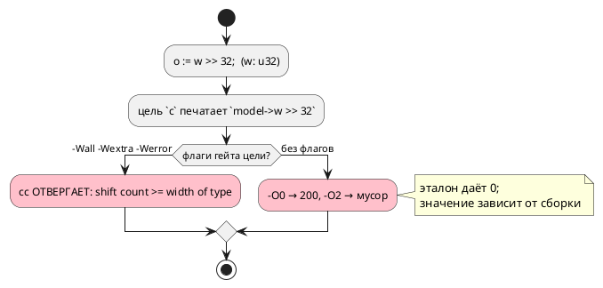

# ADR 0392: Сдвиг на величину, не меньшую ширины типа, в цели `c`

- **Status:** Accepted — исполнителю (решения заказчика **более не требует**)
- **Date:** 2026-08-22
- **Authors:** Архитектор + Аналитик
- **Related issues:** [Фича 0392](../features/0392-c-shift-width-wide.md);
  соседняя механика — [0326](0326-rust-shift-width.md) и
  [0334](0334-rust-variable-shift-width.md) (та же правка у цели `rust`)

## Context

`var w: u32 := 200;` и `o := w >> 32;`. Замер **переснят 2026-08-22** и
**опроверг запись кандидата**:

| Что | Прежняя запись (0334, 2026-08-20) | Пересъём 2026-08-22 |
|---|---|---|
| эталон | `0` | `0` |
| цель `c`, печать | `model->w >> 32` | то же |
| `cc -Wall -Wextra -Werror` | не проверялось | **ОТВЕРГАЕТ:** `error: shift count >= width of type [-Wshift-count-overflow]` |
| прогон `-O0` | — | **200** (сдвиг не выполнен) |
| прогон `-O2` | «дал `0`, совпало с эталоном» | **6155562384**, затем **4311320137** — мусор, **разный между тактами** |

То есть вывод цели `c`:

1. **не собирается** под флагами её собственного гейта (`-Werror`);
2. собранный без них — даёт значения, зависящие от уровня оптимизации и не
   совпадающие с эталоном ни в одном режиме.

⚠️ Запись кандидата («прогон `clang -O2` дал `0` … нужно решение заказчика о
цене») **неверна**: ноль не воспроизводится, а решение о цене излишне — речь не
о цене, а о невалидном выводе. Гейт корпуса класс не видит, потому что сдвигов
в `examples/` нет ни одного (наблюдение 0334).

## Decision Drivers

1. **Вывод не собирается флагами собственного гейта** — это дефект, а не цена.
2. **Правило уже принято для цели `rust`** (0326/0334): сдвиг на величину, не
   меньшую ширины, **насыщается** — `0` для беззнакового и `>> (ширина − 1)`
   для знакового. Цель `c` обязана отвечать так же — иначе два потребителя
   расходятся на одном входе.
3. **Литеральная и переменная величина различаются по цене:** первая считается
   при компиляции, вторая требует ветвления в рантайме.
4. **Вывод корпуса не должен поехать** — сдвигов в `examples/` нет, значит
   правка снапшоты не задевает.

## Considered Options

### Option A. Печатать насыщенное значение при ЛИТЕРАЛЬНОЙ величине

`w >> 32` при `u32` → `0`; знаковое `s >> 32` при `i32` → `s >> 31`.
Переменная величина остаётся как есть (граница называется).

**Pros:**
- совпадает с правилом цели `rust` (0326) — знание одно, ответы одинаковы;
- нулевая цена в рантайме: значение считает компилятор;
- снимает отказ `-Werror` (UB-выражения в выводе больше нет).

**Cons:**
- переменная величина (`w >> k`) остаётся UB у цели `c`, тогда как у `rust`
  она уже насыщается (0334) — расхождение сохраняется на этом входе.

### Option B. Насыщать и переменную величину (полный аналог 0334)

`w >> k` → выражение с ветвлением (`k >= 32 ? 0 : w >> k`).

**Pros:** цели `c` и `rust` совпадают полностью.
**Cons:** ветвление печатается на **каждый** сдвиг переменной величины — цена в
прошивке; именно её кандидат и называл. Но теперь известно, что без правки код
вообще не собирается только для литерала, а для переменной величины `-Werror`
молчит.

### Option C. Отвергать вход (`CC-…`)

**Cons:** эталон и `rust` вход исполняют — цель отказывалась бы на записи, у
которой есть определённое поведение у двух потребителей из трёх.

## Decision

Принимается **Option A** для литеральной величины (обязательная часть) и
**Option B как отдельная задача** для переменной — с замером цены на корпусе
перед включением.

Довод: литеральный случай ломает сборку под флагами гейта и даёт мусор — это
дефект, и он чинится бесплатно. Переменный случай сегодня собирается и молчит,
но расходится с целью `rust`; его цена (ветвление на каждый сдвиг) — предмет
отдельного решения, и мерить её надо на реальном выводе, а не рассуждением.

⚠️ **Правило берётся у существующего носителя.** У цели `rust` оно живёт в
`generator/rust/rust_shift.rs`; цель `c` обязана дать тот же ответ, а не
собственный — иначе класс «две реализации одного правила» (0084/0193/0195).

## Consequences

### Положительные

- Вывод цели `c` собирается флагами её гейта; значения совпадают с эталоном и
  целью `rust`.

### Отрицательные / Action items

- Переменная величина остаётся расхождением с `rust` — **названная граница**,
  вынесенная в задачу 0392-02 (с замером цены).
- В корпусе класса нет, поэтому сторожа обязаны быть фикстурными, с прогоном
  настоящего `cc` под флагами гейта.

### Acceptance criteria

1. `o := w >> 32;` при `u32` даёт у эталона и цели `c` одно значение (`0`).
2. Порождённый C собирается под `-Wall -Wextra -Wno-unused-parameter -Werror`.
3. Знаковый случай (`i32`, `>> 32`) даёт `-1` при отрицательном значении — как
   у эталона и цели `rust`.
4. Контроль: сдвиг на законную величину печатается **без** изменений (вывод
   корпуса не меняется).
5. Мутация «вернуть прежнюю печать» роняет сборку сторожа.
6. `./scripts/precheck.sh` зелёный.
