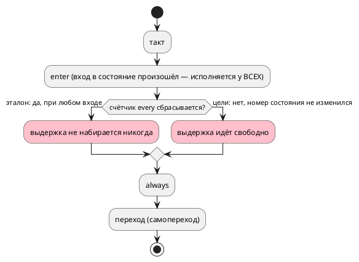

# ADR 0393: `every` при самопереходе

- **Status:** Proposed — **решение о правиле языка принимает заказчик**
- **Date:** 2026-08-22
- **Authors:** Архитектор + Аналитик
- **Related issues:** [Фича 0393](../features/0393-every-on-self-transition.md);
  механика времени — [0134](0134-time-model.md), вход в стартовое состояние —
  [0033](0033-init-tick-alignment.md)

## Context

Состояние с `every 3ms` и самопереходом `ref Run: i < 100`, срабатывающим
каждый такт (`clock 1kHz`). Замер **переснят 2026-08-22** прогоном эталона и
харнесса цели `c`:

| Такт | 1 | 2 | 3 | 4 | 5 | 6 | 7 | 8 |
|---|---|---|---|---|---|---|---|---|
| эталон, `ticks` | 0 | 0 | 0 | 0 | 0 | 0 | 0 | 0 |
| цель `c`, `ticks` | 0 | 0 | 0 | 0 | **1** | 1 | 1 | **2** |
| эталон, `entered` (порт) | 1 | 2 | 3 | 4 | 5 | 6 | 7 | 8 |
| цель `c`, `entered` | 1 | 2 | 3 | 4 | 5 | 6 | 7 | 8 |

Прочитанное:

- **тело `every` у эталона не срабатывает НИКОГДА** — самопереход сбрасывает
  счётчик каждый такт, и выдержка 3 мс не набирается;
- **у цели `c` оно срабатывает** — признак «вход в состояние» там
  `state != prev_state`, а при самопереходе номер состояния не меняется;
- **`enter` исполняется у обоих одинаково** (`entered` совпадает такт в такт) —
  то есть вход в состояние происходит, и цели это признают.

⚠️ **Уточнение к записи кандидата.** Там сказано, что `enter` «исполняется … как
и у эталона» — пересъём это подтверждает **по портам**; расхождение видно
только в счётчике `every`. (Значения переменных в трассе эталона снимаются
позже портов, поэтому `vars:entered` там на единицу больше — это свойство
печати, а не поведения.)

⚠️ **Внутри целей противоречие:** вход в состояние происходит (`enter`
исполняется), а счётчик `every` при этом не сбрасывается.

## Decision Drivers

1. **Документ обещает отсчёт «с входа»** и потактовое совпадение целей с
   эталоном (`book/`, раздел «Периодическое действие») — сегодня не выполняется
   ни то, ни другое.
2. **Ответы обоих сторон внутренне непоследовательны:** эталон признаёт вход
   (исполняет `enter`) и сбрасывает счётчик — значит `every` при самопереходе
   бесполезен всегда; цели признают вход `enter`-ом, но не сбрасывают счётчик.
3. **Класс не покрыт ничем:** `every` в корпусе не встречается ни разу, поэтому
   ни гейт, ни сверки его не видят.
4. **Цена правки несимметрична** (см. Options).

## Considered Options

### Option A. Правы цели: `every` отсчитывает свободно, самопереход его не сбрасывает

Эталон приводится к целям; документ уточняется («счётчик сбрасывается при
входе в **другое** состояние»).

**Pros:**
- правится **один** потребитель (эталон) плюс документ;
- `every` при самопереходе остаётся полезным: периодическое действие в
  состоянии, которое «крутится» на себе, — типичный сценарий (опрос датчика).

**Cons:**
- `enter` и `every` начинают понимать «вход» **по-разному** у всех
  потребителей: первый исполняется при самопереходе, второй его игнорирует.
  Это надо назвать словами в документе, иначе противоречие остаётся.

### Option B. Прав эталон: любой сработавший переход сбрасывает счётчик

Цели приводятся к эталону: признак «переход сработал» вместо сравнения номеров
состояний.

**Pros:**
- `enter` и `every` понимают «вход» одинаково — правило одно;
- документ («отсчёт с входа») исполняется буквально.

**Cons:**
- правятся **четыре** цели: около шести мест печати у `c`, по одному у `rust`,
  `sv`, `st` (там ещё и перевзвод `TON`);
- `every` при самопереходе становится **мёртвой конструкцией**: тело не
  срабатывает никогда — то есть язык допускает запись, у которой поведения нет.
  Тогда честнее диагностировать её (предупреждение), а это ещё работа.

### Option C. Правы цели, а самопереход перестаёт исполнять `enter`/`exit`

Согласовать в другую сторону: самопереход не считается входом вовсе.

**Pros:** одно понятие «вход» — смена состояния.
**Cons:** ломает `enter` при самопереходе у всех потребителей — а это
наблюдаемое поведение, на которое модели опираются (перезапуск действия при
повторном срабатывании условия).

## Decision

**Решение за заказчиком.** Аналитик предлагает **Option A** (правы цели) с
обязательным уточнением документа: «вход» для `enter`/`exit` — любое
срабатывание перехода в это состояние, для `every` — смена состояния.

Довод: Option B делает `every` при самопереходе конструкцией без поведения (её
тело не исполнится никогда) и правит четыре цели ради того, чтобы узаконить
бесполезный случай; Option A правит одного потребителя и сохраняет полезный
сценарий, но требует **назвать** разницу в документе — сегодня она не описана и
именно поэтому воспринимается как дефект.

## Consequences

### Положительные (Option A)

- Один потребитель правится, поведение целей не меняется (значит снапшоты и
  гейты целей не задеты).
- `every` в «крутящемся» состоянии работает — сценарий опроса сохраняется.

### Отрицательные / Action items

- Документ обязан назвать разницу между «входом» для `enter` и для `every`.
- Нужна потактовая сверка на `every` **с самопереходом** — сегодня класс не
  покрыт ничем (в корпусе `every` нет).
- При Option B — правка четырёх целей и, вероятно, предупреждение о мёртвом
  `every`.

### Acceptance criteria

1. Потактовая сверка эталона со всеми целями на модели с `every` **и**
   самопереходом даёт одну трассу.
2. Контроль: `every` в состоянии **без** самоперехода работает как прежде
   (проверяется той же сверкой вторым входом).
3. Раздел `book/` «Периодическое действие» называет правило сброса счётчика.
4. Мутация «вернуть прежнее поведение» роняет сверку.
5. `./scripts/precheck.sh` зелёный; вывод корпуса не изменился.
