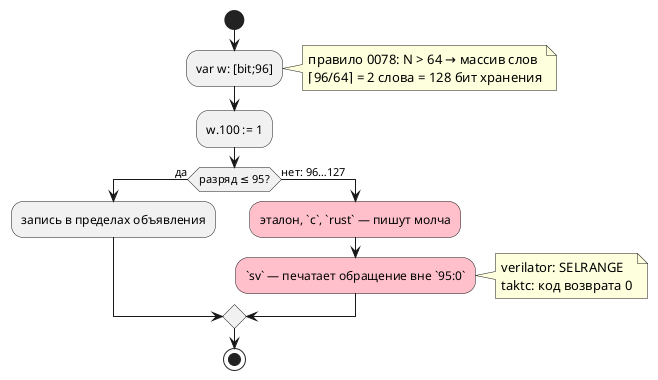

# ADR 0394: Разряд за объявленной шириной бит-вектора

- **Status:** Proposed — **решение о правиле языка принимает заказчик**
- **Date:** 2026-08-22
- **Authors:** Архитектор + Аналитик
- **Related issues:** [Фича 0394](../features/0394-bit-beyond-declared-width.md);
  замер вырос из [0307](0307-sim-bit-range-text.md), раскладка — [0078](0078-bit-array-semantics.md)

## Context

`var w: [bit;96];` — значение по правилу 0078 занимает **два слова** (128 бит),
хотя объявлено 96 разрядов. Запись `w.100 := 1;` попадает во второе слово, но
за объявленную ширину.

Замер **переснят 2026-08-22** — и он **не совпал** с записью кандидата:

| Потребитель | Прежняя запись (0307, 2026-08-20) | Пересъём 2026-08-22 |
|---|---|---|
| эталон | пишет | пишет (`w = [0, 68719476736]`) |
| `c`, `c-hal` | пишут | пишут, `cc` принял |
| `rust` | пишет | пишет, `rustc` + `clippy` приняли |
| **`sv`, `sv-mmio`** | «пишут» | **`verilator` ОТВЕРГ:** `SELRANGE: Selection index out of range: 100:100 outside 95:0` |
| `st`, `st-at` | отказ | `ST-011` (широких векторов не переводит) |

⚠️ **Класс острее, чем считалось.** Цель `sv` печатает регистр шириной по
**объявлению** (`95:0`) и обращается к разряду 100 — вывод невалиден, а
`taktc` возвращает **ноль**. То есть это не только расхождение с объявлением,
но и молчаливо неверный вывод у двух целей.

⚠️ Прежняя запись утверждала «согласие полное» — пересъём его опроверг. Ровно
поэтому правило 30 требует снимать замер заново, а не наследовать.

## Decision Drivers

1. **Невалидный вывод при нулевом коде возврата** — у целей `sv`/`sv-mmio`
   (найдено пересъёмом).
2. **Объявление обязано что-то значить.** Автор просил 96 разрядов; сегодня
   получает 128 у одних потребителей и отказ инструмента у других.
3. **Раскладка по словам — свойство представления** (0078), а не языка: она
   выбрана ради C и Rust, где нет `uint96_t`. Правило языка о **ширине**
   принадлежит объявлению.
4. **Диагностика уже почти есть:** `SIM-011` называет разрядность **значения**
   (0307), а не объявления — там же названо, что обещание отказа «по
   объявленной ширине» было бы второй ложью.

## Considered Options

### Option A. Отвергать разряд за объявленной шириной (семантика, `SE-…`)

Новая проверка: индекс разряда сверяется с **объявленной** шириной, а не с
разрядностью представления.

**Pros:**
- объявление начинает значить ровно то, что написано;
- невалидный вывод у `sv` исчезает вместе с входом;
- проверка **одна на всех** — в семантике, то есть потребителям не по чему
  расходиться (приём 0143/0192);
- у литерального индекса проверка статическая и дешёвая.

**Cons:**
- **переменный индекс** статически не проверить: `w.k` при `k: u8` останется
  на совести исполнения (эталон отвечает `SIM-011` в такте, цели — нет);
- ломающее изменение для моделей, полагавшихся на «хвост» слова: подъём
  минорной версии языка (в корпусе таких записей нет).

### Option B. Округлять объявление до слова (узаконить нынешнее)

`[bit;96]` официально значит 128 разрядов; правило записывается в документ.

**Pros:**
- поведение эталона, `c` и `rust` не меняется;
- правится только документ и цель `sv` (регистр шириной по **раскладке**, а не
  по объявлению).

**Cons:**
- объявление перестаёт быть контрактом: `[bit;96]` и `[bit;128]` — одно и то
  же, а `[bit;65]` тихо становится `[bit;128]`;
- цель `st` останется отказывать (широких векторов не переводит) — согласия
  всё равно не будет;
- «лишние» разряды не существуют ни в одной другой цели генерации: у `sv` они
  синтезируются в реальные триггеры, то есть площадь кристалла растёт молча.

### Option C. Отвергать только у цели `sv`, прочим оставить как есть

**Cons:** это фиксация расхождения в коде: один и тот же вход законен у одних
целей и незаконен у других — ровно тот класс, ради которого заведены сверки.
Отвергается.

## Decision

**Решение за заказчиком.** Аналитик предлагает **Option A**: объявленная ширина
— контракт, и разряд за ней есть ошибка (диагностика в семантике, литеральный
индекс — статически). Довод: сегодня один вход даёт три разных исхода (молчит,
отвергается чужим инструментом, отвергается целью), а раскладка по словам —
деталь представления, о которой автор не обязан знать.

⚠️ Переменный индекс остаётся за исполнением — это **названная граница**, а не
пропуск: `SIM-011` эталона её уже покрывает, а цели проверок в рантайме не
ставят (правило «не платить за то, чего автор не просил»).

## Consequences

### Положительные (Option A)

- Объявление значит написанное; невалидный вывод у `sv` исчезает.
- Проверка одна и в семантике — расходиться потребителям не по чему.

### Отрицательные / Action items

- Подъём минорной версии языка (правило 22) — вход, сегодня принимаемый,
  станет ошибкой.
- Документ (`book/`, раздел «Типы», блок про `[bit;N]`) обязан назвать правило
  и границу переменного индекса.
- Проверить, не опирается ли на «хвост» слова цель `sv-mmio` (регистровый
  файл) — там ширина регистра берётся из типа.

### Acceptance criteria

1. `w.100 := 1;` при `var w: [bit;96];` отвергается семантикой с названной
   причиной и координатой.
2. Контроль: `w.95 := 1;` принимается всеми девятью потребителями.
3. Вывод целей на контрольном входе принимают их инструменты (включая
   `verilator -Wall`).
4. Документ называет правило; версия языка поднята, коммит помечен тегом.
5. `./scripts/precheck.sh` зелёный; вывод корпуса не изменился.
