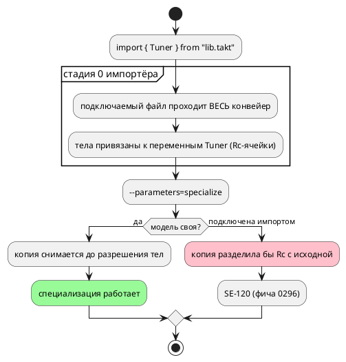

# ADR 0395: Специализация импортированной модели

- **Status:** Proposed — исполнителю (решения заказчика не требует)
- **Date:** 2026-08-22
- **Authors:** Архитектор + Аналитик
- **Related issues:** [Фича 0395](../features/0395-imported-model-specialization.md);
  причина названа в [0296](0296-semantic-stages-single-source.md), отказ введён там же

## Context

`--parameters=specialize` снимает копию модели на каждый набор аргументов
(0185). Подключаемый файл проходит **весь** конвейер внутри стадии 0 импортёра
(0296), поэтому к моменту специализации его тела уже привязаны к переменным
подключённой модели, и копия разделила бы с исходной `Rc`-ячейки.

Замер **переснят 2026-08-22**:

| Режим | Ответ |
|---|---|
| `--parameters=assign` (умолчание) | компилируется |
| `--parameters=specialize` | **`SE-120`** «Специализация модели 'Tuner', подключённой из другого файла, не поддерживается…» |

Отказ введён фичей 0296 **вместо** прежнего поведения: до неё цель `c`
печатала доступ к чужому полю (`cc`: «no member named 'tuner' in
'struct …P1'») при нулевом коде возврата. То есть сегодня класс закрыт
**честным отказом**, а не молчаливой порчей; фича снимает саму границу.

## Decision Drivers

1. **Граница названа, но произвольна:** специализация — свойство модели, а не
   способа её получения; автор не обязан знать, что `import` строит дерево
   иначе.
2. **Причина — МЕСТО снятия копии**, а не порядок проходов (вывод 0296):
   импорт обязан отдавать поздние стадии конвейеру корня.
3. **Цена перестройки названа там же:** усыновление (0184) и выборочный импорт
   читают **готовые** карты переменных, типов и функций подключённого файла, а
   наполняют их стадии 2 и 5.
4. **Отказ сегодня честный** — то есть работа улучшает возможности, а не чинит
   молчаливую порчу; приоритет соответствующий (Tier 3).

## Considered Options

### Option A. Оставить отказ (статус-кво)

**Pros:** ноль работы; обход назван в тексте `SE-120` (задать параметры в файле
объявления либо собрать в режиме `assign`).
**Cons:** библиотечная модель с параметрами специализируется только у себя
дома — то есть параметризованная библиотека наполовину бесполезна.

### Option B. Импорт строит стадии 0–1, поздние отдаёт конвейеру корня

Option C ADR 0296, отложенная там же.

**Pros:**
- копия снимается **до** разрешения тел — `Rc` не разделяются по построению;
- порядок стадий остаётся единым (0296): у подключаемого файла исчезает
  «конвейер внутри конвейера», а с ним и двойной проход стадий 2–6, названный
  ценой устройства;
- `SE-120` становится недостижимым и снимается.

**Cons:**
- усыновление (0184) и выборочный импорт (`import { … }`) читают готовые карты
  подключённого файла — их придётся либо отложить до поздних стадий, либо
  научить работать с неполными картами;
- риск задеть порядок диагностик импорта (0294, 0279) и правило «имя типа
  занимается один раз» (0243), которое проверяется на стыке файлов.

### Option C. Снимать копию текстом (перекомпилировать файл на каждый набор)

**Pros:** копии заведомо независимы.
**Cons:** повторный разбор и семантика на каждый набор аргументов; путь
импорта перестаёт быть общим с обычным (класс 0296 — два носителя одного
знания); детерминированность вывода придётся доказывать заново.

## Decision

Принимается **Option B** — как и предполагала ADR 0296 (там она названа Option
C и отложена по объёму). Исполнителю: импорт строит стадии 0–1 подключаемого
файла, поздние стадии идут общим конвейером корня; усыновление переносится
туда, где карты уже наполнены.

⚠️ **Замер обязан быть переснят перед началом работы**: сегодня вход отсекается
`SE-120`, и цена ошибки — возврат к молчаливой порче (доступ к чужому полю),
которую 0296 закрыла.

## Consequences

### Положительные

- Параметризованная библиотечная модель специализируется у импортёра.
- Исчезает двойной проход стадий 2–6 у подключаемого файла (цена устройства,
  названная 0296).
- `SE-120` снимается как недостижимый.

### Отрицательные / Action items

- Усыновление (0184) и выборочный импорт переезжают на поздние стадии — самая
  рискованная часть: они читают карты, наполняемые стадиями 2 и 5.
- Диагностики импорта (`SE-074`, `SE-102` + сноска 0294, `SE-108` через
  границу файлов) обязаны сохранить и коды, и позиции.

### Acceptance criteria

1. `--parameters=specialize` на импортированной параметризованной модели
   компилируется; цель `c` печатает **разные** структуры на разные наборы
   аргументов, `cc` их принимает.
2. Потактовая сверка эталона с целью `c` в обоих режимах (`assign` и
   `specialize`) — четыре трассы, как в сторожe R11 фичи 0185.
3. `SE-120` снят либо помечен защитным с объяснением недостижимости.
4. Диагностики импорта не изменили ни кодов, ни координат (существующие тесты
   0294, 0279, 0243, 0184).
5. Вывод корпуса не изменился; `./scripts/precheck.sh` зелёный.
