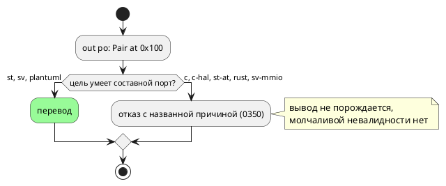

# Фича 0390: Порт составного типа: нормировать ли в семантике

- **Номер:** 0390
- **Статус:** АНАЛИЗ
- **Зависит от:** нет (проставлено на стадии анализа 2026-08-22)
- **Tier:** 3 — расставлен по признаку вреда (шкала — в блоке 1 `FEATURES.md`)
- **Класс:** семантика
- **Связанные issue (анализ):** кандидат блока 2 `FEATURES.md`, переведён в фичу пакетно 2026-08-22

## Стадии жизненного цикла (правило 17)

Все стадии — **разделы этой карточки** (правило 32): «Архитектура (ADR)»,
«Анализ», «Разработка», «Тест-план», «Отчёт о тестировании», «Итог».
Отдельным артефактом остаются только исправления —
[`docs/fixes/`](../fixes/README.md) (при необходимости `0390-YY-*`).

## Краткое описание

- **Порт составного типа: нормировать ли в семантике.** Замер
  [0350](0350-port-composite-type.md) (2026-08-20): после правки
  порт-структуру переводят `st` и `sv`, а `c`, `c-hal`, `st-at`, `rust`,
  `sv-mmio` отказывают своими кодами. Язык принимает запись, у которой
  поведение есть у двух целей из восьми. ⚠️ Сузить язык (`SE-124` на
  нескалярный тип порта) — **решение заказчика**: это ломающее изменение
  версии языка, и оно закрыло бы путь регистровому файлу `sv-mmio`, где
  массив мог бы лечь в несколько регистров.

> Фича зарегистрирована из блока кандидатов `FEATURES.md` **без проработки**
> (решение заказчика 2026-08-22: «завести фичи из кандидатов без проработки»).
> Текст кандидата перенесён **дословно**, вместе с замером и его датой: замер
> есть свидетельство, а пересказ его теряет. Стадии 2 и 3 не пройдены —
> зависимости и объём **не оценивались**; далее фича проходит жизненный цикл по
> правилу 17.

## Документирование (правило 24)

**Зависит от варианта.** A — не требуется (поведение не меняется). B —
затронут раздел `book/` «Порты и адреса»: правило о допустимых типах порта плюс
описание новой диагностики в приложении «Ошибки и предупреждения». C — там же
описывается расширенный протокол HAL (прикладной раздел «Инструментарий»).

<!-- При ЗАКРЫТИИ фичи (стадия 8, статус ГОТОВО) сюда добавляется раздел
     «## Итог (что сделано)» —
     ссылки на отчёт/фиксы (правило 21). Незакрытые фичи «Итога» не имеют. -->

## Архитектура (ADR)

- **Status:** Proposed — **решение о правиле языка принимает заказчик**
- **Date:** 2026-08-22
- **Authors:** Архитектор + Аналитик
- **Related issues:** [Фича 0390](0390-port-composite-type-policy.md);
  замер вырос из [0350](0350-port-composite-type.md#архитектура-adr)

### Context

`out po: Pair at 0x100;` при `struct Pair { lo: u8, hi: u8 }`. Замер
**переснят 2026-08-22** (прежний — 0350, 2026-08-20):

| Потребитель | Ответ |
|---|---|
| эталон | исполняет (`po = Pair{lo=1,hi=1}`) |
| `st` | переводит; `iec2c` принял, `cc` собрал |
| `sv` | переводит; `verilator` принял, `yosys` синтезировал |
| `plantuml` | принимает |
| `c`, `c-hal` | `CC-015` — тип не представим в HAL-колбэке |
| `st-at` | `ST-004` — размещённая переменная составного типа |
| `rust` | `RS-016` |
| `sv-mmio` | `SV-002` — распакованный порт в шапке модуля |

То есть **три перевода из восьми**. Фича 0350 привела цели к согласию «либо
перевод, либо отказ с причиной» (молчаливо невалидного вывода нет), но сам
язык остался с записью, поведение которой существует у меньшинства целей.

### Decision Drivers

1. **Язык не должен обещать больше, чем исполняет большинство целей** — иначе
   переносимость модели зависит от того, какую цель автор выберет позже.
2. **Обратное соображение:** регистровый файл `sv-mmio` — естественное место
   для составного порта (массив мог бы лечь в несколько регистров), и запрет
   закрыл бы этот путь навсегда.
3. **Отказы уже объясняющие** (0350): автор не остаётся без причины, то есть
   цена статус-кво — недоинформированность, а не молчаливая порча.
4. **Ломающее изменение** требует подъёма версии языка и ломает модели, где
   составной порт работает (цели `st`/`sv`).

### Considered Options

#### Option A. Оставить как есть (статус-кво)

**Pros:** ничего не ломается; путь к регистровому файлу открыт; отказы целей
объясняют причину и называют обход.
**Cons:** запись переносима не полностью — модель, написанная под `st`, не
собирается для `c`; язык описывает возможность, которой у большинства целей
нет.

#### Option B. Сузить язык: `SE-…` на нескалярный тип порта

**Pros:** обещание языка совпадает с исполнением; ошибка приходит **до**
выбора цели, то есть автор узнаёт о границе сразу.
**Cons:** ломающее изменение (подъём минорной версии); закрывает путь
`sv-mmio`; отнимает работающие сегодня модели у `st` и `sv`.

#### Option C. Достроить недостающие цели

Составной порт у `c`/`c-hal` — через развёртку в несколько колбэков; у
`rust` — через методы HAL по полям; у `sv-mmio` — регистровый файл по полям.

**Pros:** язык исполняется всеми; путь к регистровому файлу не закрывается, а
открывается.
**Cons:** самая дорогая: протокол HAL меняется у двух целей (ломающее для
пользовательского кода, который его реализует), у `sv-mmio` — раскладка
регистров; отказ `st-at` (размещённая переменная) упирается в IEC.

### Decision

**Решение за заказчиком.** Аналитик предлагает **Option A** (оставить) с
оговоркой: перед сужением языка стоит дождаться запроса на регистровый файл со
составными портами — сегодня Option B закрыла бы путь, о котором известно, что
он осмыслен, ради устранения недоинформированности, уже смягчённой отказами
0350.

⚠️ Если заказчик выберет **B**, объём мал (одна проверка в семантике), но это
подъём версии языка и ломающее изменение. Если **C** — работа крупная и
меняет протокол HAL, то есть затрагивает пользовательский код.

### Consequences

#### При Option A

- Ничего не меняется; фича закрывается как `ОТМЕНА` с обоснованием (правило 17).

#### При Option B

- Одна проверка (`SE-…`) в `validate`; подъём версии языка; документ обязан
  назвать правило; отказы целей 0350 становятся недостижимыми — их придётся
  пометить защитными либо снять.

#### При Option C

- Протокол HAL целей `c`/`rust` расширяется (ломающее для пользователей);
  раскладка регистров `sv-mmio` — новая работа; `st-at` останется отказывать
  (ограничение IEC).

#### Acceptance criteria

- **B:** составной порт отвергается семантикой с координатой и причиной;
  контроль — скалярный порт принимается; версия языка поднята; отказы 0350
  либо сняты, либо помечены защитными.
- **C:** потактовая сверка эталона с каждой достроенной целью; инструменты
  принимают вывод; протокол HAL описан в README и `book/`.

## Анализ

### Цель и контекст

Язык принимает `out po: Pair;`, а поведение у этой записи есть **у трёх целей
из восьми**. Фича решает: сузить язык, достроить цели или оставить как есть.

### Замер (правило 30, переснят 2026-08-22)

| Потребитель | Ответ | Инструмент |
|---|---|---|
| эталон | исполняет | — |
| `st` | переводит | `iec2c` принял, `cc` собрал |
| `sv` | переводит | `verilator` принял, `yosys` синтезировал |
| `plantuml` | принимает | — |
| `c`, `c-hal` | `CC-015` | вывода нет |
| `st-at` | `ST-004` | вывода нет |
| `rust` | `RS-016` | вывода нет |
| `sv-mmio` | `SV-002` | вывода нет |

Прежний замер (0350) подтверждён; уточнены коды отказов у `st-at` (`ST-004`) и
`rust` (`RS-016`) — в записи кандидата они не назывались.

⚠️ Молчаливо невалидного вывода нет ни у одной цели: это работа 0350.

### Зависимости фичи (правило 17/19)

- **Зависит от:** нет; опорная [0350](0350-port-composite-type.md)
  закрыта.
- **Связь:** Option C пересекается с [0280](0280-sv-mmio-bus-axi-wishbone.md)
  (адаптеры шин, `ЗАМОРОЖЕНА`) — регистровый файл со составными портами
  осмыслен именно там.
- **Влияние на порядок:** фича ждёт **решения заказчика**; Option B — подъём
  версии языка, удобно совмещать с другими языковыми фичами цикла.

### Требования и проверяемые условия

- **R1 (B).** Составной тип порта отвергается семантикой с координатой и
  названной причиной; контроль — скалярный порт принимается.
- **R2 (B).** Отказы целей 0350 (`CC-015`, `RS-016`, `SV-002`, `ST-004`)
  становятся недостижимыми: их надо снять либо пометить защитными и объяснить
  (иначе мёртвый код, класс 0233/0278).
- **R3 (C).** Каждая достроенная цель сверяется с эталоном потактово;
  инструменты принимают вывод.
- **R4 (C).** Изменение протокола HAL описано в README и `book/` — его
  реализует пользователь.
- **R5 (A).** Решение и его довод записаны в карточке (раздел «Итог (отмена)»).

### Критерии приёмки и способ проверки

| # | Критерий | Способ проверки |
|---|---|---|
| A1 | R1 | семантический тест + контроль |
| A2 | R2 | греп/тест на достижимость отказов целей |
| A3 | R3 | `takt-sim/tests/conformance/` + `scripts/probe.sh` |
| A4 | R4 | README, `book/`, гейт команд README |
| A5 | R5 | карточка фичи |

### Объём работ

| Вариант | Объём |
|---|---|
| **A** | ноль (закрытие как `ОТМЕНА` с обоснованием) |
| **B** | одна проверка в `validate` + версия языка + документ + ревизия четырёх отказов целей |
| **C** | протокол HAL у `c`/`rust`, раскладка регистров `sv-mmio`, сверки на каждую цель; `st-at` остаётся ограниченным IEC |

### Редакторский слой (правило 29)

**Правки не требуются** ни при одном варианте: формы объявления порта и типы
не меняются. Вариант B заводит диагностику — она доедет общей точкой; её
описание идёт в приложение `book/` (правило 25).

### Особенности по обратной функциональности

- **B** ломает модели, где составной порт работает (цели `st`, `sv`), —
  подъём минорной версии языка.
- **C** ломает **пользовательский** код: реализацию трейта HAL у целей
  `c`/`rust` придётся дополнить.
- **A** обратно совместим полностью.

### Риски и зависимости

- **Закрытие пути `sv-mmio`** (Option B) — главный риск: регистровый файл со
  составными портами известен как осмысленный сценарий.
- **Ревизия отказов** (Option B): недостижимый отказ — мёртвый код, который
  нельзя ни проверить, ни удержать от расхождения (урок 0233).
