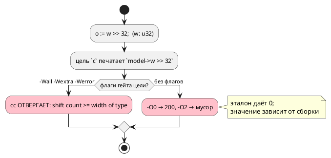

# Фича 0392: Сдвиг на величину, не меньшую ширины типа, в цели c на 32- и 64-битных типах

- **Номер:** 0392
- **Статус:** АНАЛИЗ
- **Зависит от:** нет (проставлено на стадии анализа 2026-08-22)
- **Tier:** 2 — расставлен по признаку вреда (шкала — в блоке 1 `FEATURES.md`)
- **Класс:** генерация
- **Связанные issue (анализ):** кандидат блока 2 `FEATURES.md`, переведён в фичу пакетно 2026-08-22

## Стадии жизненного цикла (правило 17)

Все стадии — **разделы этой карточки** (правило 32): «Архитектура (ADR)»,
«Анализ», «Разработка», «Тест-план», «Отчёт о тестировании», «Итог».
Отдельным артефактом остаются только исправления —
[`docs/fixes/`](../fixes/README.md) (при необходимости `0392-YY-*`).

## Краткое описание

- **Сдвиг на величину, не меньшую ширины типа, в цели `c` на 32- и 64-битных
  типах.** Замер [0334](0334-rust-variable-shift-width.md)
  (2026-08-20): цель `c` права по построению на 8- и 16-битных типах (операнды
  продвигаются до `int`), а `u32 >> 32` стандарт объявляет **неопределённым**
  (C11 6.5.7p3). Прогон `clang -O2` дал `0`, то есть совпало с эталоном — но
  это свойство сборки, а не языка. ⚠️ Выражение с ветвлением удорожит **каждый**
  сдвиг ради случая, не наблюдавшегося ни разу; нужно решение заказчика о цене.

> Фича зарегистрирована из блока кандидатов `FEATURES.md` **без проработки**
> (решение заказчика 2026-08-22: «завести фичи из кандидатов без проработки»).
> Текст кандидата перенесён **дословно**, вместе с замером и его датой: замер
> есть свидетельство, а пересказ его теряет. Стадии 2 и 3 не пройдены —
> зависимости и объём **не оценивались**; далее фича проходит жизненный цикл по
> правилу 17.

## Документирование (правило 24)

**Не требуется.** Правило языка прежнее (0127: семантика переполнения и
сдвигов задана эталоном); фича приводит печать одной цели к уже принятому
поведению. Раздел `book/` о выражениях описывает сдвиги без обещаний о ширине —
правки не нужны.

<!-- При ЗАКРЫТИИ фичи (стадия 8, статус ГОТОВО) сюда добавляется раздел
     «## Итог (что сделано)» —
     ссылки на отчёт/фиксы (правило 21). Незакрытые фичи «Итога» не имеют. -->

## Архитектура (ADR)

- **Status:** Accepted — исполнителю (решения заказчика **более не требует**)
- **Date:** 2026-08-22
- **Authors:** Архитектор + Аналитик
- **Related issues:** [Фича 0392](0392-c-shift-width-wide.md);
  соседняя механика — [0326](0326-rust-shift-width.md#архитектура-adr) и
  [0334](0334-rust-variable-shift-width.md#архитектура-adr) (та же правка у цели `rust`)

### Context

`var w: u32 := 200;` и `o := w >> 32;`. Замер **переснят 2026-08-22** и
**опроверг запись кандидата**:

| Что | Прежняя запись (0334, 2026-08-20) | Пересъём 2026-08-22 |
|---|---|---|
| эталон | `0` | `0` |
| цель `c`, печать | `model->w >> 32` | то же |
| `cc -Wall -Wextra -Werror` | не проверялось | **ОТВЕРГАЕТ:** `error: shift count >= width of type [-Wshift-count-overflow]` |
| прогон `-O0` | — | **200** (сдвиг не выполнен) |
| прогон `-O2` | «дал `0`, совпало с эталоном» | **6155562384**, затем **4311320137** — мусор, **разный между тактами** |

То есть вывод цели `c`:

1. **не собирается** под флагами её собственного гейта (`-Werror`);
2. собранный без них — даёт значения, зависящие от уровня оптимизации и не
   совпадающие с эталоном ни в одном режиме.

⚠️ Запись кандидата («прогон `clang -O2` дал `0` … нужно решение заказчика о
цене») **неверна**: ноль не воспроизводится, а решение о цене излишне — речь не
о цене, а о невалидном выводе. Гейт корпуса класс не видит, потому что сдвигов
в `examples/` нет ни одного (наблюдение 0334).

### Decision Drivers

1. **Вывод не собирается флагами собственного гейта** — это дефект, а не цена.
2. **Правило уже принято для цели `rust`** (0326/0334): сдвиг на величину, не
   меньшую ширины, **насыщается** — `0` для беззнакового и `>> (ширина − 1)`
   для знакового. Цель `c` обязана отвечать так же — иначе два потребителя
   расходятся на одном входе.
3. **Литеральная и переменная величина различаются по цене:** первая считается
   при компиляции, вторая требует ветвления в рантайме.
4. **Вывод корпуса не должен поехать** — сдвигов в `examples/` нет, значит
   правка снапшоты не задевает.

### Considered Options

#### Option A. Печатать насыщенное значение при ЛИТЕРАЛЬНОЙ величине

`w >> 32` при `u32` → `0`; знаковое `s >> 32` при `i32` → `s >> 31`.
Переменная величина остаётся как есть (граница называется).

**Pros:**
- совпадает с правилом цели `rust` (0326) — знание одно, ответы одинаковы;
- нулевая цена в рантайме: значение считает компилятор;
- снимает отказ `-Werror` (UB-выражения в выводе больше нет).

**Cons:**
- переменная величина (`w >> k`) остаётся UB у цели `c`, тогда как у `rust`
  она уже насыщается (0334) — расхождение сохраняется на этом входе.

#### Option B. Насыщать и переменную величину (полный аналог 0334)

`w >> k` → выражение с ветвлением (`k >= 32 ? 0 : w >> k`).

**Pros:** цели `c` и `rust` совпадают полностью.
**Cons:** ветвление печатается на **каждый** сдвиг переменной величины — цена в
прошивке; именно её кандидат и называл. Но теперь известно, что без правки код
вообще не собирается только для литерала, а для переменной величины `-Werror`
молчит.

#### Option C. Отвергать вход (`CC-…`)

**Cons:** эталон и `rust` вход исполняют — цель отказывалась бы на записи, у
которой есть определённое поведение у двух потребителей из трёх.

### Decision

Принимается **Option A** для литеральной величины (обязательная часть) и
**Option B как отдельная задача** для переменной — с замером цены на корпусе
перед включением.

Довод: литеральный случай ломает сборку под флагами гейта и даёт мусор — это
дефект, и он чинится бесплатно. Переменный случай сегодня собирается и молчит,
но расходится с целью `rust`; его цена (ветвление на каждый сдвиг) — предмет
отдельного решения, и мерить её надо на реальном выводе, а не рассуждением.

⚠️ **Правило берётся у существующего носителя.** У цели `rust` оно живёт в
`generator/rust/rust_shift.rs`; цель `c` обязана дать тот же ответ, а не
собственный — иначе класс «две реализации одного правила» (0084/0193/0195).

### Consequences

#### Положительные

- Вывод цели `c` собирается флагами её гейта; значения совпадают с эталоном и
  целью `rust`.

#### Отрицательные / Action items

- Переменная величина остаётся расхождением с `rust` — **названная граница**,
  вынесенная в задачу 0392-02 (с замером цены).
- В корпусе класса нет, поэтому сторожа обязаны быть фикстурными, с прогоном
  настоящего `cc` под флагами гейта.

#### Acceptance criteria

1. `o := w >> 32;` при `u32` даёт у эталона и цели `c` одно значение (`0`).
2. Порождённый C собирается под `-Wall -Wextra -Wno-unused-parameter -Werror`.
3. Знаковый случай (`i32`, `>> 32`) даёт `-1` при отрицательном значении — как
   у эталона и цели `rust`.
4. Контроль: сдвиг на законную величину печатается **без** изменений (вывод
   корпуса не меняется).
5. Мутация «вернуть прежнюю печать» роняет сборку сторожа.
6. `./scripts/precheck.sh` зелёный.

## Анализ

### Цель и контекст

`w >> 32` при `w: u32` — неопределённое поведение по C11 6.5.7p3. Цель `c`
печатает его буквально; цель `rust` тот же вход насыщает (0326/0334).

### Замер (правило 30, переснят 2026-08-22) — **опроверг запись кандидата**

| Что | Прежняя запись | Пересъём |
|---|---|---|
| эталон | `0` | `0` |
| `cc` с флагами гейта | не проверялось | **ОТВЕРГАЕТ:** `shift count >= width of type [-Wshift-count-overflow]` |
| прогон `-O0` | — | `200` |
| прогон `-O2` | «`0`, совпало с эталоном» | `6155562384`, затем `4311320137` — **мусор, разный между тактами** |

Выводы:

- **решения заказчика о «цене» не требуется**: речь не о цене ветвления, а о
  выводе, который не собирается флагами собственного гейта;
- значение зависит от уровня оптимизации — то есть «совпало с эталоном» было
  случайностью конкретного прогона;
- гейт корпуса класс не видит: сдвигов в `examples/` нет ни одного.

### Зависимости фичи (правило 17/19)

- **Зависит от:** нет; опорные закрыты — [0326](0326-rust-shift-width.md),
  [0334](0334-rust-variable-shift-width.md) (правило у цели `rust`).
- **Влияние на порядок:** решения заказчика **не требует** (в отличие от того,
  что утверждала запись кандидата) — фича готова к разработке.

### Требования и проверяемые условия

- **R1.** Литеральная величина ≥ ширины: беззнаковое → `0`, знаковое →
  `>> (ширина − 1)`; значения совпадают с эталоном и целью `rust`.
- **R2.** Порождённый C собирается под флагами гейта (`-Wall -Wextra
  -Wno-unused-parameter -Werror`).
- **R3.** Правило берётся у существующего носителя цели `rust`, а не пишется
  заново (иначе две реализации одного правила).
- **R4.** Контроль: законная величина сдвига печатается без изменений — вывод
  корпуса не меняется.
- **R5.** Переменная величина — **названная граница** (задача 0392-02), с
  замером цены перед включением.

### Критерии приёмки и способ проверки

| # | Критерий | Способ проверки |
|---|---|---|
| A1 | R1 | потактовая сверка эталона с целью `c` (беззнаковый и знаковый входы) |
| A2 | R2 | сборка порождённого C флагами гейта прямо в тесте |
| A3 | R3 | чтение: вызов носителя, а не своя формула |
| A4 | R4 | `git diff --exit-code examples/generated/` |
| A5 | R5 | тест-граница: переменная величина печатается по-прежнему |
| A6 | Мутация | «вернуть прежнюю печать» роняет A2 |

### Объём работ

| Задача | Место | Оценка |
|---|---|---|
| 0392-01 (обязательная) | печатник сдвига цели `c` (`c_expr`) + носитель правила | малая |
| 0392-02 (отдельная) | переменная величина: ветвление; замер цены на выводе | средняя, требует замера |

### Редакторский слой (правило 29)

**Правки не требуются:** предмет — печать выражения у одной цели; лексика,
синтаксис, узлы АСД и диагностики не меняются.

### Особенности по обратной функциональности

Вывод цели `c` меняется **только** на входах со сдвигом ≥ ширины типа — то
есть там, где он сегодня не собирается флагами гейта. Прочие сдвиги
печатаются как прежде; вывод корпуса не меняется (сдвигов в `examples/` нет).

### Риски и зависимости

- **Ширина берётся у типа операнда**, а он в C продвигается до `int`: на 8- и
  16-битных типах цель права по построению (0334), и правка не должна их
  трогать — иначе изменится вывод там, где ничего не ломалось.
- **Корпус класс не покрывает** — сторожа фикстурные, с прогоном настоящего
  `cc` под флагами гейта (иначе дефект выглядит предупреждением).
