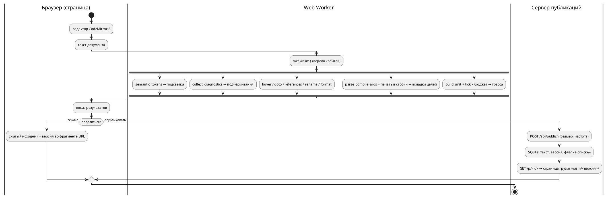

# Фича 0531: Онлайн-редактор Takt: подсветка, LSP, генерация, симуляция, обмен ссылками

- **Номер:** 0531
- **Статус:** РАЗРАБОТКА
- **Зависит от:** нет (проверено на стадии анализа 2026-09-04: ни одна незакрытая
  фича не даёт контракта, схемы или инфраструктуры, которых ждёт эта)
- **Tier:** — (шкала «признак вреда» к новой возможности не применяется;
  предложено оставить прочерк — решение заказчика, см. ADR)
- **Класс:** прочее (инструменты)
- **Связанные issue (анализ):** запрос заказчика 2026-09-04

## Стадии жизненного цикла (правило 17)

Все стадии — **разделы этой карточки** (правило 32). Пройдены регистрация,
архитектура (ADR, 2026-09-04) и анализ (2026-09-04, задачи `0531-01`…`0531-05`
и порядок их выполнения — в разделе «Анализ»); идёт разработка — выполнены
задачи `0531-01`, `0531-02` (раздел «Разработка»), `0531-03`, `0531-08`,
`0531-06`, `0531-07a` и `0531-10a` (разделы «Часть 03», «Часть 08»,
«Часть 06», «Часть 07» и «Часть 10» анализа). Ниже — то, что
сказал заказчик, и вопросы, на которые отвечает ADR.

## Краткое описание

Веб-сервис, в котором модель на Takt пишут, проверяют и запускают прямо в
браузере, а результатом делятся по ссылке — как на pastebin.

Состав, названный заказчиком:

- **редактор** с подсветкой синтаксиса Takt;
- **семантический анализ** — «всё, что может обеспечить LSP»: диагностики по
  мере набора, переход к объявлению, поиск использований, переименование,
  наведение, форматирование;
- **генерация кода** — вывод целей рядом с исходником (предпросмотр);
- **симуляция** — отдельной вкладкой;
- **обмен**: код выкладывается на всеобщее обозрение, у каждой публикации своя
  ссылка.

⚠️ Задача **большая** и по правилу 2 подлежит декомпозиции: на стадии анализа
она разбивается на задачи `0531-YY`, а часть, возможно, выделяется в отдельные
фичи со своими номерами.

## Документирование (правило 24)

Предварительно: **язык не меняется** — сервис показывает то, что уже умеют
`taktc`, `takt-lsp` и `takt-sim`. Раздел документа при этом, вероятно, нужен:
«Инструментарий» описывает работу с инструментами, и веб-редактор — такое же
применение (правило 24 допускает прикладные разделы). Решение принимается на
стадии архитектуры; если сервис потребует ограничить конструкции языка (например
запретить долгие прогоны), это уже **изменение языка** и отдельный разговор.

## Вопросы к архитектуре (стадия 2)

Список открытых решений, а не предложений — их предстоит принять заказчику.

1. **Где исполняется компилятор.** Сборка `takt-lang` в WebAssembly и работа
   целиком в браузере — или серверный прогон с API? Первое снимает вопросы
   изоляции и нагрузки, второе не требует портирования и даёт доступ к
   инструментам целей (`cc`, `iec2c`, `verilator`), которых в браузере нет.
2. **Симуляция.** Прогон в браузере против прогона на сервере; лимиты шагов и
   времени; что делать с моделями, которые не завершаются (у эталона есть предел
   итераций, но не предел прогона).
3. **Хранение публикаций.** Что именно сохраняется (исходник, сценарий,
   выбранная цель, версия языка), сколько живёт, можно ли править и удалять;
   нужен ли приватный режим «по ссылке, но не в списке».
4. **Версия языка у публикации.** Ссылка должна открываться так же и через год:
   значит публикация хранит версию, а сервис — несколько версий компилятора.
   Иначе старые ссылки будут молча меняться в поведении.
5. **LSP в браузере.** `takt-lsp` — процесс, говорящий по LSP; в вебе нужен
   мост (WebSocket или WASM-сборка). Пути поиска импортов в вебе отсутствуют —
   решить, поддерживаются ли многофайловые публикации.
6. **Цели генерации в предпросмотре.** Показывать все восемь или выбранную;
   что делать с целями, отказывающими на входе (это нормальный ответ, а не
   ошибка сервиса).
7. **Злоупотребления.** Публичная площадка с исполнением кода: лимиты на размер,
   частоту, длительность; модерация; хранение адресов.
8. **Куда кладётся сервис.** Отдельный крейт в этом репозитории или отдельный
   репозиторий; как он собирается и чем проверяется (правило 5: у изменения
   обязана быть сборка и тесты).

## Что уже есть в проекте (опора для анализа)

- `takt-lang` — компилятор с восемью целями и библиотечным API (`parse`,
  `compile_to_c`, …);
- `takt-lsp` — сервер LSP: диагностики, переход к объявлению, использования,
  переименование, форматирование, символы документа;
- `takt-sim` — эталонный симулятор: прогон по тактам, сценарии, GIF/SVG;
- `book/takt.sublime-syntax` и списки ключевых слов — готовое описание лексики
  для подсветки, сверяемое с лексером гейтом `check-book-keywords.py`;
- плагины редакторов (`extensions/`) — образец того, какие возможности
  редакторского слоя уже описаны.

## Архитектура (ADR)

- **Status:** Proposed — решения, названные в «Decision» как **решения заказчика**,
  ждут его слова; остальное предложено к принятию.
- **Date:** 2026-09-04
- **Authors:** архитектор, системный аналитик

### Context

Сервис обязан показывать **то же**, что `taktc`, `takt-lsp` и `takt-sim`:
документ уже обещает, что «диагностика в редакторе совпадает с диагностикой
компилятора» (раздел «Инструментарий»), и второй компилятор для веба проект
позволить себе не может. Значит, вопрос архитектуры — **где исполняется тот же
самый код** и **через какую границу** он говорит с браузером.

**Что уже есть (снято чтением дерева 2026-09-04):**

| Слой | Что есть | Что мешает браузеру |
|---|---|---|
| компилятор | `takt-lang`: `parse`, `compile_to_*` (8 целей), `compile_cli::parse_compile_args` (разбор ключей — одна таблица `target_flags`, 0466), `verify_all` | `compile_to_*` и `generator::generate` принимают **путь вывода** и пишут файлы сами; `std::fs` встречается в 17 файлах — генераторы, импорт, карта адресов, рабочая область LSP |
| LSP | библиотечный слой — **чистые функции над текстом**: `collect_diagnostics(src)`, `hover_info(src, pos)`, `goto_declaration`, `references_at`, `rename_at`, `formatting_edits`, `document_symbols`, `completion_items`, `semantic_tokens`; позиции — UTF-16 (`lsp/position.rs`) | транспорт (`Connection::stdio`, диспетчер) живёт в бинарнике `takt_lsp.rs` (529 строк); варианты `*_in_workspace` читают диск |
| эталон | `takt_sim::build_unit` + `Unit::tick`, `active_states`, `variable`, `set_port`, `is_terminal`; сценарий — `json_input::SimStep`; предел итераций цикла `MAX_ITERATIONS = 100_000` **на такт** | `SimulationRunner` печатает в stdout (11 мест) и пишет GIF/SVG на диск; раскладка графа берёт `rand::rng()` (`unit/viewport/graph.rs`) — на `wasm32-unknown-unknown` `getrandom 0.4` требует явного бэкенда; предела **прогона** нет — только `-n` |
| подсветка | `lsp::semantic_tokens` (лексер + имена из дерева), `book/takt.sublime-syntax` (для PDF, сверяется с лексером гейтом 0298) | третий список ключевых слов для веба — класс 0084/0193 |
| процесс | гейты внешних инструментов — мягкий пропуск, под `PRECHECK_STRICT=1` ошибка; CI Actions **не исполняется** (биллинг, 0175) — развёртывание только руками; расширение Zed собирается под WASM вне предкоммита (0414) | предкоммит 233 с — новый крейт в корневом workspace платит на каждом прогоне |

**Замер 2026-09-04 (проба, правило 30): крейты собираются под WebAssembly без
единой правки.** `cargo check --target wasm32-wasip1` (таргет уже стоит в пине
0414):

| Крейт | Набор фич | Результат | Время |
|---|---|---|---|
| `takt-lang` | умолчание | `Finished` | 14.6 с |
| `takt-lang` | `lsp` (`lsp-types`, `lsp-server`, `serde_json`) | `Finished` | 10.1 с |
| `takt-sim` (`--lib`, вместе с `resvg`, `gif`, `clap`) | умолчание | `Finished` | 5.8 с |

Пробный `cdylib` с одним экспортом, удерживающим компилятор с восемью целями,
слой LSP и эталон (релиз, `opt-level = "s"`, `lto`, `panic = "abort"`, без
`wasm-opt`): **3.3 МБ** (`takt_wasm_probe.wasm`), **937 КБ** в gzip; сборка модуля при
готовых зависимостях — 10.9 с. ⚠️ В пробу вошли `resvg`, `fontdb`, `rustybuzz`
(графика эталона) — рабочий модуль без них будет меньше (A2).

⚠️ Что проба **не** доказывает: таргет браузера `wasm32-unknown-unknown` в пине
отсутствует и не проверялся; известное по документации препятствие на нём —
`getrandom` (см. таблицу), а операции `std::fs` там **компилируются**, но
отвечают ошибкой при вызове. Инструменты целей (`cc`, `iec2c`, `verilator`,
`yosys`) в браузере недоступны при любом варианте.

### Decision Drivers

1. **Исполнение чужого кода.** На сервере это изоляция, лимиты, дежурство и
   площадка для злоупотреблений; в браузере — песочница, за которую платит
   браузер, и нагрузка, за которую платит автор модели.
2. **Один носитель.** Тот же код, что у `taktc`; подсветка — из того же лексера;
   ключи сборки — из той же таблицы. Второй список — молчаливое расхождение
   (класс 0084/0193/0195).
3. **Ссылка через год.** Поведение задаёт **версия крейта** `takt-lang`
   (0.55.0), а не только версия языка (0.17.0): фиксы меняют вывод без подъёма
   языка. Публикация обязана хранить то, что задаёт поведение.
4. **Стоимость владения.** CI не исполняется, дежурного нет, разработчик один.
   Каждая движущаяся часть на сервере — обязательство навсегда.
5. **Правило 5 и цена предкоммита.** У каждой части — сборка и тесты; при этом
   233 с предкоммита не должны вырасти вдвое ради веба.
6. **Правило 2.** Части обязаны быть самостоятельно полезны: редактор без
   сервера публикаций — уже инструмент.

### Considered Options

#### Option A. Всё в браузере (WebAssembly); сервер — только хранилище публикаций

Компилятор, слой LSP и эталон собираются в **один модуль WASM**, исполняются в
Web Worker; сервер (если он есть) хранит тексты и раздаёт статику.

**Pros:** песочница браузера снимает вопросы 1, 2 и 7 карточки (изоляция,
лимиты прогона, злоупотребления исполнением); версии — это **файлы**
`wasm/<версия>/takt.wasm`, старые лежат рядом с новыми и не стоят ничего;
ноль процессов на сервере ради компиляции; проба показала, что портировать
нечего — только развязать вывод от файловой системы.

**Cons:** нет инструментов целей — показывается вывод компилятора, а не вердикт
`cc`/`iec2c`/`verilator` (граница названная: тот же класс «валидный вывод при
нулевом коде», который у проекта сторожат гейты, в браузере не виден); модуль
весит мегабайты (замер выше); в проект входит JS-инструментарий (см. A3).

#### Option B. Всё на сервере: API над `taktc`/`takt-sim`, `takt-lsp` через WebSocket-мост

**Pros:** ничего не портируется; доступны инструменты целей; LSP говорит своим
протоколом.

**Cons:** исполнение чужого кода на сервере — контейнер/seccomp, лимиты CPU и
памяти, очередь; **процесс `takt-lsp` на сессию** (сервер не многодокументный);
несколько версий — несколько установленных бинарников и их маршрутизация;
`takt-sim` без предела прогона надо убивать по таймеру; при заблокированном CI
всё это разворачивается и чинится руками. Драйверы 1 и 4 против.

#### Option C. Гибрид: LSP и генерация в браузере, симуляция на сервере

**Cons:** худшее обеих — сервер всё равно исполняет чужой код, а код живёт на
двух путях; единственный аргумент (длинные прогоны) закрывается бюджетом
тактов в Worker с `terminate()`. Отвергнут.

#### Option D. Чужая площадка (Compiler Explorer)

Language добавляется PR с бинарником компилятора; ссылки короткие — их
инфраструктура. **Cons:** нет ни LSP, ни симуляции, ни своих публикаций;
исполнение — на их машинах со своей политикой. Отвергнут: закрывает одну
позицию из пяти.

**Выбор — Option A.** Ниже — решения внутри него; каждое с отвергнутой
альтернативой.

#### A1. Мост браузер ↔ WASM: C-ABI + JSON, без `wasm-bindgen`

Экспорты вида `fn(ptr, len) -> ptr` с строками UTF-8; аргументы и ответы —
JSON. Ответы слоя LSP сериализуются **типами `lsp-types`** (они уже `serde`):
форма ответа в вебе тождественна форме ответа `takt-lsp` редактору, и второго
описания API нет. Ключи сборки принимаются **строкой аргументов CLI** и
разбираются `parse_compile_args` — таблица применимости ключей 0466 остаётся
единственной.

Отвергнуто: `wasm-bindgen`/`wasm-pack` — ещё один внешний инструмент, чья
версия обязана совпадать с версией крейта; связка склеивающего JS занимает
≈60 строк, и писать их дешевле, чем сторожить инструмент. Отвергнуто: LSP
JSON-RPC через `lsp_server::Connection::memory()` — переносит в веб
**транспорт** (529 строк диспетчера), тогда как содержание — функции над
текстом; редактору в вебе клиент протокола не нужен.

#### A2. Таргет `wasm32-unknown-unknown`; вывод генераторов развязывается от файлов

Таргет браузера без WASI: прослойка WASI в браузере — ещё одна JS-зависимость
ради `std::fs`, которого в вебе быть не должно. Следствие — правка **в
библиотеке**: у генераторов появляется носитель «напечатать в строки»
(`Vec<(имя_файла, текст)>`), а нынешний `generate(…, output_path, …)` становится
«напечатать и записать». Бинарник и веб зовут один печатник; снимки
`examples/generated/` (0048, 0274) сторожат тождественность байт в байт.
Раскладка графа получает **детерминированный** генератор (трасса проекта
воспроизводима по замыслу 0134, случайность в кадре — то же нарушение), а
`resvg`/`gif` уходят под фичу `graphics` крейта `takt-sim` (умолчание — вкл.,
в WASM — выкл.).

#### A3. Редактор — CodeMirror 6; подсветка — `semantic_tokens` из модуля

Токены приходят от того же лексера, что у `takt-lsp` (на неразбираемом файле —
лексерные, имена появляются после разбора), диагностики — декорациями; своей
грамматики подсветки у веба **нет**. Отвергнуто: Monaco + `monaco-languageclient`
(мегабайты и клиент протокола ради того, что уже есть функциями); отвергнута
грамматика Monarch/Lezer (третий список слов).

Цена: в проект входит `node` с `package-lock.json` и сборщиком (`esbuild`);
политика та же, что у `iec2c`/`verilator` — нет `node` → мягкий пропуск,
`PRECHECK_STRICT=1` → ошибка. Отвергнуто: CDN во время исполнения (сервис
зависит от чужого хоста) и коммит собранного бандла (собранный артефакт в
дереве — то, чего проект избегает: 0274 сверяет снимки, а не хранит).

#### A4. Симуляция — в Worker, потактово через `Unit::tick`, с бюджетом

Сценарий — тот же JSON, что у `-s` (`json_input`); за такт — состояния и
значения в трассу (таблица, как у `takt-sim`); бюджет — число тактов (умолчание
как у `-n`) **и** время стены; превышение — `Worker.terminate()` и сообщение с
названной причиной. ⚠️ Бюджет — **свойство прогона**, как `-n`, а не языка:
конструкции не ограничиваются, язык не меняется (раздел «Документирование»
карточки). Кадры SVG — позже, после A2.

#### A5. Версия публикации — версия крейта `takt-lang`; модули лежат по версиям

Публикация хранит `takt_lang` (крейт) и `LANGUAGE_VERSION` (для показа);
страница грузит `wasm/<версия крейта>/takt.wasm`; новый документ берёт
последнюю. Старые модули **не удаляются** — это и есть ответ на вопрос 4
карточки. Отвергнуто: хранить только версию языка — фиксы меняют поведение
между подъёмами языка (0507…0512 вышли без подъёма).

#### A6. Обмен — двумя ступенями

1. **Ссылка без сервера:** сжатый исходник + сценарий + цель + версия — во
   фрагменте URL (приём Compiler Explorer / TypeScript Playground). Вечная,
   самодостаточная, площадки для злоупотреблений нет. Достаточна для «поделиться».
2. **Сервер публикаций** (вопросы 3 и 7 карточки): `POST` → короткий
   идентификатор; список публичных; флаг «по ссылке, но не в списке»
   (умолчание — **не в списке**); удаление по токену владельца; предел размера
   (64 КиБ); ограничение частоты по адресу с окном в минуты — **адрес с
   публикацией не хранится**; модерация — удаление администратором. Сервер
   ничего не исполняет. Реализация — Rust (`axum` + SQLite) в **своём**
   workspace `web/server` (драйвер 5: корневой `cargo test` его не собирает),
   со своим шагом предкоммита.

Срок жизни публикаций и наличие ступени 2 в первом выпуске — **решение
заказчика**.

#### A7. Один файл; импорт — названная граница

Публикация — один файл. `import` даёт штатный `SE-001` с подсказкой (0279) —
это честный ответ, не отказ сервиса. Многофайловые публикации требуют
поставщика файлов в `semantic::import` (сейчас читает диск напрямую) — кандидат
в фичи после закрытия этой.

#### A8. Размещение в дереве и гейты

| Часть | Где | Сборка и проверка |
|---|---|---|
| привязки | `takt-wasm/` — **член корневого workspace** (тонкий: JSON ↔ вызовы библиотек) | нативно — обычный `cargo test`; под WASM — шаг предкоммита `cargo build --release --target wasm32-unknown-unknown -p takt-wasm` (таргет — в пин `rust-toolchain.toml`, приём 0414) |
| фронтенд | `web/` (`package.json`, lockfile, `esbuild`) | шаг предкоммита: сборка + **сверка в `node`**: корпус `examples/*.takt` через модуль против вывода `taktc` **байт в байт** по всем целям и трассы `examples/simulations/` против `takt-sim` — основание 0048 (генерация детерминирована) |
| сервер | `web/server/` — свой workspace (как `extensions/zed-takt`) | свой шаг: `cargo test` в его каталоге |

Гейты, перечисляющие крейты списком (`check-test-targets.py: CRATES`,
`check-module-size.sh`), получают третий крейт — иначе он невидим им молча.
Хостинг статики и домен — **решение заказчика**; развёртывание — скриптом
`scripts/`, поскольку CI не исполняется.

### Decision

Принять **Option A** с решениями A1–A8. Целевой поток:



**Декомпозиция для стадии анализа** (правило 2; порядок — по самостоятельной
пользе):

| Часть | Содержание | Что даёт сама по себе |
|---|---|---|
| 0531-01 | печать генераторов в строки; фича `graphics` и детерминированная раскладка у `takt-sim`; крейт `takt-wasm` (компиляция всех целей, диагностики, функции LSP, форматирование, потактовая симуляция); таргет в пине; шаг сборки WASM | модуль, который можно позвать из `node` |
| 0531-02 | фронтенд: редактор, токены, диагностики, наведение/переход/использования/переименование/форматирование, вкладки целей, вкладка симуляции с бюджетом; ссылка во фрагменте URL; гейт сверки с `taktc`/`takt-sim` | рабочий редактор без сервера |
| 0531-03 | сервер публикаций: API, хранение, список, приватность, лимиты, удаление, раздача модулей по версиям | «как pastebin» |
| 0531-04 | документ: подраздел «Онлайн-редактор» в разделе «Инструментарий» (правило 24 допускает; новый **раздел** не заводится); README; скрипт развёртывания | описание применения |

Нумерация задач уточняется анализом; выделение 0531-03 в отдельную фичу —
по решению заказчика о ступени 2.

**Решения, ожидающие заказчика:** (1) `Tier` — шкала признака вреда к новой
возможности не применяется, предложено оставить `—`; (2) нужна ли ступень 2
обмена в первом выпуске и срок жизни публикаций; (3) хостинг статики и домен;
(4) согласие на вход `node` в предкоммит на условиях мягкого пропуска.

### Consequences

- **Язык не меняется**; бюджет прогона — свойство прогона. Раздел
  «Документирование» карточки подтверждается.
- Библиотека `takt-lang` получает печать генераторов **в строки** — правка
  касается всех восьми целей и сторожится снимками 0274 и гейтом 0048; это
  улучшение и для тестов (сегодня они читают файлы).
- `takt-sim` теряет случайность в раскладке — кадр становится воспроизводимым,
  что согласно 0134 и так ожидалось от эталона.
- В предкоммит входят три шага (WASM-сборка, сверка в `node`, тесты сервера);
  цена измеряется на стадии анализа (`scripts/measure-precheck.sh`, урок 0272)
  и обязана уложиться в бюджет, названный там.
- Граница «инструменты целей в браузере недоступны» показывается пользователю
  словами на вкладке цели, а не молчанием.
- Первый JS-код в проекте: правила `docs/CODE.md` его не покрывают — анализ
  называет минимум (lockfile, версия `node`, без транспиляции сверх `esbuild`).

#### Acceptance criteria

1. Вывод каждой из восьми целей в браузере **байт в байт** совпадает с
   `taktc` на корпусе `examples/*.takt`; трасса симуляции совпадает с
   `takt-sim` на `examples/simulations/` — проверяет гейт, а не глаз.
2. Подсветка, диагностики, наведение, переход, использования, переименование
   и форматирование в браузере идут через функции `takt_lang::lsp`; в `web/`
   нет списка ключевых слов Takt (сторож — греп по каталогу).
3. Публикация, открытая по ссылке, грузит модуль **своей** версии; при двух
   выложенных версиях старая продолжает открываться (тест на двух модулях).
4. Прогон, превышающий бюджет, останавливается с названной причиной; страница
   остаётся отзывчивой (Worker).
5. Ключи сборки в вебе — те же строки, что у `taktc compile`; отказ цели
   показывается как её диагностика.
6. `./scripts/precheck.sh` зелёный; без `node` шаги веба пропускаются словом
   «пропуск», под `PRECHECK_STRICT=1` — ошибка.

## Анализ

### Цель и контекст

ADR принял **Option A**: компилятор, слой LSP и эталон исполняются в браузере
одним модулем WebAssembly, сервер (ступень 2 обмена) только хранит публикации.
Анализ переводит решение в задачи: что именно меняется в библиотеках, что
заводится заново, чем каждая часть проверяется и в каком порядке они идут.
Нумерация частей совпадает с нумерацией задач разработки (правило 17).

### Замер (правило 30, дата 2026-09-04)

Сверх замеров ADR (сборка под WASM без правок; модуль 3.3 МБ / 937 КБ gzip):

| Предмет | Факт | Следствие для задач |
|---|---|---|
| как генераторы пишут вывод | текст собирается **в памяти** (`generate_header`/`generate_source` → `String`), запись — `fs::write` в `generate` каждой цели: `c` (2 файла), `sv` (модуль + адаптер шины), `rust`, `st`, `plantuml` — **7 мест в 5 модулях**; `c-hal`, `st-at`, `sv-mmio` идут теми же печатниками | задача 01: одно место записи вместо семи, печатники не трогаются |
| печать позиции диагностики | `diagnostics/position.rs` **читает файл с диска** (два места), чтобы напечатать `файл:строка:колонка` | в браузере файла нет: реестр файлов обязан принимать текст из памяти — путь, которым уже идёт LSP на несохранённом документе (0153: «текст открытых документов сильнее диска»); проверяется в 02 |
| импорт | `semantic/import` читает диск напрямую и канонизирует путь **корневого** файла | в вебе — пустой список путей и синтетическое имя; `import` даёт `SE-001` (A7); отказ канонизации на несуществующем корне — проверить в 02 |
| трасса эталона | строку шага печатает `runner.rs` (`print!` ×5, `println!` ×4, `eprintln!` ×3); тесты `examples_scenario_tests.rs` идут **через библиотеку** (`build_unit`/`tick`) | задача 01: строка шага собирается функцией в библиотеке, CLI и веб печатают одну и ту же |
| сценарии корпуса | `examples/simulations/` — 6 сценариев + каталог `graphics` | материал гейта сверки трасс (02) |
| случайность | `rand::rng()` — два места в `unit/viewport/graph.rs` (раскладка графа); `getrandom 0.4` в `Cargo.lock` | задача 01: сеяный генератор; проверка сборки на `wasm32-unknown-unknown` — в 02 |
| предел прогона | `MAX_ITERATIONS = 100 000` — на **цикл в такте**; предела тактов нет, только `-n` | бюджет веба — свойство прогона (A4): умолчание 10 000 тактов и 5 с стены |
| инструменты машины | `node` v26.8.1, `npm` 11.19.0 есть; `esbuild` нет (ставится через `npm ci`); таргеты rustup: `aarch64-apple-darwin`, `wasm32-wasip1`, `wasm32-wasip2` — **`wasm32-unknown-unknown` не установлен** | первый шаг 02 — таргет в пин (приём 0414) |
| корпус редакторского слоя | 0464: 295 входов × шесть операций, выгружаются в `target/matrix-corpus/` | гейт 02 гоняет тот же корпус через модуль: ответ обязан приходить (без падения) |

### Зависимости фичи (правило 17/19)

**Зависит от: нет.** Проверено по контракту (библиотечные API `takt-lang` и
`takt-sim` — на месте), по схеме (новых узлов языка нет) и по инфраструктуре
(гейты внешних инструментов с мягким пропуском есть). Замороженная 0257 (кэш
рабочей области LSP) не нужна: рабочей области в вебе нет. 0175 (CI) не
блокирует: развёртывание руками заложено в ADR.

### Требования и проверяемые условия

- **R1. Печать в строки.** `generator::generate` печатает через новый носитель
  `generate_texts(l, model, options) -> Result<Output, Diagnostic>`, где `Output`
  — список `(имя файла, текст)` плюс предупреждения; запись на диск делает
  обёртка. Проверка: снимки `examples/generated/` (0274) и гейт
  детерминированности (0048) **байт в байт** без изменений.
- **R2. Эталон без консоли.** Строка шага и итоговая сводка строятся функциями
  библиотеки; `SimulationRunner` их печатает. Проверка: вывод `takt-sim` на
  `examples/simulations/` совпадает с прежним байт в байт (`run_simulations.sh`).
- **R3. Графика — фича.** `resvg`/`gif`/`svg`-рендер под фичей `graphics`
  (умолчание вкл.); раскладка графа — сеяный генератор (`StdRng::seed_from_u64`),
  кадр воспроизводим. Проверка: `cargo test -p takt-sim --no-default-features`
  зелёный; два прогона с GIF дают одинаковые байты.
- **R4. Крейт `takt-wasm`.** Экспорты C-ABI со строками JSON: `version`,
  `compile(target, args, source)`, `diagnostics`, `tokens`, `hover`, `goto`,
  `references`, `rename`, `format`, `symbols`, `completion`, `sim_open(source,
  scenario)`, `sim_tick(n)`, `sim_close`. Формы ответов — типы `lsp-types` и
  `Diagnostic` через `serde`. Нативные тесты крейта — в `cargo test`.
- **R5. Тождественность.** Гейт в `node`: каждый `examples/*.takt` × каждая цель
  — файлы из модуля равны файлам `taktc` байт в байт, отказы равны по коду и
  позиции; каждый сценарий `examples/simulations/` — трасса равна выводу
  `takt-sim`; корпус 0464 × операции — ответ приходит.
- **R6. Редактор.** Подсветка из `tokens`; диагностики подчёркиванием и
  списком; наведение, переход, использования, переименование, форматирование —
  командами; вкладки восьми целей с ключами сборки строкой `taktc compile`;
  вкладка симуляции: сценарий, бюджет, трасса, останов с причиной. В `web/` нет
  списка ключевых слов Takt (сторож — греп).
- **R7. Ссылка.** Фрагмент URL несёт `{v, src, scn, t, args}` (сжатие
  `CompressionStream("deflate-raw")`, base64url); открытие восстанавливает всё
  и грузит `wasm/<v>/`. Проверка: круговой рейс на корпусе.
- **R8. Сервер (ступень 2, по решению заказчика).** `POST /api/publications`
  → `{id, owner_token}`; `GET /api/publications/{id}`; `DELETE` с токеном;
  `GET /api/publications?listed=1` постранично; предел 64 КиБ; частота — окно
  в минуты по адресу, адрес **не** хранится; SQLite; раздача статики и
  `wasm/<версия>/`. Проверка: интеграционные тесты HTTP в своём workspace.
- **R9. Гейты.** Шаги предкоммита: сборка модуля, сверка в `node`, тесты
  сервера; политика — мягкий пропуск / `PRECHECK_STRICT=1`. Цена шагов
  измеряется `scripts/measure-precheck.sh` и записывается в отчёт.
- **R11. Подсветка вывода целей** (решение заказчика 2026-09-04). Вкладка цели
  показывает порождённый код **подсвеченным по правилам своего языка**: C
  (`c`/`c-hal`), Structured Text (`st`/`st-at`), Rust, SystemVerilog
  (`sv`/`sv-mmio`), PlantUML. Исходник на Takt красится своим слоем (`tokens`
  модуля, R6) — целевые языки к нему отношения не имеют.
  ⚠️ Словари целевых языков **берутся у редактора** (режимы CodeMirror), а не
  пишутся руками: собранный чтением стандарта список отстаёт — это измерено на
  зарезервированных именах IEC (фича 0342, прогон 0511 добавил 33 имени).
  ⚠️ Сторож «в `web/` нет списка ключевых слов Takt» (R6) остаётся в силе и
  **не** запрещает словари чужих языков: предмет запрета — дубль знания о
  **Takt**, которое живёт в лексере.
  ⚠️ ST и Takt-подсветки в проекте уже есть — определения `book/*.sublime-syntax`
  для документа (фича 0269). Задача обязана начать с замера: годятся ли они
  веб-редактору или нужен другой носитель; два описания одного языка разъедутся
  (класс 0084).
  Проверка: смоук в `node` — у каждой из восьми целей разметка непуста и
  различает хотя бы ключевое слово, число и комментарий.

- **R12. Перенос практик референса** (решение заказчика 2026-09-04). Из проекта
  `tamagotchi` берётся не только протокол моста (он уже взят задачей `0531-02`),
  но и **всё применимое**: авторизация (`crates/kjuru-service/src/auth.rs` —
  argon2id + JWT, `passport.rs`), дизайн-бук (`docs/design/BOOK.md`,
  `REFERENCE.md`, `CONTROLS.html`, `web/design/`), раскладка статики и сборки,
  оснастка развёртывания. Состав определяет **проработка** (см. «Часть 07»): она
  и решает, что переносится, что берётся идеей, а что не нужно вовсе — у
  редактора Takt нет ни игроков, ни питомцев, и слепой перенос дал бы
  инфраструктуру без адресата.
  ⚠️ Авторизация фиче нужна **не всякая**: ADR (решение A6) описывает обмен
  двумя ступенями, где ступень 1 самодостаточна и никакого входа не требует.
  Проработка обязана назвать, что именно даёт вход в редакторе (владение
  публикацией? приватные ссылки? ничего?), и обосновать — иначе появится вход
  ради входа.

- **R13. Кеш клиента и обновление приложения** (решение заказчика 2026-09-04).
  Модуль весит 3.34 МБ (830 КБ gzip): тянуть его на каждое открытие
  недопустимо — страница обязана его кешировать. Одновременно она обязана
  **узнавать о новой сборке** сервиса и обновляться, как это сделано в
  референсе (`build-number`, `crates/kjuru-service/src/apiversion.rs`).
  ⚠️ У редактора несохранённый исходник в буфере: обновление, которое молча
  перезагружает страницу, теряет работу автора. Форма («новая версия — обновить»
  с сохранением текста) — предмет проработки задачи `0531-07`.
  ⚠️ Кеш обязан уживаться с решением A5: публикация открывается модулем **своей**
  версии (`wasm/<версия>/`), то есть на сервере одновременно живут несколько
  модулей, и «последняя версия» не единственная.

- **R14. Стенд в контейнерах: `docker-compose` и управление** (решение
  заказчика 2026-09-04). Из референса переносятся и адаптируются `Dockerfile`,
  `docker-compose.yml` и управление стендом: **запуск, гашение, проверка
  состояния, перезапуск**.
  ⚠️ Это решение **отменяет** вывод проработки «контейнеров в первом выпуске
  нет» (раздел 3 «Части 07»): тот опирался на состав служб референса
  (PostgreSQL и пять служб), которого у нас нет, — но выбор способа
  развёртывания принадлежит заказчику, а не аналитику.
  ⚠️ Команды живут в `scripts/`, а не в `Makefile`: команды проекта названы в
  README, и README **проверяется** гейтом (0275) — второй носитель команд дал
  бы класс 0084. Цели референса `up`/`down`/`restart`/`ps`/`logs` становятся
  скриптами `scripts/web-*.sh`.
  ⚠️ Что от референса **не** переносится: PostgreSQL со своими параметрами и
  учётом запросов, профили смотрителей, `autoheal`, шлюз мессенджера — у нас
  одна служба, SQLite файлом на хосте и статика каталогом.
  Проверка: сторож скриптов (гашение на непущенном стенде не ошибка, проверка
  состояния отличает поднятый от погашенного), мягкий пропуск без `docker`.

- **R15. Адаптивный интерфейс** (решение заказчика 2026-09-04). Страница
  работает на узком экране так же, как на широком: раскладка перестраивается,
  цели нажатия остаются достижимыми, ничего не обрезается и не уезжает за край.
  Образец — референс `tamagotchi` (его `web/static/app.css` и разметка);
  предметный состав правил снимается замером задачи `0531-08`.
  ⚠️ Точки перелома и размеры берутся ИЗ ЗАМЕРА референса, а не придумываются:
  придуманная сетка расходится с той, что уже проверена на устройствах.
  ⚠️ У редактора своя трудность, которой нет у референса: на узком экране
  **две области** (модель и вывод) не помещаются рядом, и надо решить, что
  показывать — переключение вкладками или вертикальный стек.

- **R16. Проекты пользователя** (решение заказчика 2026-09-04). У пользователя
  несколько **проектов**; в проекте хранятся **только исходники**, размер
  проекта ограничен. Проект бывает **закрытым** или **открытым**: открытые
  видны всем, ищутся и раздаются ссылкой, а права на проект выдаются по видам
  — правка, копирование себе, только чтение и прочие.
  ⚠️ Это **пересматривает** вывод проработки «Часть 07», где вход пользователя
  признан ненужным: проекты принадлежат кому-то, а значит учётная запись
  становится нужна. Что из прежнего вывода остаётся, а что отменяется — предмет
  проработки задачи `0531-09`.
  ⚠️ Соотношение с уже решённым обменом (A6: ссылка-фрагмент + публикация с
  токеном владельца) обязано быть названо: проект и публикация — одно, разное
  или второе есть частный случай первого. Молчание здесь дало бы две системы
  хранения одного и того же.

- **R17. Язык интерфейса** (поручение заказчика 2026-09-04). Оболочка
  редактора переводима: подписи, кнопки и сообщения страницы берутся из
  словаря, а не вшиты в разметку.
  ⚠️ Тексты, приходящие **от модуля** (диагностики, трасса, сводка прогона),
  этой задачей не переводятся: они рождаются в `takt-lang`/`takt-sim`, и их
  язык — предмет отдельной фичи
  [0532](0532-i18n-diagnostics.md). До неё смешение языков — названная
  граница, а не недоделка; проработка `0531-10` обязана сказать, что видит
  пользователь в этот период.
  ⚠️ Прежний вывод «Части 07» («английский не нужен: диагностики русские»)
  оказался верен ровно наполовину — он и назвал причину, которую снимает 0532.

- **R10. Документ.** Подраздел «Онлайн-редактор» в разделе «Инструментарий»
  (правило 24; без номеров фич); README — раздел «Онлайн-редактор»; скрипт
  сборки статики и развёртывания в `scripts/`.

### Критерии приёмки и способ проверки

Критерии ADR 1–6 остаются; способ проверки — **гейт R5**, а не ручной прогон.
Дополнительно: `scripts/precheck.sh` зелёный при отсутствующем `node` (слово
«пропуск») и при `PRECHECK_STRICT=1` с установленным `node`; снимки 0274 и
вывод `takt-sim` не изменились после 01.

### Редакторский слой (правило 29)

**Язык не меняется** — правки `takt-lang/src/lsp/` и плагинов `extensions/` не
требуются. Веб — **новый потребитель** того же слоя: он зовёт функции
`takt_lang::lsp` напрямую, поэтому любое будущее изменение слоя доезжает до
него сборкой. Ответ зафиксирован; в отчёте стадии 6 повторить.

### Особенности по обратной функциональности

- Сигнатуры `compile_to_*` и CLI **не меняются**; меняется публичный трейт
  `Generator` (метод печати в строки) — версия крейта `takt-lang` поднимается
  по semver (минор), версия языка **нет**.
- `takt-sim`: вывод CLI байт в байт прежний; фича `graphics` по умолчанию
  включена, потребители без изменений.
- Ссылка ступени 1 самодостаточна и не зависит от сервера — при появлении
  ступени 2 старые ссылки продолжают открываться.

### Риски и зависимости

- **`getrandom` на `wasm32-unknown-unknown`** отвечает ошибкой компиляции без
  явного бэкенда. Снятие — `rand` без `os_rng` (сеяный генератор — R3);
  запасной ход — бэкенд `wasm_js` только для `wasm32`. Решается сборкой в 02.
- **Паника в модуле** = `abort`, модуль умирает. Worker пересоздаёт модуль и
  сообщает «внутренняя ошибка»; пределы глубины (0129/0156) делают панику на
  входе неожиданной, а не штатной.
- **Цена предкоммита.** Холодная сборка под второй таргет — полный проход
  зависимостей; замер в 02 (`measure-precheck.sh`, урок 0272: два прогона).
- **JS без правил.** `docs/CODE.md` его не описывает: минимум — lockfile,
  версия `node` в `package.json` (`engines`), `esbuild` как единственный шаг,
  без транспиляции и фреймворков.
- **Хостинг и CI.** Развёртывание — скрипт; площадка — решение заказчика.
- **Размер модуля** 3.3 МБ до снятия графики; при необходимости — `wasm-opt`
  как **необязательный** инструмент с мягким пропуском.

### План разработки: задачи и порядок выполнения

| Порядок | Задача | Предмет | Зависит от | Проверка |
|---|---|---|---|---|
| 1 | `0531-01` | библиотеки: печать генераторов в строки (R1), строка шага эталона функцией (R2), фича `graphics` и сеяная раскладка (R3) | — | снимки 0274, гейт 0048, `run_simulations.sh` байт в байт |
| 2 | `0531-02` | крейт `takt-wasm` (R4), таргет в пине, шаг сборки модуля, гейт сверки в `node` (R5, R9) | 01 | гейт R5 зелёный; `precheck.sh` с `node` и без |
| 3 | `0531-03` | фронтенд `web/` **без зависимостей** (решение заказчика 2026-09-04): редактор, вкладки целей, симуляция с бюджетом (R6), ссылка во фрагменте (R7) | 02 | гейт сборки `web/`, круговой рейс ссылки, греп на список слов |
| 4 | `0531-06` | подсветка синтеза: вывод целей во вкладках красится как код своего языка (R11) — **решение заказчика 2026-09-04** | 03 | смоук в `node`: у каждой цели непустая разметка, у `takt` — своя |
| 5 | `0531-07` | перенос практик референса `tamagotchi`: авторизация, дизайн-бук и всё, что окажется применимым (R12) — **решение заказчика 2026-09-04**; состав определяет проработка | 03 | по итогам проработки (раздел «Часть 07») |
| 6 | `0531-04` | сервер публикаций `web/server/` на `axum` (R8) — **по решению заказчика**; при отказе задача отменяется, порядок сдвигается | 03, 07 | HTTP-тесты в своём workspace, шаг предкоммита |
| 7 | `0531-05` | документ и README (R10), скрипт сборки статики и развёртывания | 03 (и 04, если она есть) | гейты документа (0133…0527), `check-readme-commands.sh` |

Порядок обусловлен пользой каждой ступени (правило 2): после 01 библиотеки
чище и без веба; после 02 модуль проверяем из `node`; после 03 есть работающий
редактор с обменом по ссылке; 04 добавляет площадку; 05 закрывает
документирование.

#### Часть 01 — библиотеки готовятся к модулю

- **Что меняется:** `generator/mod.rs` (носитель `Output`, `generate_texts`,
  `generate` = печать + запись), пять `generate` целей (семь `fs::write` → один
  носитель), `takt-sim/src/runner.rs` (строка шага и сводка → функции),
  `takt-sim/Cargo.toml` (фича `graphics`), `unit/viewport/graph.rs` (сеяный
  генератор).
- **Проверки:** снимки и гейты R1–R3; тест «два прогона с GIF — одинаковые
  байты»; тест «`generate_texts` для `c` отдаёт два файла с именами, которые
  прежде писались на диск».

#### Часть 02 — крейт `takt-wasm` и гейт тождественности

- **Что меняется:** новый член workspace `takt-wasm/` (`cdylib` + `rlib` для
  нативных тестов; экспорты R4; JSON через `serde_json`); `rust-toolchain.toml`
  (`wasm32-unknown-unknown`); `scripts/check-test-targets.py` и
  `check-module-size.sh` (третий крейт); `scripts/check-wasm.sh` (сборка) и
  `scripts/check-wasm-identity.mjs` (сверка R5 в `node`, склейка ≈60 строк JS:
  память, UTF-8, вызовы); сторожа гейтов по правилу 0315.
- **Проверки:** R5 на корпусе; отказ канонизации корня и печать позиции без
  файла — тестами на синтетическом имени; `precheck.sh` в обоих режимах.

#### Часть 03 — фронтенд и ссылка (план анализа)

- **Что меняется:** `web/` (страницы и Worker с модулем),
  `scripts/check-web.sh` (сборка + смоук в `node`), сторож грепа «нет списка
  ключевых слов».
  ⚠️ Запись анализа называла `package.json`, `esbuild` и CodeMirror 6 — это
  **отменено** решением заказчика 2026-09-04 (фронтенд без зависимостей);
  сделанное описано ниже.
- **Проверки:** R6, R7; бюджет останавливает бесконечную модель (`loop` без
  выхода) с названной причиной; страница отзывчива во время прогона.


#### Часть 03 — фронтенд и ссылка

Предмет — требования R6, R7 и часть R9/R13. Решение заказчика 2026-09-04:
фронтенд **без зависимостей** (отменяет A3 ADR).

##### Что сделано

- `web/static/` — страница без сборщика: `index.html`, `app.css`, и модули
  браузера `app.js`, `editor.js`, `bridge.js`, `share.js`, `draft.js`,
  `worker.js`. Сборка — `scripts/build-web.sh`: копия статики плюс модуль в
  `takt.wasm` и `wasm/<версия>/takt.wasm` плюс `version.json`.
- **Редактор** — `contenteditable`, подсветка **токенами модуля**
  (`takt_tokens` → `bridge.spans`); своего словаря в `web/` нет, и это
  сторожит гейт. Строка с диагностикой помечена и цветом, и текстом в списке.
- **Операции слоя LSP**: диагностики (список с кодом, переход по клику),
  наведение (подсказка в строку состояния, не всплывашкой), Alt+клик — переход
  к объявлению и счёт использований, F2 — переименование, кнопка «Формат».
- **Вкладки целей**: цель и ключи сборки — те же строки, что у
  `taktc compile`; отказ показывается как диагностика цели (код, позиция,
  текст).
- **Прогон** — в отдельном потоке (`worker.js`) порциями по бюджету: страница
  остаётся отзывчивой на модели, которая не завершается никогда, а останов
  называется словами («бюджет прогона исчерпан: N тактов»).
- **Ссылка** (R7): состояние `{v, src, scn, t, args}` сжимается
  `CompressionStream("deflate-raw")` и кодируется base64url во фрагмент URL —
  фрагмент не уходит на сервер ни в логи, ни в `Referer`.
- **Черновик** (R13): исходник, сценарий, цель и ключи пишутся в
  `localStorage` с задержкой, восстанавливаются при открытии; предел — тот же
  64 КиБ, что у публикации, и превышение **названо**, а не усечено молча.

##### Гейт и сторож

`scripts/check-web.sh`: сборка статики, проверка, что разметка ссылается
только на собранное, разбор каждого скрипта (`node --check`), греп «нет
списка ключевых слов Takt», прогон `web/tests/web-tests.mjs` (11 проверок).
Сторож `scripts/test-check-web.sh` (B1…B5) роняет гейт на пропавшем файле, на
сломанном скрипте и на заведённом словаре языка, принимает согласованное
дерево и держит политику «нет `node` — пропуск, под `PRECHECK_STRICT=1` —
ошибка».

##### Что нашёл прогон страницы (2026-09-04)

1. **`display: flex` сильнее атрибута `hidden`** — панель «Прогон» висела на
   экране вместе с выводом, и вкладки не были вкладками. Правило
   `.panel[hidden] { display: none }` заведено.
2. **`innerText` удваивал переводы строк**: каждая строка — блочный узел, и
   перевод считался дважды. Документ из семи строк возвращался четырнадцатью,
   а лишние переводы уезжали в ссылку и в черновик. Текст берётся
   `textContent` узлов-строк.
3. **Порядок каскада важнее специфичности**: адаптивный блок стоял выше
   базового `.pane { display: flex }` и не действовал вовсе. Все медиазапросы
   перенесены в конец файла.

⚠️ Все три класса невидимы тестам в `node`: страница собиралась, скрипты
разбирались, проверки проходили. Нашёл их **прогон в браузере**, и это
названная граница фичи — вёрстку проверяет человек.

##### Что осталось за границей задачи

- Автодополнение мост отдаёт (`takt_completion`), но на странице оно не
  подключено: список без контекста курсора мешает больше, чем помогает.
- Предупреждения компилятора (`SE-036` и прочие, что CLI печатает до
  генерации) модуль по-прежнему не отдаёт — канал заводится вместе с
  задачей `0531-09`.

#### Часть 06 — подсветка вывода целей (решение заказчика)

- **Что меняется:** `web/` — режимы подсветки целевых языков во вкладках
  предпросмотра (C, ST, Rust, SystemVerilog, PlantUML) и выбор режима по цели.
- **Замер первым шагом:** что уже есть в проекте для ST и Takt
  (`book/*.sublime-syntax`, фича 0269) и годится ли это редактору; какие режимы
  даёт CodeMirror из коробки. Итог замера — в отчёт: словари чужих языков
  берутся у библиотеки, руками не пишутся.
- **Проверки:** смоук в `node` (у каждой цели разметка непуста и различает
  ключевое слово, число, комментарий); сторож R6 остаётся зелёным — списка слов
  **Takt** в `web/` по-прежнему нет.

##### Замер первым шагом (2026-09-04)

Вопрос замера: откуда брать словари целевых языков и откуда — роли цвета.
Прочитано дерево: `book/*.sublime-syntax`, `book/takt.tmTheme`, списки имён у
целей `st`, `sv`, `rust`, сборка документа.

| Носитель | Что это | Годится ли вкладке цели |
|---|---|---|
| `book/st.sublime-syntax` (0269) | описание ST под вывод целей `st`/`st-at`, 75 слов в пяти группах | как **файл** — нет (движка `sublime-syntax` в браузере нет), как **описание языка** — да: с ним надо сверяться |
| `book/takt.sublime-syntax` | описание Takt для PDF | не нужно: исходник красится токенами модуля (R6), второй словарь Takt запрещён |
| `book/ebnf.sublime-syntax` | грамматика приложения | к целям отношения не имеет |
| `book/takt.tmTheme` | цвета блоков кода PDF, палитра tango | как **реестр ролей** — да; как источник **цветов** — нет: тема одна и светлая, у страницы светлая и тёмная |
| `generator/sv/sv_module.rs` | `SV_KEYWORDS` — 248 слов IEEE 1800-2017, судят имена (`SV-012`) | **да, целиком** |
| `generator/rust/rust_name.rs` | `KEYWORDS` + `CANNOT_BE_RAW` — 47 + 4 слова, судят имена (`RS-004`) | **да, целиком** |
| `generator/st/st_reserved.rs` | `IEC_RESERVED` — имена, отвергаемые `iec2c` | **нет**: предмет иной — там есть `abs`, `left`, `concat` и нет `IF`, `VAR`, `TYPE` |
| syntect (внутри Typst) | встроенные `c`, `rust`, `systemverilog` | недоступен: это данные крейта, которого в дереве нет |
| CodeMirror | режимы всех пяти языков | недоступен: фронтенд **без зависимостей** (решение заказчика 2026-09-04 отменило A3) |
| PlantUML | нигде | описания нет ни у кого |

**Вывод замера.** Указание R11 «словари берутся у редактора» после отмены A3
неисполнимо буквально — библиотеки-редактора у проекта нет. Исполнимо по
существу: у трёх языков из пяти носитель **свой** и лучше библиотечного (его
держит зелёным прогон чужих инструментов), у четвёртого — описание документа, с
которым заведена машинная сверка. Руками написаны словари **C и PlantUML**, и
это названная граница: цена промаха здесь другого класса, чем у списка IEC. Там
пропущенное имя означало вывод, отвергнутый `iec2c` при нулевом коде возврата;
здесь — слово без цвета. Ни поведение автомата, ни валидность вывода от словаря
подсветки не зависят.

##### Что сделано

- **`takt_lang::generator::keywords`** — публичный носитель слов целевых языков:
  `SV` (248), `RUST` (47), `RUST_NOT_RAW` (4). Списки **переехали** из
  `sv/sv_module.rs` и `rust/rust_name.rs`, потребителей стало двое — судья имён
  (`SV-012`, `RS-004`) и подсветка. Второй копии в проекте нет.
- **`takt-wasm/src/highlight/`** — разбор целевого языка и таблицы пяти
  описаний. Ответ `takt_highlight { target, text }` — **та же форма**, что у
  `takt_tokens` (пятёрки LSP плюс легенда), поэтому страница разворачивает его
  тем же `spans()` и красит тем же раскладчиком строк.
- **Цель, а не язык, в запросе**: соответствие «`c-hal` печатает C, `st-at` —
  Structured Text» знает модуль (`Target::language`) — вторая таблица целей в
  браузере была бы классом 0466.
- **`web/static`**: раскладчик строк вынесен в общий `paintCode` (его зовут и
  редактор, и вкладка вывода), у имени файла появилась приписка — язык
  подсветки либо причина, по которой цвета нет.
- **Роли цвета сверены с темой документа**: заведены `--tok-constant` и
  `--tok-operator`, `.tok-enumMember` переведена с числа на константу, а
  `.tok-class` **заведена впервые** — правила не было вовсе, и имена состояний
  в редакторе оставались без цвета.

##### Что нашёл замер ролей

Сверка `app.css` с `book/takt.tmTheme` нашла три расхождения, каждое —
«документ красит, редактор нет»:

1. **`class` не покрашен ни разу.** Легенда слоя LSP несёт роль `class`
   (состояния и модели), а правила `.tok-class` в стилях не было — имена
   состояний шли цветом текста. Тема документа красит их как тип.
2. **`enumMember` красился числом.** Тема зовёт эту роль `constant.language` и
   даёт ей свой цвет; вариант перечисления выглядел литералом.
3. **`operator` не имел своей роли** — цвет брался у чернил напрямую, то есть
   роль существовала в разметке и не существовала в реестре.

##### Замер производительности (2026-09-04, прогон в браузере)

Вывод цели `c`, размноженный до предела показа: 202 124 символа, 7 545 строк,
18 768 отрезков.

| Шаг | Время |
|---|---|
| разбор в модуле (`takt_highlight`) | 39 мс |
| разворот пятёрок (`spans`) | 5 мс |
| раскладка строк (`paintCode`) | 105 мс |
| **прежняя раскладка** (`marks.filter` на каждую строку) | **3 856 мс** |

⚠️ Раскладка строк была **квадратичной** и досталась вкладке вывода по
наследству от редактора: каждая строка фильтровала весь список отрезков. На
исходнике в тридцать строк это незаметно, на выводе цели — четыре секунды на
каждое нажатие клавиши. Отрезки раскладываются по строкам одним проходом; заодно
это чинит и редактор на крупной модели. Порог показа без подсветки — 200 000
символов, и он **назван словами** в приписке у имени файла.

##### Проверки

- Словарь ST **сверяется** с `book/st.sublime-syntax` по пяти группам в обе
  стороны (`highlight::syntax::tests::st_dictionary_matches_the_book`); мутация
  «убрать `EXIT` из документа» роняет тест с именем группы.
- Словари Rust и SV **равны** спискам компилятора, и списки не выродились
  (`rust_and_sv_take_words_from_the_compiler`).
- Проба каждого из восьми целевых языков различает ключевое слово, число и
  комментарий (`each_language_distinguishes_keyword_number_and_comment`).
  ⚠️ Проверяется на **пробе языка**, а не на выводе цели: в выводе `plantuml`
  нет ни чисел, ни комментариев, и требование к нему было бы требованием к
  фикстуре.
- Смоук в `node`: у каждой из восьми целей разметка вывода непуста, язык назван,
  и **ни один отрезок не выходит за конец своей строки** — съехавшая колонка
  красит соседнее слово, а вывод при этом выглядит совершенно рабочим.
- Роли `--tok-*` сверяются с темой документа в обе стороны; сторож гейта
  получил случай **B6**, роняющий его на роли, заведённой только в стилях.
- Токен не пересекает конец строки (правило протокола LSP): комментарий IEC из
  трёх строк — три токена.

##### Что нашёл первый прогон

1. **Сторож гейта не клал в копию дерева `book/takt.tmTheme`** — и случай B4
   («согласованное дерево принимается») падал с чужой причиной. Копия дерева не
   «весь проект»: файл, который читают тесты, обязан быть в списке.
2. **Типизированный литерал IEC распадался надвое.** Хвост `T#100ms`
   начинается с цифры, и `word_len` возвращал ноль: подсветка давала `T#` и
   отдельно `100ms`. Хвост литерала — свой разбор.
3. **Пробы «ключевое слово, число, комментарий» на выводе цели неисполнимы**
   для `plantuml` и для заголовка `.h`: там законно нет чисел. Условие приёмки
   разделено — разметка проверяется на выводе, различение ролей на пробе языка.
4. **Тождественность списков нельзя доказать адресом.** `assert!(ptr::eq(…))`
   падал: компоновщик размножил статику в двух крейтах (два разных адреса у
   одного списка). Сверка идёт по содержимому.

##### Границы

- Словари C и PlantUML написаны руками — носителя в проекте нет (см. замер).
- Разбор **лексический**: `#include <stdint.h>` не считает `<stdint.h>`
  строкой, а `logic`/`wire` у SV красятся как ключевые слова, а не как типы —
  разделять их значило бы завести второй список рядом с компиляторным.
- Вёрстку по-прежнему проверяет человек: браузерного гейта в проекте нет.
  Прогон 2026-09-04 сделан на четырёх целях, в тёмной теме и на 375×812.

#### Часть 07 — перенос практик референса (решение заказчика)

- **Предмет:** что из `tamagotchi` применимо к онлайн-редактору Takt —
  авторизация, дизайн-бук и оснастка. Задача **начинается с проработки**, а не
  с кода: список переносимого составляется чтением референса и сверкой с тем,
  что у фичи уже решено (ADR, задачи 01–03).
- **Проработка выполнена моделью Fable** (поручение заказчика 2026-09-04), её
  итог — ниже. Вопросы, на которые она отвечала: кеширование статики и модуля на стороне
  клиента и способ узнать о новой сборке сервиса (R13) — с оглядкой на то, что
  в буфере редактора лежит несохранённый исходник; нужен ли вход пользователя и зачем;
  какие части дизайн-бука переносимы (у референса экран 32×16 и пиксельная
  графика — у редактора текст и вкладки); что из раскладки `web/` и оснастки
  развёртывания годится; чего переносить НЕ следует и почему.

##### Замер референса (2026-09-04)

Референс — `/Volumes/HOME/GitHub/pastor/repositories/testing/rustlang/tamagotchi`, коммит `c03f6a38`. Прочитаны целиком: `crates/kjuru-service/src/{auth,passport,error,config,openapi}.rs`, обработчики входа и сборка роутера в `routes.rs`, `docs/design/{BOOK.md,REFERENCE.md}`, шапки `CONTROLS.html` и `web/design/v2.dc.html`, `web/static/{sw.js,manifest.webmanifest,api.html}`, слой `i18n`, скрипты `scripts/{check_design,split_inline,stamp_assets,minify_dist,check_js_syntax}.py` и `setup_nginx_tamagotchi.sh`, `Makefile`, `Dockerfile`, `docker-compose.yml`, `deploy/`, `crates/kjuru-web/src/{lib,ffi}.rs`, `build.rs`, разделы «Клиенты», «Сервис», «Развёртывание», «Ворота качества» его `CLAUDE.md`, его `docs/RULE.md` и план «Версия приложения и предложение обновиться» в `docs/PLAN.md`. **Не читаны:** `storage.rs` (4806 строк), `events.rs`, `support.rs`, `verify.rs`, тело `admin.html` — утверждений о них ниже нет.

Осознанное решение референса отличимо от случайности по его же документам: решения записаны в `BOOK.md` (восемь правил, у каждого — из какой поломки родилось) и в `CLAUDE.md` с пометкой «решение владельца». Случайное там тоже есть: ограничения частоты запросов у сервиса **нет вовсе** (греп `rate|limit|governor` — только `DefaultBodyLimit`), хотя площадка публичная.

##### 1. Авторизация: не нужна, и вот почему

**Что вход даёт редактору.** Единственное, чего нельзя без учётной записи, — связать несколько публикаций с одним человеком: список «мои публикации», правка после выкладки, имя автора. Всё прочее (поделиться, опубликовать, спрятать из списка, удалить своё, модерировать чужое) решено ADR A6 **без входа**: ступень 1 — ссылка во фрагменте, ступень 2 — токен владельца при `POST`, удаление по нему, модерация администратором. Ни один из шести критериев приёмки входа не требует; «как pastebin» его тоже не требует.

**Что тянет за собой перенос `auth.rs`.** Файл невелик (185 строк: argon2id, JWT HS256, экстракторы `AuthUser`/`AdminUser`), но он верхушка: таблица `users` с `pass_hash` и `role`, `refresh_tokens` с цепочками и отзывом, список сеансов, «выйти везде», подтверждение через ботов мессенджеров (`verify.rs`, 2098 строк, свои корни доверия), список бранных слов для логинов, удаление аккаунта по сроку. У референса это оправдано — у игрока есть питомец, чат, обращения, роль оператора. У редактора адресата нет: это и есть **вход ради входа**, о котором предупреждает R12.

**Вывод: в первом выпуске входа нет.** Переносятся три приёма, ни один не требует пользователей:

| Приём референса | Где | Как у нас |
|---|---|---|
| непрозрачный токен: 32 случайных байта, в БД лежит **SHA-256**, не сам токен | `auth.rs` | токен владельца публикации (A6): выдаётся раз в ответе `POST`, хранится отпечатком; утечка БД не даёт удалять чужое |
| единый тип ошибки API: машинный код + русское сообщение + статус; `Internal` пишется в лог, наружу — «внутренняя ошибка» | `error.rs` | `ApiError` сервера: `too_large` (413), `rate_limited` (429), `not_found`, `forbidden`, `bad_request`, `internal` |
| администратор — отдельный экстрактор, право проверяется **на каждый запрос**, а не вшито в токен | `auth.rs` | модерация — заголовок с секретом из окружения (`TAKT_WEB_ADMIN_TOKEN`), сравнение постоянного времени; пустая переменная — модерации нет, и сервис говорит об этом при старте |

⚠️ `passport.rs` (паспорт метода: группа, кеш, задержка, цена; тесты «нет метода без паспорта», «справочное таймером не спрашивают») — **идея, не код**: у референса семьдесят методов, у нас четыре. Переносится правило «новый метод нельзя завести молча» (тест перечисляет маршруты списком) и следствие для клиента — справочное не опрашивается таймером (раздел 6).

**Условие пересмотра.** Вход понадобится, когда заказчик попросит «мои публикации» или правку после выкладки. Тогда минимальная форма — вход по ссылке на почту либо сторонний OAuth; своя таблица паролей — самый дорогой вариант по владению (CI не исполняется, дежурного нет). **Открытый вопрос:** нужно ли имя автора на странице публикации — это уже персональные данные, а A6 обещает их не хранить.

##### 2. Дизайн-бук: переносимо, идеей, не нужно

У референса три носителя: `REFERENCE.md` (палитра, типографика, геометрия), `BOOK.md` (восемь правил, токены, реестр пар, описание контролов по шаблону), `CONTROLS.html` (витрина на живом `app.css`). Экран 32×16 занимает в них меньше, чем кажется: раздел 5 `REFERENCE.md` и три контрола из одиннадцати. Остальное — кнопки, поля, карточки, вкладки, окна, подсказки, то есть ровно то, из чего состоит редактор.

**Переносимо как есть:**

1. **Токены в два слоя: сырьё и роли.** Сырьё — цвета числом в одном блоке `:root`; роли — пары «заливка / чернила» (`--surface`/`--on-surface`, `-sunken`, `-raised`, `-accent`, `-yes`, `-alarm`, `-warn`), объявленные **на том же `:root`** (иначе тема накрывает страницу наполовину). Тема — подмена сырья и только его. У нас ролей больше на группу: **диагностики** (ошибка/предупреждение/подсказка) и **подсветка кода**.
2. **Отклик формулой:** `color-mix(in srgb, var(--on-surface) var(--state-hover), var(--surface))`, плотность одна на проект. Убирает класс «семь заливок наведения» до его появления.
3. **Вариант контрола — подмена пары, и ничего больше** (с ловушкой специфичности).
4. **Цвет числом в правилах запрещён** — единственное правило дизайна, которое сторожит машина: `check_design.py` находит палитру **по форме** (тело правила из одних объявлений токенов), а не по имени файла.
5. **Размеры из шкал:** высоты 48/40/32/24, скругления 8/14/18/pill, пять ступеней кегля; `font-size` числом гейт отвергает **весь** (у референса набралось 26 значений на 92 объявления, прежде чем завели правило).
6. **Пять состояний у всего нажимаемого**, `:focus-visible` одним правилом кольцом; недоступность одна на всё, без `opacity`.
7. **Доступность:** контраст ≥ 4,5:1, цель нажатия ≥ 24×24, состояние никогда не только цветом. Для редактора прямо: **диагностика — не только подчёркивание**, а список с кодом и текстом; отказ цели — не только цвет вкладки, а слово.
8. **Никаких внешних CDN**, шрифт локальным `woff2` — совпадает с A3.
9. **Подсказки свои, только там, где есть наведение** (`matchMedia("(hover: hover)")`), `aria-label` всегда; **ошибка формы — строкой под полем**; окно поверх страницы — только для непропускаемого.
10. **Движение:** переходы 120 мс по фону и рамке, `prefers-reduced-motion` гасит.

**Переносимо идеей:**

- **Книга контролов + витрина + гейт «книга не разошлась с вёрсткой»** (реестр пар сверяется в обе стороны). У нас контролов около семи: кнопка, кнопка-значок, поле, вкладка, чип диагностики, строка списка, окно. Витрина — та же страница на живом `app.css`: третьей копии правды не заводить.
- **Палитра единым источником в Rust** — у референса оправдана вторым потребителем (TUI). У нас его нет: источник — сам `app.css`. Крейт ради теста «CSS равен себе» не нужен.
- **Цветовая схема подсветки кода.** У референса нет; у нас **уже есть** носитель — `book/takt.tmTheme` и `book/takt.sublime-syntax` (ими красится код в PDF). Веб-подсветка обязана красить те же виды токенов теми же ролями, иначе документ и редактор разойдутся глазами (класс 0298). Годится ли `tmTheme` источником CSS-переменных — **замер задачи 06**.
- **Значки.** Референс сперва запрещал их («элементы подписаны словами»), потом ввёл сетку 20×20 с формулой толщины и гейтом. У редактора значков мало — правило «подпись словом» берётся как есть, формула и эталоны — когда значков станет больше пяти.
- **Тёмная тема.** ⚠️ У референса её **нет** (замер: `prefers-color-scheme` в его `app.css` отсутствует). Но устройство токенов к ней готово: тема = второй блок сырья. Для редактора она ожидание, а не украшение (код читают долго): по `prefers-color-scheme` без переключателя, роли не трогаются.
- **Типографика.** Наклонный чертёжный шрифт референса — под игру. У документа Takt шрифт **Fira Code** (OFL); у редактора тот же, локальным `woff2` — тогда код в PDF и в браузере выглядит одинаково. Интерфейсный — системный стек.

**Не нужно:** экран ЖК и всё вокруг него, пиксельные спрайты и генераторы, чипы состояния питомца, реплей, шкалы, кладбище, панель оператора со своей палитрой, макет `v2.dc.html` (устарел по словам самого референса: источник правды — вёрстка).

##### 3. Оснастка: раскладка, сборка, развёртывание

**`web/static` → `web/dist`** переносится **как принцип**: исходники читаемы, собранный каталог производный. У референса сборка — цель `Makefile`: `cargo build --target wasm32-unknown-unknown`, копия модуля, `wasm-opt -Oz` при наличии (1005 → 605 КБ, мягкий пропуск), копия статики, вынос встроенных `<script>`/`<style>` в файлы, своя минификация, отпечаток в адресе. Три Python-скрипта существуют потому, что **на его стенде нет `node`**. Переносится **цель**, не скрипты. `wasm-opt` — как у референса: необязательный, мягкий пропуск, замер в отчёт.

**Конфигурация из окружения:** один префикс, умолчания для локальной разработки, понятная ошибка разбора чисел, каталог статики, **`BASE_PATH`** — префикс за обратным прокси. ⚠️ Последнее у референса появилось из поломки: клиент ходил в API **абсолютными** путями, и за прокси `/tamagotchi/` ссылки уводили в корень. У нас страница обязана строить адреса **относительно** себя с первого дня.

**Сервер:** `axum` + `tower-http` (`fs`, `set-header`, `compression`), статика через `ServeDir`, `DefaultBodyLimit`, `/health` без авторизации. Переносится: `ServeDir`, лимит тела 64 КиБ (A6), `/health` (`SELECT 1`), заголовки кеша. **Не переносится** учёт обращений в БД — A6 обещает не хранить адрес.

**Развёртывание.** У референса: многостадийный `Dockerfile`, `docker-compose` с PostgreSQL и пятью службами, выкладка `ssh стенд 'git pull && make up'`, nginx идемпотентным скриптом, HTTPS через certbot. Для нас, при неисполняемом CI и одном разработчике:

| Что | Решение | Почему |
|---|---|---|
| контейнеры | **нет** в первом выпуске | сервер — бинарник + SQLite + каталог статики; compose референса существует ради PostgreSQL и пяти служб |
| скрипт выкладки | `scripts/deploy-web.sh`: сборка, раскладка `wasm/<версия>/`, `rsync`, перезапуск службы | приём «всё проверяемое лежит в скриптах» (0302) |
| nginx | **идеей**: идемпотентная генерация, правила кеша по форме адреса, заставка 503, `server_tokens off`, `client_max_body_size` под лимит | скрипт референса на 400 строк привязан к его путям и потоковым локейшенам |
| резервные копии | идеей: суточная `sqlite3 .backup`, хранить 14, раз в неделю проверка восстановлением | у референса это решение владельца: «оборванный дамп выглядит как обычный файл» |
| `Makefile` | **нет** | команды живут в `scripts/` и README, и README **проверяется** (0275); `Makefile` стал бы вторым носителем команд (класс 0084) |
| номер сборки (`build-number`) | **нет** | версию задаёт крейт (A5), «ту ли сборку открыл пользователь» отвечает хеш бандла |

**i18n** — устройство простое и переносимое, **но не нужно**: диагностики, документ и текст форматтера русские, английская оболочка вокруг русских сообщений дала бы половинчатый интерфейс. **Открытый вопрос:** нужен ли английский вообще.

**PWA** — переносится **шапка страницы**: `theme-color`, favicon, `og:*` для предпросмотра ссылки (у референса появились из поломки: краулер брал обрывки справки; у нас предпросмотр ссылки — как раз то, чем делятся). Манифест и «на экран Домой» не нужны. Service worker референса **ничего не кеширует** и существует только ради уведомлений на iOS — у нас его нет.

##### 4. Чего переносить не следует

- **Пользователи, пароли, JWT, refresh-цепочки, сеансы, подтверждение через мессенджеры** — адресата нет (раздел 1). Сюда же чужие корни доверия в `deploy/certs/`.
- **PostgreSQL, миграции отдельным образом, кеш `.sqlx`** — у нас SQLite bundled, схему держит одна функция при старте.
- **OpenAPI и страница описания API** — у референса семьдесят методов и три клиента; у нас четыре ручки и один. Описание — таблица в документе, тест на список маршрутов.
- **Версионирование API vendor-медиатипом** — у нас версионируется **модуль**, а не API; вторая ось версий — ровно то, о чём предупреждает A5.
- **Единый канал событий, WebSocket, long poll, уведомления, шедулер** — у редактора нет живых данных с сервера.
- **Учёт обращений в БД** — против A6.
- **Своя минификация и разбор JS на Python** — заменены сборкой статики; держать оба — две реализации одной сборки.
- **Полное скрытие полос прокрутки** (решение владельца референса) — в редакторе кода полоса несёт информацию: где я в файле, где диагностики.
- **Свой выпадающий список и гармошка карточек** — у редактора один-два `select`, нативных достаточно.
- ⚠️ Правила Rust берутся из `docs/CODE.md` нашего проекта, а не из свода референса.

##### 5. Кеш клиента (дополнение заказчика 2026-09-04)

**Как у референса.** Кеш — **только HTTP**, ни Service Worker, ни Cache API. Три слоя: отпечаток в адресе у собранных файлов; заголовки от **формы адреса** (помеченный — год и `immutable`, непомеченный — десять минут, HTML намеренно мимо кеша прокси — «иначе после выкладки браузер ещё десять минут показывал бы старую страницу, подтягивая к ней новые стили»); сжатие на лету, предсжатых файлов нет. Модуль референса 603 КБ; наш — 3 344 001 Б / 829 626 Б gzip, в 5,5 раза больше, и сжимать его каждому первому заходу — лишняя работа стенда.

**Переносится как есть:** «содержимое задаёт адрес, адрес задаёт срок»: у бандла хеш **в имени** (лучше, чем строка запроса: часть прокси её игнорирует), HTML — `no-cache`, помеченное — год и `immutable`. Правило по форме адреса дублируется в сервере, чтобы без nginx заголовки были те же.

**Переносится идеей — у нас несколько версий модуля.** По A5 модуль лежит в `wasm/<версия>/`, то есть **версия уже в пути** — случай «неизменяемого адреса»:

- модуль — `immutable` на год **по пути**, без строки запроса; каждая версия своя запись в кеше; публикация, открывшая `wasm/0.56.0/`, во второй раз не грузит ничего;
- ⚠️ **обратная сторона:** адрес обещает неизменность, а выложить под тем же путём другой файл — молчаливая порча у всех, кто уже кешировал. Сторож — **выкладка отказывает**, если в `wasm/<версия>/` лежит модуль с другой контрольной суммой (рядом `manifest.json` с `sha256`, версией крейта, версией языка, датой). Обойти можно только подъёмом версии крейта;
- «какая версия последняя» — `wasm/index.json` с `no-cache`;
- **предсжатие**: выкладка кладёт рядом `.gz` (и `.br`, если есть); стенд ничего не считает;
- стабильный адрес и верный `Content-Type: application/wasm` позволяют браузеру держать и скомпилированный код.

**Чего не должно быть:** Service Worker с Cache API — по причинам референса (обновление воркера, «залипшая» версия, отладка) плюс нашей: версий модуля несколько, и воркер, кеширующий «последнюю», обманул бы публикацию.

**Проверяется машиной:** собранный `index.html` ссылается только на файлы с хешем в имени; отказ выкладки на подмене модуля; заголовки ответов (тест сервера); `curl -I` в смоуке выкладки.

##### 6. Обновление приложения (дополнение заказчика 2026-09-04)

**Как у референса.** Механизма **нет**: перезагрузки страницы в его коде не встречается, канал событий сборку не несёт. Есть только **показ**: счётчик сборки → `build.rs` → метод API → строка «сборка: … · коммит» в карточке версии (при отсутствии данных пишется `unknown` — «врать о коммите хуже, чем признать»). Страница узнаёт о новой сборке при следующем открытии; открытая вкладка работает на старой, пока её не перезагрузят. Несохранённой работы у игрока нет — состояние на сервере. В его плане (не сделано) записано: спрашивать версию и хеш, при расхождении **предлагать** обновиться спокойным окном — «молча не обновляемся: игрок может быть посреди партии».

**Переносится этот план с двумя поправками — у нас есть несохранённый исходник, и это переворачивает порядок:**

1. **Черновик переживает всё.** Редактор пишет исходник, сценарий, цель и ключи в `localStorage` при правке (с задержкой), при открытии восстанавливает; `beforeunload` спрашивает, пока черновик расходится с сохранённым. Это независимо от обновлений: случайная перезагрузка, закрытая вкладка, паника модуля (`abort`) — ни одна не теряет текст.
2. **Обнаружение новой сборки.** Бандл несёт свой идентификатор (хеш содержимого + версия крейта модуля). На сервере — `version.json` с `no-cache` (пишет выкладка; работает и без сервера публикаций — это статика). Страница спрашивает его **не таймером**, а по событиям: при открытии, при возвращении вкладки на глаза, перед публикацией.
3. **Что показывает.** Ненавязчивую строку в шапке: «доступна новая сборка — обновить», без окна и без повтора; нажатие — сохранить черновик и перезагрузить. Отказ помнится до следующего открытия. **Молча не перезагружаемся никогда.**
4. **Старая вкладка продолжает работать.** Условие — выкладка **не удаляет** файлы предыдущих сборок (удаляются старше N, умолчание 5). Иначе вкладка, дозапрашивающая шрифт или словарь подсветки, получит 404. Сторож — после двух выкладок оба бандла на месте.
5. **Публикация и версия модуля.** Новая сборка не меняет модуль у открытой публикации (A5); новый документ берёт последнюю версию из `wasm/index.json`.

**Чего не должно быть:** автоматической перезагрузки; опроса по таймеру; счётчика сборки как сущности; версионирования API заголовком.

**Проверяется машиной:** круговой рейс черновика в `node`; сохранение предыдущих бандлов; совпадение идентификатора в бандле и в `version.json` (один источник — скрипт выкладки); заголовок `no-cache` у `version.json`.

##### 7. Предложенная декомпозиция

Кода в «переносе» немного, а требований — на несколько задач соседей. Предложение аналитика (**решение о порядке — за заказчиком**): не делать одну большую `0531-07`, а разнести по подзадачам; `07a` и `07b` идут **до** фронтенда `03`, иначе `03` заведёт свои цвета и свою раскладку статики, и переносить придётся дважды.

| Порядок | Подзадача | Предмет | Зависит от | Проверка |
|---|---|---|---|---|
| 1 | `0531-07a` | дизайн-система: `web/static/app.css` (сырьё в двух блоках, роли, шкалы, формула отклика, пять состояний, роли диагностик и токенов кода); книга контролов; витрина на живом `app.css`; гейт `check-design.py` + сторож | 02 | сторож роняет гейт на цвете числом, на готовом цвете в `:hover`, на паре вне реестра; замер контраста ролей — в отчёт |
| 2 | `0531-07b` | оснастка статики: раскладка `web/static`/`web/dist`, хеш в имени, `wasm/<версия>/` + `manifest.json` + `index.json` + `version.json`, предсжатие, черновик в `localStorage` и `beforeunload`, обнаружение новой сборки по событиям; шапка страницы; шрифт кода локально | 07a | тесты в `node`: только хешированные ссылки, круговой рейс черновика, идентификатор бандла = `version.json` |
| 3 | `0531-03` | фронтенд — как в плане, **на** 07a/07b | 07b | как в плане |
| 4 | `0531-08` | адаптивный интерфейс: раскладка узкого экрана, сенсорные цели, поведение вкладок (R15) — **решение заказчика 2026-09-04**, замер снимается с референса | 03 | замер в отчёте; проверка вёрстки на трёх ширинах — ручная, гейта на браузер в проекте нет |
| 5 | `0531-06` | подсветка целей; **замер `tmTheme` как источника ролей подсветки** | 03 | как в плане + сторож «роли кода ↔ `takt.tmTheme`», если замер подтвердит носитель |
| 6 | `0531-10` | i18n веб-интерфейса (R17, поручение заказчика 2026-09-04) — **в проработке у модели Fable**; язык сообщений инструментов — отдельная фича [0532](0532-i18n-diagnostics.md) | 03 | по итогам проработки (раздел «Часть 10») |
| 7 | `0531-09` | **проекты пользователя** (R16, решение заказчика 2026-09-04): понятие проекта, предел размера, закрытые и открытые, поиск, права и вход — **в проработке у модели Fable**; состав и место в плане определяет её итог | 03, 07 | по итогам проработки (раздел «Часть 09») |
| 8 | `0531-07c` | сервер и развёртывание: `ApiError`, токен отпечатком, админ-секрет из окружения, конфигурация с `BASE_PATH`, `/health`, лимит тела, заголовки кеша; `deploy-web.sh` с отказом на подмене модуля и хранением N бандлов; **`Dockerfile`, `docker-compose.yml` и скрипты управления стендом — запуск, гашение, проверка, перезапуск (R14, решение заказчика)**; шаблон nginx; резервная копия SQLite | 04 | HTTP-тесты + сторож выкладки и скриптов стенда; тест «маршруты перечислены списком» |
| 9 | `0531-05` | документ и README | 07c | как в плане |

Если заказчик отменяет ступень 2 (`04`), `07c` сводится к выкладке и nginx: `version.json`, `wasm/<v>/` и предсжатие живут на статике и сервера не требуют.

##### Что сделано (задача `0531-07a`)

- **Дизайн-система описана словами** — `web/design/BOOK.md`: два слоя токенов,
  реестр пар, формула отклика, шкалы кегля и высот, пять состояний,
  доступность, движение и семь контролов по шаблону «что это → состояния →
  чего у него нет».
- **Витрина `web/design/controls.html`** стоит на **живом** `web/static/app.css`
  — своих цветов и кеглей у неё нет, только раскладка. В `web/dist` она не
  собирается: это документ разработчика, а не часть сервиса.
- **Шкалы заведены и применены**: пять ступеней кегля (`--text-xs`…`--text-xl`),
  три высоты (`--h-touch`, `--h-control`, `--h-compact`), одно скругление,
  отступы `--gap` с производными **от базового** (в «кармане» база ужимается, и
  производные с ней), длительность перехода `--motion`. Литеральных `font-size`
  и `height` в правилах не осталось ни одного.
- **Отклик и недоступность доведены**: `select` получил наведение и нажатие
  (был только `button`), недоступность — одна на все контролы и **без
  `opacity`**: полупрозрачный контрол теряет контраст вместе с фоном, и предел
  4,5:1 перестаёт соблюдаться.
- **Гейт `scripts/check-design.py`** — семь правил (`D1`…`D7`) и сторож
  `scripts/test-check-design.sh` (`G0`…`G8`). Шаг внесён в предкоммит; внешних
  инструментов он не требует.

##### Что судит машина

| Правило | Предмет | Чем платим без него |
|---|---|---|
| `D1` | цвета числом нет вне палитры | тема накрывает страницу наполовину |
| `D2` | в `:hover`/`:active` только формула отклика | семь чуть-чуть разных заливок наведения |
| `D3` | пара «заливка / чернила» — из реестра; сверка **трёх** сторон: вёрстка, книга, витрина | книга описывает оформление, которого нет |
| `D4` | кегль из шкалы | 26 значений на 92 объявления (замер референса) |
| `D5` | высота и скругление из шкал | контролы разной высоты в одной строке |
| `D6` | контролы книги и витрины совпадают | витрина показывает вчерашний интерфейс |
| `D7` | у витрины нет своих цветов и кеглей | витрина показывает не то, что проверяет |

⚠️ Палитра ищется **по форме** (тело правила из одних объявлений токенов), а не
по имени файла или селектора: правило, привязанное к имени, обходится переносом
строки в другой блок.

⚠️ Сторож требует и обратного: **вырожденный вход отвергается**. Гейт, который
на пустом `app.css` отвечает «нарушений нет», доказывает не чистоту вёрстки, а
то, что он ничего не прочёл.

##### Замер контраста ролей (2026-09-04)

Отношение контраста по WCAG 2.1, обе темы. Предел для текста — **4,5:1**.

| Пара | светлая | тёмная |
|---|---|---|
| `--surface` / `--on-surface` | 16.27 | 14.48 |
| `--surface-raised` / `--on-surface` | 16.56 | 13.31 |
| `--surface-sunken` / `--on-surface` | 14.88 | 15.14 |
| `--surface-sunken` / `--on-surface-soft` | 5.32 | 7.38 |
| `--surface-raised` / `--on-surface-soft` | 5.92 | 6.49 |
| `--surface-accent` / `--on-surface-accent` | 6.12 | 5.56 |
| `--surface` / `--alarm` | 6.53 | 6.51 |
| `--surface` / `--warn` | 5.44 | 8.47 |
| `--surface-sunken` / `--warn` | **4.98** | 8.86 |

Роли подсветки кода на `--surface`:

| Роль | светлая | тёмная | | Роль | светлая | тёмная |
|---|---|---|---|---|---|---|
| `keyword` | 6.77 | 7.12 | | `string` | 6.01 | 10.34 |
| `type` | 6.67 | 8.32 | | `comment` | **4.75** | 5.87 |
| `number` | 7.51 | 7.99 | | `function` | 6.67 | 8.32 |
| `constant` | 7.81 | 8.40 | | `variable` | 16.27 | 14.48 |
| `operator` | 5.81 | 7.06 | | | | |

**Наименьшее значение — 4.75** (`comment` в светлой теме), и это осознанный
край: комментарий обязан быть тише кода, но остаться читаемым. Ниже предела нет
ни одной роли.

##### Что нашёл прогон витрины

- **Витрина не прокручивалась вовсе.** Страница редактора держит
  `display: flex`, `height: 100dvh` и `overflow: hidden` — прокрутка у неё живёт
  внутри областей. Витрина длиннее экрана, и на живом `app.css` она унаследовала
  это правило целиком. Обычный поток документа возвращается тремя строками её
  собственной раскладки — цветов и кеглей это не касается.
- **Первый прогон гейта нашёл настоящее расхождение**: пара
  `--surface-raised` / `--on-surface-soft` применяется у имени файла в выводе
  цели и в реестре книги названа не была.

##### Границы

- **Значков нет**, и правило «подпись словом» взято как есть: формула толщины и
  эталоны заводятся, когда значков станет больше пяти (правило референса).
- **Шрифт кода — системная подстановка**, а не локальный `woff2`: раскладку
  статики с хешем в имени ведёт задача `07b`, и шрифт кладётся вместе с ней.
- **Контраст замерен, а не проверяется машиной**: значения роли задаёт человек,
  и гейт на них потребовал бы разбора `color-mix` и наследования — цена выше
  пользы, пока палитра одна.
- Вёрстка витрины и страницы проверена человеком; браузерного гейта в проекте
  нет и эта задача его не заводит.

##### 8. Риски и границы

- **Гейта на браузер в проекте нет и не появится в этой фиче**: что проверяется в `node` — проверяется; что видно только в браузере (фокус, контраст глазами, `beforeunload`, кеш скомпилированного модуля) — ручная проверка с датой в отчёте. У референса та же граница названа словами.
- **Гейт дизайна ошибается в сторону ложной тревоги** — так устроен и референс («непонятное место лучше показать человеку»); список исключений поимённо и с причиной, и **не растёт молча**.
- **`immutable` по пути модуля** держится дисциплиной выкладки; без сторожа первая же «горячая правка» под старой версией повредит кеш у всех.
- **Тёмная тема без переключателя** — решение первого выпуска; переключатель потребует хранения выбора и класса на корне.
- **Черновик в `localStorage`** — на один браузер, без синхронизации; ограничить его тем же пределом, что и публикацию, с сообщением, а не молчаливым усечением.
- **Правило 29** не затрагивается: язык не меняется.
- **Предкоммит** получает шаг гейта дизайна (доли секунды) и тесты `node` (внутри шага веба); замер — в отчёт.

##### Открытые вопросы к заказчику

1. Нужно ли **имя автора** у публикации? По умолчанию — нет: A6 обещает не хранить личного.
2. Нужен ли **английский** интерфейс? По умолчанию — нет: диагностики и документ русские.
3. **Тёмная тема** по системной настройке без переключателя в первом выпуске — подтвердить.
4. **Fira Code** как шрифт кода в вебе (тот же, что в PDF) — подтвердить; интерфейсный шрифт системный.
5. **Сколько предыдущих сборок** хранить на стенде (умолчание 5) и держать ли модули всех версий бессрочно.


#### Часть 08 — адаптивный интерфейс (решение заказчика)

Предмет — R15. Замер референса снят моделью Fable 2026-09-04; ниже — что из
него применено.

##### Замер референса (что нашлось)

Тринадцать медиазапросов, и у каждого названа причина в комментарии. Главное,
что взято:

- **порог «карман» решается ПО ШИРИНЕ, а не по наличию мыши**: у референса
  правило по `hover` растянуло полку во весь экран на планшете (его обращение
  №8) — отсюда `(min-width: 560px), (hover: hover)`, а не один `hover`;
- **оболочка `100dvh` с прокруткой внутри областей**: `vh` оставляет на
  телефоне пустую полосу под съехавшей адресной строкой;
- **две полосы прокрутки запрещены**; узкая раскладка **прячет соседнюю
  колонку целиком**, а не жмёт обе;
- **подпись у вкладки не прячется**: «по одним значкам вкладку находят не
  все»; на 340 px ужимается кегль, а не текст;
- цели нажатия ≥ 44 px там, где нет наведения; отступы ужимаются раньше
  контролов; `env(safe-area-inset-bottom)` у нижней полки.

⚠️ Замер нашёл и **дефект референса**: `env(safe-area-*)` у него объявлен, а
`viewport-fit=cover` в `meta viewport` — нет, и в браузере телефона отступ
равен нулю. У нас он проставлен, и это сторожит тест.

##### Что сделано

- Порог **900 px** — своё число (у референса двух колонок нет): 2 × 40
  символов Fira Code 0.9rem ≈ 700 px плюс поля. Ниже — **одна область на
  экран** и полка режимов «Модель / Вывод / Прогон» внизу, над зоной жестов.
- `100dvh` с запасом `100vh`, `overflow-x: clip`, `overscroll-behavior:
  contain` у прокручиваемых областей.
- `@media (hover: none)` — цель нажатия 44 px, поля ввода 16 px (иначе iOS
  увеличивает страницу при фокусе), строка диагностики становится целью.
- «Карман» 560 px — отступы вдвое, подпись над полем; ландшафт
  (`max-height: 560px`) — служебным строкам минимум.
- Переключателя раскладки в коде **нет**: её выбирает CSS по ширине, а
  `resize`-обработчик стал бы вторым носителем порога.

##### Проверки

Машиной (тесты в `node`): точки перелома перечислены **в одном месте** и
множество чисел в `@media` равно реестру; рядом с каждым `100vh` есть `100dvh`;
`env(safe-area-*)` не бывает без `viewport-fit=cover`; у каждой вкладки есть
подпись словом. Человеком — вёрстка на 320×568, 390×844, 768×1024 и в
ландшафте: гейта на браузер в проекте нет, и это названная граница.

⚠️ Прогон в браузере 2026-09-04 нашёл третий класс, невидимый тестам:
**порядок каскада важнее специфичности** — адаптивный блок стоял выше
базового `.pane { display: flex }` и не действовал вовсе. Все медиазапросы
перенесены в конец файла.

##### Границы

Набор кода на телефоне остаётся неудобным (нет Tab, автозамена, клавиатура
закрывает экран): телефон — режим чтения, прогона и обмена ссылкой. Это
записывается словами в документ задачей `0531-05`, а не выдаётся за
полноценную правку.

#### Часть 09 — проекты пользователя (решение заказчика)

Проработка выполнена моделью Fable (поручение заказчика 2026-09-04).
⚠️ Её выводы **меняют план**: задача `04` отменяется как самостоятельная, а
восемь вопросов вынесены заказчику (раздел 10) — до ответов состав задач
`09a`…`09e` считается предложением, а не решением.

##### Замер и опора (2026-09-04)

Прочитано: карточка целиком (ADR A5–A8, требования R8, R12–R16, «Часть 07», «Часть 04», отчёты задач 01–02); дерево `web/static/`; каталога `web/server/` **нет** — задача 04 не начата. Референс: `crates/kjuru-service/src/{auth,error,config,passport}.rs` целиком, обработчики входа в `routes.rs`, миграции `0001`, `0003`, `0004`, `0005`, `0013`, `0015`, `docker-compose.yml`. **Не читаны:** `storage.rs` (кроме грепа по `LIKE`), `verify.rs`, `events.rs`. Понятий «проект», «видимость», «право» в референсе **нет** (греп по миграциям — ноль): переносятся учётная запись, токены, ошибки и конфигурация; модель проекта проектируется здесь.

| Предмет | Факт | Следствие |
|---|---|---|
| корпус `.takt` | 11 файлов `examples/*.takt`, 76 372 Б; крупнейшие: `stacker.takt` 17 248 Б, `book/src/20-processor/examples/machine_lib.takt` 21 506 Б | предел файла 64 КиБ ≈ 3× крупнейшего примера — годится |
| предел 64 КиБ | назван в A6 без вывода; повторён в `draft.js`; у референса буфер моста 64 КиБ, а лимит тела HTTP — 6 МиБ | число унаследовано от буфера, а не выведено; вывод — ниже |
| вывод целей | `c` на модели из 400 состояний — 200 КиБ (отчёт 02) | сборки в проекте не хранить |
| SQLite bundled | сборка включает FTS5 и JSON1, версия 3.51.3, токенизаторы `unicode61` и `trigram` | полнотекстовый поиск без внешнего движка |
| поиск у референса | `login LIKE '%…%'`, и его же миграция признаёт: «btree не возьмёт в любом случае» | `LIKE` не переносить — FTS5 |
| ограничение частоты | у референса отсутствует | своё, окном в памяти |

##### 0. Что из «Части 07» остаётся, а что отменяется

**Отменяется** (решение заказчика R16): вывод «в первом выпуске входа нет» и его основание «адресата нет» — адресат появился, это владелец проекта. Вместе с ним отменяется **ступень 2 обмена A6 в прежней форме** (анонимная публикация с токеном владельца): проект с владельцем делает её лишней, а двух систем хранения одного текста быть не должно. Открытый вопрос про имя автора закрывается: у открытого проекта показывается **логин** владельца — псевдоним, а не персональные данные.

**Остаётся в силе:** ступень 1 A6 (ссылка-фрагмент) целиком; A5 (модуль своей версии); A7 (`import` → `SE-001`) с уточнением ниже; три перенесённых приёма (токен отпечатком SHA-256 — теперь для refresh-токенов; `ApiError`; право администратора проверяется на каждый запрос); разделы дизайна, оснастки, кеша и обновления; список «чего не переносить» — **кроме первой строки**: пользователи, пароли и refresh-цепочки переносятся, подтверждение через мессенджеры, список бранных слов и удаление аккаунта по сроку — по-прежнему нет.

**Пересматривается оценка** «своя таблица паролей — самый дорогой вариант»: она считала хвост референса целиком (2098 строк подтверждения через ботов). Сам `auth.rs` — 185 строк без внешних служб; вход по почте требует SMTP и доставляемости, OAuth — регистрации приложения у третьей стороны. При неисполняемом CI и одном разработчике **пароль без внешних служб — самый дешёвый по владению**, дорогой он по ответственности (утечка хешей), и это закрывает argon2id. Цена — нет восстановления пароля без почты.

##### 1. Что такое проект

**Проект** — именованное хранилище **исходников** одного владельца: файлы `*.takt` и сценарии `*.json` (форма `json_input::SimStep`, та же, что у `-s`), плюс метаданные: имя, описание, видимость, версия крейта (A5), ревизия. Сценарий — исходник, а не результат: без него модель не показать.

**Не хранится:** вывод целей, трассы, кадры, диагностики, черновики, история правок (ревизия — счётчик обнаружения конфликта, не журнал). Всё воспроизводимо модулем версии проекта (0048 — генерация детерминирована, 01 — раскладка сеяна) и стоило бы на порядок больше исходника (200 КиБ вывода против 17 КиБ модели).

**Соотношение с A6 и A7.** Публикация ступени 2 становится **частным случаем проекта**: «опубликовать» = открытый проект. Хранилище — **список файлов с первого дня** (иначе вторая схема при первом же `import`), но компиляция в первом выпуске — **одного файла**, выбранного активным; `import` внутри проекта даёт `SE-001`, как обещает A7. Несколько файлов нужны ради разных моделей и сценариев рядом, а не ради импорта. Поставщик файлов для `semantic::import` (сегодня читает диск напрямую) остаётся кандидатом в отдельную фичу: правка семантики компилятора не должна ехать под фичей инструмента.

**Версия модуля** — свойство проекта: при создании берётся последняя, страница проекта грузит модуль его версии, подъём — **явное действие владельца**, после которого вывод может измениться.

##### 2. Ограничение размера

| Предмет | Значение | Из чего выведено |
|---|---|---|
| файл | **64 КиБ** | 3× крупнейшего файла корпуса (21 506 Б); совпадает с черновиком и буфером моста — один предел на всё, второй разошёлся бы (класс 0084) |
| файлов в проекте | **32** | достаточно для «модель + библиотека + сценарии» |
| проект суммарно | **512 КиБ** | 8 файлов предела либо ≈ 30 обычных |
| проектов у пользователя | **100** | потолок владения: 50 МиБ на пользователя в худшем случае |
| имя проекта / файла / описание | 64 / 64 / 512 символов; имя файла — `[A-Za-z0-9_-]+\.(takt|json)` | имя файла становится именем корневой модели (0195: `concat.takt` → отказ IEC) |

Единица — **байты UTF-8** (в `.takt` есть кириллица, 0053); превышение — `413` с названным пределом и фактом, не усечение.

##### 3. Видимость, доступ, ссылки

Три состояния, а не два: **`private`**, **`link`** (читает всякий, у кого ссылка; в списке и поиске нет — это флаг «не в списке» A6, нужный, чтобы показать закрытый проект человеку без учётной записи), **`public`**. Умолчание — `private`. Идентификатор — **16 случайных байт, base64url**: при `link` он и есть секрет, а последовательный номер перечислялся бы перебором.

**Список открытых** — постранично курсором по `updated_at`. **Поиск** — FTS5 по имени, описанию и **тексту файлов** `.takt` (сценарии не индексируются), токенизатор `unicode61` (кириллица разбивается верно); фильтр по автору — отдельный параметр, не полнотекст. Поиск видит **только `public`**, и проверка стоит в запросе, а не фильтром после выборки.

**Две ссылки, разный смысл:** `/p/<id>` — **живая** страница проекта (следует за правками, требует сервера); ссылка-фрагмент — **снимок** (вечная, без сервера). Обе подписаны словами. Уживаются потому, что не подменяют друг друга: снимок не портится удалением проекта.

##### 4. Права

| Уровень | Может | Не может | Зачем |
|---|---|---|---|
| `view` | читать, открывать без сохранения, брать снимок | сохранять, копировать себе | «только чтение»; рецензент |
| `fork` | всё `view` + копировать себе | править | «копирование себе»; ученик берёт образец |
| `edit` | всё `fork` + сохранять, создавать и удалять файлы | менять видимость, права, имя, версию; удалять проект | «правка»; соавтор |
| владелец | всё | — | один на проект |

**Чего не делать:** права по файлам, группы и организации, «редактор с правом делиться», срок действия права. **Открытый проект даёт всем `fork`, а не `view`**: текст уже в браузере читателя, и запрет копировать неисполним — право, которое нельзя обеспечить, не право.

**Копирование себе (форк):** новый проект получателя с копией файлов на момент копирования, той же версией модуля, видимостью `private`; `forked_from` = идентификатор исходника (`ON DELETE SET NULL`). Связь **односторонняя и без синхронизации**. Автор исходника видит **число копий** и список тех, что открыты; закрытые копии — уже чужие проекты.

##### 5. Авторизация: минимальная форма

**Логин + пароль** по `auth.rs` референса: argon2id, access — JWT HS256 сроком **час** (у референса сутки; редактор обновляет пару refresh-токеном незаметно, а короткий срок сокращает окно после «выйти»), refresh — непрозрачный токен 32 байта, в БД **SHA-256**, одноразовый, семейство от одного входа, повторное предъявление гасит семейство. Ручки: `register`, `token` (grant `password` и `refresh_token`), `revoke` (на неизвестный токен «готово», не оракул). Роль читается **из БД на каждый запрос** — отзыв действует немедленно. Первый администратор — командой CLI сервера.

**Хранится:** `id`, `login`, `pass_hash`, `role`, `created_at`. **Не хранится:** почта, имя, адрес, `User-Agent`, часовой пояс, `last_seen_at`. Ограничение частоты — окно в памяти по адресу, **без записи** (A6: адрес не хранится).

**Без входа** страница работает как сегодня: черновик, ссылка-снимок, чтение открытых проектов. Вход нужен ровно для трёх вещей: сохранить, скопировать, получить право.

##### 6. Хранилище и схема

SQLite bundled, `journal_mode=WAL`, `foreign_keys=ON`, схема — одна функция при старте с номером версии в `PRAGMA user_version`.

```sql
users(id TEXT PK, login TEXT NOT NULL UNIQUE COLLATE NOCASE, pass_hash TEXT NOT NULL,
      role TEXT NOT NULL DEFAULT 'user', created_at INTEGER NOT NULL);
refresh_tokens(id INTEGER PK, user_id TEXT NOT NULL REFERENCES users(id) ON DELETE CASCADE,
      token_hash TEXT NOT NULL UNIQUE, family TEXT NOT NULL, created_at, expires_at,
      revoked_at INTEGER);
projects(id TEXT PK, owner_id TEXT NOT NULL REFERENCES users(id) ON DELETE CASCADE,
      name TEXT NOT NULL, description TEXT NOT NULL DEFAULT '',
      visibility TEXT NOT NULL CHECK (visibility IN ('private','link','public')),
      takt_lang TEXT NOT NULL, language_version TEXT NOT NULL,
      main_file TEXT, revision INTEGER NOT NULL DEFAULT 0,
      size_bytes INTEGER NOT NULL DEFAULT 0,
      forked_from TEXT REFERENCES projects(id) ON DELETE SET NULL,
      created_at, updated_at INTEGER NOT NULL);
project_files(project_id TEXT NOT NULL REFERENCES projects(id) ON DELETE CASCADE,
      name TEXT NOT NULL, kind TEXT NOT NULL CHECK (kind IN ('takt','scenario')),
      text TEXT NOT NULL, size_bytes INTEGER NOT NULL, PRIMARY KEY (project_id, name));
project_grants(project_id TEXT NOT NULL REFERENCES projects(id) ON DELETE CASCADE,
      user_id TEXT NOT NULL REFERENCES users(id) ON DELETE CASCADE,
      level TEXT NOT NULL CHECK (level IN ('view','fork','edit')),
      granted_at INTEGER NOT NULL, PRIMARY KEY (project_id, user_id));
projects_fts USING fts5(name, description, body, project_id UNINDEXED, tokenize='unicode61');
```

Индекс FTS строится **в той же транзакции**, что запись файла; строка есть только у `public`. Триггеры не заводятся — три точки записи идут через один носитель.

**Выдержит ли поиск.** Границы две, и поиск — не первая. (1) FTS5 — обратный индекс, не `LIKE`; при 10 000 открытых проектов индекс ≈ 100 МБ, запрос — миллисекунды по устройству; **замер не снимался** и снимается подзадачей `09c` (10 000 синтетических проектов, порог 50 мс). (2) Настоящая граница — **один писатель**: WAL пускает читателей параллельно, но запись сериализуется; при десятках сохранений в секунду очередь видна. Перестанет хватать при втором экземпляре сервиса или втором хосте — тогда путь референса: PostgreSQL с теми же таблицами. Признак — замер, не ощущение.

##### 7. Устройство работы

| Ручка | Кто | Предмет |
|---|---|---|
| `POST register`, `POST token`, `POST revoke`, `GET me` | — / пользователь | вход |
| `GET projects` | пользователь | мои и выданные мне, с уровнем |
| `POST projects` | пользователь | создать (проверка числа) |
| `GET projects/{id}` | по видимости и праву | метаданные и список файлов |
| `PATCH projects/{id}` | владелец | имя, описание, видимость, версия, активный файл |
| `DELETE projects/{id}` | владелец, админ | удалить |
| `GET/PUT/DELETE projects/{id}/files/{name}` | `view` / `edit` | `PUT` с ревизией → `409` при расхождении |
| `POST projects/{id}/fork` | `fork` | копия себе |
| `GET/PUT/DELETE projects/{id}/grants/{login}` | владелец | права |
| `GET public?q=&owner=&cursor=` | — | список и поиск открытых |
| `GET /p/{id}` | — | страница проекта |

Чужой закрытый проект отвечает **`404`**, не `403`: иначе ручка — оракул существования.

**Страница редактора.** Без входа — как сегодня. После входа: список проектов, внутри — файлы; **сохранение явное** (`Ctrl+S`), не на каждую букву — сервер не должен видеть недописанное, а ревизия конфликта имеет смысл только у осмысленной записи. Индикатор «не сохранено» — словом. Конфликт — «перечитать / перезаписать», без молчаливого выбора.

**Черновик `localStorage`** остаётся слоем сохранности несохранённого и ключуется проектом и файлом (`takt.draft.v2` с полями `{project, file, revision, …}`; безымянный буфер — прежний ключ). Расхождение ревизий показывается обеими датами, выбор — за автором. Успешное сохранение стирает черновик файла.

##### 8. Декомпозиция

Задача `04` («сервер публикаций») **отменяется как самостоятельная**: её содержимое становится остовом `09a`, анонимная публикация с токеном владельца **не делается**. `07c` теперь зависит от `09a`.

| Порядок | Подзадача | Предмет | Зависит от | Проверка |
|---|---|---|---|---|
| 6 | `0531-09a` | остов сервера: workspace `web/server/` на `axum` + `rusqlite`; схема; `ApiError`; конфигурация; статика и `wasm/<v>/`; `/health`; **учётные записи и вход**; окно частоты | 03 | HTTP-тесты: регистрация, вход, обмен пары, повтор refresh гасит семейство, `revoke`; тест схемы «нет колонок почты, адреса, UA»; тест списка маршрутов; шаг предкоммита со сторожем |
| 7 | `0531-09b` | проекты и файлы: CRUD, пределы, ревизия и `409`, версия модуля, размер транзакцией | 09a | `413` на каждом пределе с названным числом; `409` при устаревшей ревизии; размер равен сумме после серии правок |
| 8 | `0531-09c` | видимость, витрина, поиск FTS5, страница проекта | 09b | `private` — `404` чужому; `link` читается, но не ищется; поиск находит по слову в теле и не находит `private`; **замер** 10 000 проектов в отчёт |
| 9 | `0531-09d` | права и копирование: три уровня, форк, счётчик копий | 09b | матрица «уровень × операция» падает списком; форк независим от правок исходника; удаление исходника оставляет копию |
| 10 | `0531-09e` | страница: вход, список проектов, явное сохранение, черновик `v2`, конфликт | 07b, 09d | тесты в `node`: круговой рейс черновика `v2`, выбор при расхождении ревизий; ручная проверка с датой |

##### 9. Риски, границы, что проверяется машиной

- **Пароли — ответственность навсегда.** Утечка отдаёт argon2id-хеши и отпечатки токенов (необратимо), но восстановления пароля без почты нет: сброс — командой администратора.
- **Неисполнимый запрет копирования** — не обещать того, чего сервер обеспечить не может.
- **Один писатель SQLite** — граница масштабирования; признак переезда — замер.
- **Черновик двух видов** (безымянный и проектный) — две ветви одной логики, сторож на обе.
- **Гейта на браузер нет**: вход, список, конфликт — ручная проверка с датой.
- **Каждый гейт со сторожем** (правило 0315): сторож ломает предел размера, снимает проверку видимости в поиске и убирает каскадное удаление грантов — гейт обязан упасть на каждом.
- **Правило 29 не задето**: язык не меняется; крейты `takt-lang`/`takt-sim` не трогаются.

##### 10. Открытые вопросы к заказчику

1. **Значения пределов** (64 КиБ / 32 файла / 512 КиБ / 100 проектов) — подтвердить или назвать свои.
2. **Сценарии в проекте** — хранить как исходник (предложено да) или проект только из `.takt`?
3. **Восстановление пароля**: без почты его нет — принять сброс администратором или хранить почту (тогда SMTP и персональные данные)?
4. **Импорт внутри проекта**: отдельной фичей после 0531 (предложено) или здесь, ценой правки `semantic::import`?
5. **Передача владения** проектом — нужна ли в первом выпуске (предложено нет).
6. **Открытый проект = `fork` для всех** (предложено) либо владелец выбирает `view`/`fork`, зная, что `view` — пожелание, а не запрет.
7. **Три состояния видимости** вместо двух — подтвердить `link`.
8. **Отмена задачи `04`** и анонимной публикации в пользу проектов — подтвердить.


#### Часть 10 — i18n веб-интерфейса (поручение заказчика)

Проработка выполнена моделью Fable (поручение заказчика 2026-09-04). Предмет —
требование R17: оболочка переводима, тексты **модуля** — предмет фичи
[0532](0532-i18n-diagnostics.md).

##### Замер (2026-09-04)

| Предмет | Факт | Следствие |
|---|---|---|
| русские строки нашей страницы | `index.html`: 19 текстовых узлов + 6 атрибутов; скрипты: `app.js` 13, `worker.js` 5, `draft.js` 2 — **45 строк, 2020 Б** | словарь ≈ 2,9 КБ; после задачи `09` — оценочно 150 ключей ≈ 12 КБ |
| тексты от модуля | диагностика `${line}:${column}: ${code}${message}`, трасса и сводка из `takt_sim::trace`, отказы целей | оболочка их **не переводит**: она не знает ни параметров, ни формы — это предмет 0532 |
| референс: словари | `ru.json` 506 ключей, `en.json` 343 — **163 ключа только в `ru`**, непереведённое молча падает на русский | у нас неполный словарь — **отказ гейта**, а не тихое падение |
| референс: разметка | `data-i18n` 32, `data-i18n-html` 45, `data-i18n-tip` 17 | `data-i18n-html` не переносим: `innerHTML` из словаря — лишний путь в DOM |
| референс: выбор языка | `localStorage` → `navigator.language` → база `ru`; `t(key, params)` с `{name}` | переносится целиком, кроме серверной половины |
| референс: сервер | `users.lang` заведена **ради писем** в мессенджер; `Accept-Language` не читается нигде | у нас сервер текстов не складывает — колонка не нужна |
| референс: проверка словарей | теста паритета ключей **нет** | у нас паритет — гейт, иначе повторится «163 ключа» |

##### 1. Устройство

- **Словарь** — `web/static/i18n/<язык>.json`, плоский `ключ → строка`, ключи по
  месту (`bar.format`, `trace.budget`), подстановки `{name}`. Никакой сборки:
  файл — статика.
- **Разметка** помечается атрибутами: `data-i18n` — текст узла,
  `data-i18n-attr="placeholder|aria-label|title"` — атрибут (обобщение трёх
  атрибутов референса в один).
- **Скрипты** зовут `t(key, params)` из `web/static/i18n.js`. `worker.js`
  текстов не строит — возвращает `{key, params}`, печатает главный поток: одна
  точка рендера, она же граница с текстами модуля.
- **Выбор языка**: `localStorage["takt.lang"]` → `navigator.language` → `ru`;
  переключатель в шапке, смена без перезагрузки, `<html lang>` ставится. В
  ссылку-снимок и черновик язык **не входит**: это свойство читателя, а не
  документа.
- **Профиль пользователя (09)**: `users.lang` **не заводить** — у референса она
  появилась ради писем, которых у нас нет.
- **Падение на базовый**: нет ключа — текст `ru`; нет и там — сам ключ (пустая
  кнопка хуже). В работе недостижимо: паритет держит гейт.

##### 2. Тексты модуля: до 0532 и после

Три источника: **оболочка** (переводится здесь), **модуль** (диагностики,
трасса, сводка — русские до 0532), **данные автора** (исходник, сценарий — не
переводятся никогда).

- **До 0532 смешение названо, а не спрятано**: при языке ≠ `ru` над списком
  диагностик и трассой стоит строка «Сообщения инструментов пока только на
  русском». Переводить их словарём «код → текст» на странице **нельзя**: у 72
  кодов больше одного места эмиссии (замер 0532), и второй носитель разошёлся
  бы с первым (класс 0084).
- **После 0532** страница кладёт `lang` в каждый запрос к модулю, а список
  языков берёт из `takt_version`. Это шаг `10b`; `10a` — оболочка — идёт сейчас.

##### 3. Что проверяется машиной

В `web/tests/web-tests.mjs`, под тем же гейтом и сторожем: **паритет** ключей и
наборов `{параметров}` во всех словарях; каждый `data-i18n*` есть в `ru.json` и
обратно (мёртвый ключ — отказ); **нет строк мимо словаря** (кириллица в
скриптах и текстовых узлах вне `i18n/` — отказ списком, приём «нет списка
ключевых слов Takt»); поведение `t()` и порядка выбора языка; сборка кладёт
словари с хешем в имени. Сторож каждого условия — испорченная копия дерева.

**Человеку**: качество перевода и вёрстка — подписи разной длины
(`Поделиться`/`Share`) на трёх ширинах задачи 08.

##### 4. Цена и кеш

45 ключей ≈ 2,9 КБ на словарь (меньше, чем `app.css`); модуль `i18n.js` ≈ 60
строк. Грузятся словарь языка и `ru` (база) — параллельно с модулем. Кеш — по
«Части 07» §5: хеш в имени, `immutable` на год; в HTML словарь **не
встраивается** (HTML — `no-cache`).

##### 5. Языки первого выпуска

**`ru` (база) и `en`** — и только они. Третий стоит не 45 ключей, а полного
словаря плюс перевода ≈ 275 живых кодов в 0532. Правило: **язык либо полон,
либо не заведён**; ратчета у паритета нет.

##### 6. Декомпозиция

| Порядок | Подзадача | Предмет | Зависит от | Проверка |
|---|---|---|---|---|
| 1 | `0531-10a` | `i18n.js`, `ru.json` + `en.json`, разметка атрибутами, переключатель, строка-граница, проверки | 03 | гейт веба и сторож; ручная проверка на трёх ширинах |
| 2 | `0531-10b` | `lang` в запросах к модулю, список языков из `takt_version`, снятие строки-границы | 10a, **0532** | смоук в `node`: диагностика приходит на языке запроса |

##### Открытые вопросы к заказчику

1. Два языка (`ru`, `en`) в первом выпуске — подтвердить.
2. Строка-граница «сообщения инструментов пока на русском» до 0532 — принять
   либо скрывать переключатель до 0532 (тогда `10a` даёт только механизм).
3. `users.lang` в схеме `09` не заводить — подтвердить.
4. `meta description` на одном языке — подтвердить.

⚠️ Задача `10a` выполнена **по плану проработки**, то есть со строкой-границей
(вопрос 2 решён так, как записан в таблице декомпозиции). Вопросы 1, 3 и 4
остаются за заказчиком; сделанное им не противоречит, а вопрос 3 к коду ещё не
относится — схемы `09` нет.

##### Что сделано (задача `0531-10a`)

- **`web/static/i18n.js`** — словарь, подстановки `{имя}`, выбор языка
  (сохранённый → язык браузера → база), применение к разметке. Разметка
  помечена `data-i18n` (текст) и `data-i18n-attr="атрибут:ключ"` (атрибут);
  формы `data-i18n-html` у референса **нет**: `innerHTML` из словаря — лишний
  путь в DOM.
- **Словари** `web/static/i18n/{ru,en}.json` — 45 ключей, плоские, без сборки.
  Переключатель в шапке; самоназвания (`Русский`, `English`) не переводятся —
  так читатель находит свой язык, не зная текущего.
- **Смена языка идёт без перезагрузки**: в редакторе лежит несохранённая
  работа. Язык **не входит** ни в ссылку-снимок, ни в черновик — это свойство
  читателя, а не документа.
- **Текст строит одна точка.** `worker.js` и `draft.js` возвращают
  `{key, params}`, печатает главный поток: словарь в воркере был бы вторым
  экземпляром. Строки, пришедшие **от модуля** (трасса, сводка, текст отказа
  цели), проходят насквозь — это тексты инструментов, и их язык заводит фича
  0532.
- **Строка-граница**: при языке ≠ `ru` над списком диагностик и над трассой
  стоит «Сообщения инструментов пока только на русском». Переводить их
  словарём «код → текст» на странице нельзя — у 72 кодов больше одного места
  эмиссии (замер 0532), и второй носитель разошёлся бы с первым.
- **Стартовая модель вынесена в `web/static/sample.js`** и не переводится: с
  первого нажатия клавиши она становится документом автора и уезжает в
  черновик и в ссылку. Перевод сделал бы ссылки двух читателей разными
  моделями.
- **Форм множественного числа нет**, и это выбор: у русского их три, у
  английского две. Строки сформулированы так, что число стоит последним
  («переименовано вхождений: 3»), — приём дешевле механизма и не врёт ни на
  одном числе.

##### Проверки

Шесть в `web/tests/web-tests.mjs`, под тем же гейтом и сторожем:

- **паритет** словарей — состав ключей и наборы `{подстановок}` в каждом; замер
  референса (163 ключа только в `ru`, непереведённое молча падает на русский)
  и есть причина, по которой это машина, а не дисциплина;
- **список выпуска равен составу каталога** словарей: язык без словаря даёт
  подписи-ключи, словарь без записи не выбрать ничем;
- **каждый ключ разметки есть в словаре, и мёртвых ключей нет** — в обе
  стороны;
- **текста оболочки мимо словаря нет**: посимвольный сканер
  (`web/tests/strings.mjs`) отличает строковый литерал от комментария —
  комментарии проекта по-русски, и грепом их не развести, а разбирать
  JavaScript зависимостью нельзя (фронтенд без зависимостей). Исключений два и
  оба названы: `sample.js` (документ автора) и `i18n.js` (самоназвания языков
  и отказ **загрузки словаря** — сообщить о нём словарём нечем);
- **подстановки и падение** на базовый язык, затем на сам ключ;
- **порядок выбора языка**: сохранённый → браузер (регион отбрасывается) → база.

Сторож гейта получил случаи **B7** (неполный словарь) и **B8** (текст мимо
словаря). Гейт дополнен шагом «словари лежат в собранной статике»: разметка на
них не ссылается — их запрашивает `i18n.js`, и пропажа дала бы страницу,
подписанную ключами.

##### Что нашёл прогон страницы (2026-09-04)

Четыре класса, и **ни один** не виден тестам в `node`:

1. **`i18n.apply` перерисовывала строку версии обратно в «загрузка модуля…»** —
   ключ остался на узле, который дальше заполняет код. Метка снимается вместе
   с ключом.
2. **Построенное кодом не переводилось вовсе**: список диагностик, вывод цели и
   строка версии собираются на ходу, и после переключения языка подписи стали
   английскими, а «Ошибок нет» под ними — нет. Заведён `redraw()`. Трасса
   прогона **не** перерисовывается намеренно: это журнал уже случившегося.
3. **Смена языка роняла загрузку страницы**: язык выбирается первым делом, а
   `redraw()` звал `refresh()`, когда редактора ещё нет. Отказ при этом
   выглядел отказом модуля — «модуль не загружен: Cannot read properties of
   null».
4. **Шапка перестала умещаться в 320 px**: «Формат», «Поделиться» и «Русский»
   вместе шире экрана. В «кармане» шапка переносится в две строки, распорка
   `.spacer` служит переносом — своего числа перелома правило не заводит.

Пятым нашлось попутно: **перекраска забирала фокус** — после выбора языка с
клавиатуры курсор уходил в текст. Курсор возвращается только в редактор, в
котором он и стоял.

##### Границы

- `0531-10b` (язык сообщений модуля) ждёт фичу
  [0532](0532-i18n-diagnostics.md) — до неё смешение названо строкой.
- Хеша в имени словаря нет: раскладку кеша ведёт задача `07b`.
- Качество перевода — на человеке. Вёрстка проверена на 320×568, 768×1024 и в
  широкой раскладке, на обоих языках.

#### Часть 04 — сервер публикаций (решение заказчика)

- **Что меняется:** `web/server/` — свой workspace на **`axum`** (решение
  заказчика 2026-09-04), `rusqlite` bundled, схема БД, лимиты, раздача статики и модулей по версиям;
  `scripts/check-web-server.sh`.
- **Проверки:** R8 интеграционными тестами; предел размера и частоты; удаление
  по токену; «не в списке» не появляется в списке; адрес не хранится (тест на
  схему БД).

#### Часть 05 — документ и развёртывание

- **Что меняется:** `book/src/17-tools/index.typ` — подраздел «Онлайн-редактор»
  (применение: адрес, вкладки, ссылка, бюджет прогона; без процесса и номеров);
  README; `scripts/deploy-web.sh` (сборка статики, раскладка `wasm/<версия>/`).
- **Проверки:** гейты документа и README; `check-readme-commands.sh` на новых
  командах.

## Разработка

### Решения заказчика, принятые по ходу разработки

- **2026-09-04: сервис — отдельный крейт.** Подтверждает раскладку ADR
  (раздел «Decision»): привязки WebAssembly живут в **своём** крейте
  `takt-wasm`, сервер публикаций — в **своём** workspace `web/server/`. В
  `takt-lang`/`takt-sim` кода сервиса нет и не будет: библиотеки лишь получают
  вход без диска и без консоли (задача `0531-01`), а всё, что знает про
  браузер, HTTP и хранение, живёт снаружи.
- **2026-09-04, уточнение: `takt-wasm` — ЧЛЕН корневого workspace.** Из трёх
  прочтений («член корневого workspace», «свой workspace рядом», «один крейт на
  привязки и сервер») заказчик выбрал первое — то, что называет ADR. Значит
  крейт собирается тем же `cargo`, делит `Cargo.lock` и попадает под гейты,
  перечисляющие крейты списком (`check-test-targets.py`, `check-module-size.sh`);
  отдельным workspace остаётся только сервер — как `extensions/zed-takt`.

### Задача 0531-01 — библиотеки готовятся к модулю

Предмет — требования R1–R3 анализа. Веб-кода задача не содержит: после неё
библиотеки чище и без веба (правило 2 — польза каждой ступени).

#### Что сделано

**R1. Печать целей в строки** (`takt-lang`, версия крейта `0.55.0` → `0.56.0`).

- `generator::Output` — файлы вывода (`GeneratedFile { name, text }`) и
  предупреждения цели; `generator::generate_texts(l, model, options)` —
  печать **в память**; `generate(l, model, output_path, options)` — та же
  печать плюс запись. Запись делает один носитель `write_output`, а код
  диагностики отказа диска спрашивается у цели (`Generator::write_failure`):
  `CC-010`, `ST-001`, `RS-001`, `SV-001`, `PU-001` остались прежними.
- Трейт `Generator` вместо `generate` объявляет `generate_texts` +
  `write_failure`. `fs::write` было **семь** мест в пяти модулях (`c` — два,
  `sv` — два, `st`, `rust`, `plantuml`), стало одно; выбор цели тоже один —
  `generator_of` (прежде список целей повторялся бы в двух функциях, класс
  0084).
- Публичные `compile_to_*` и CLI **не меняются**: `Compilation::emit` зовёт
  прежний `generate`.

**R2. Эталон без консоли** (`takt-sim`, версия крейта `0.11.0` → `0.12.0`).

- Новый публичный модуль `takt_sim::trace`: `step_line(unit, port_names,
  step_no, now_ns)` строит строку шага, `result_report(&RunResult)` — итоговую
  сводку (`ResultReport { info, errors }`; деление на потоки — свойство
  содержания, а не CLI). Туда же переехали `format_duration` (прежний путь
  `runner::format_duration` держит реэкспорт) и `format_value`.
- `SimulationRunner` и бинарник `takt-sim` эти строки только **печатают**.

**R3. Графика — выключаемая фича** (`takt-sim`).

- `[features] graphics` (умолчание — включена) закрывает `gif`, `svg`,
  `unit::viewport` и зависимости `resvg`/`gif`/`svg`/`base64`/`petgraph`/
  `rand`/`rand_distr`. Бинарник `takt-sim` объявляет `required-features =
  ["graphics"]`: CLI умеет писать GIF и SVG, и без них половина его ключей
  бессмысленна.
- `runner.rs` стал каталогом: `runner/mod.rs` — прогон, `runner/graphics.rs` —
  запись кадров (рекордер, `capture_frame*`, легенда). Граница проведена по
  модулю, а не россыпью `#[cfg]` внутри цикла прогона.
- Запрос кадров при сборке без графики — **отказ** с названной причиной, а не
  молчаливый пропуск.
- Раскладка графа сеяна (`StdRng::seed_from_u64`, `LAYOUT_SEED`), а порядок
  узлов и рёбер берётся **отсортированным**: `state_transitions` — `HashMap`,
  и её обход давал разную раскладку при одинаковой трассе. Порядка проверки
  переходов сортировка не касается — она живёт в раскладке.

#### Замер (2026-09-04)

| Предмет | До | После |
|---|---|---|
| мест `fs::write` в генераторах | 7 в 5 модулях | 1 (`write_output`) |
| вывод восьми целей на `examples/*.takt` | — | **байт в байт** прежний (11 примеров × 8 целей, включая коды возврата и текст диагностик) |
| трассы `examples/simulations/` | — | **байт в байт** прежние (6 сценариев); сводки жёсткого и мягкого режимов сверены отдельно |
| два прогона с графикой | GIF 100 955 Б против 99 973 Б, кадры SVG разные | GIF и 27 кадров SVG совпадают побайтно |
| `cargo test -p takt-sim --no-default-features` | не собирался (фичи не было) | 711 тестов зелёные |
| шаг предкоммита «сборка без графики» | — | 0.7 с (тёплый кеш) |

⚠️ **Расхождение кадров нашлось не там, где ожидал анализ.** Замер анализа
называл единственным источником случайности `rand::rng()` в `graph.rs`; сеяный
генератор дефект **не снял** — кадры остались разными. Второй источник —
обход `HashMap` переходов: порядок узлов входит в начальное размещение, и
раскладка зависела от затравки `RandomState`, то есть менялась от запуска к
запуску даже с постоянным зерном.

#### Проверки

- Носитель печати: `takt-lang/src/generator/mod.rs` — `c_output_carries_header_and_source`
  (цель `c` отдаёт `root.h` и `root.c`) и `written_files_match_texts`
  (записанное на диск равно напечатанному в память, пять целей).
- Сводка прогона: `takt-sim/src/trace.rs` — `every_outcome_is_reported`
  (все пять исходов, каждый в свой поток).
- Воспроизводимость раскладки: `takt-sim/src/unit/viewport/graph.rs` —
  `layout_is_reproducible` и `node_order_does_not_depend_on_map_order`.
- Шаг предкоммита `cargo build -p takt-sim --no-default-features --lib`:
  выключаемая ветвь, которую никто не собирает, ломается молча — прогон с
  `--all-features` компилирует ровно противоположную.

#### Что осталось за границей задачи

- Предупреждения эталона (`SIM-030`…`SIM-032`, `SIM-037`, двусмысленные имена)
  по-прежнему печатаются `eprintln!` из библиотеки. Это тот же класс, что R2, но
  R2 назван точно — строка шага и сводка; вынос предупреждений — кандидат для
  `0531-02`, где модулю понадобится и этот канал.
- Публичного входа «скомпилировать в строки» у `takt-lang` нет: `compile_to_*`
  остались файловыми. Вход заводит `0531-02` вместе с крейтом `takt-wasm` —
  там же, где разбираются ключи сборки (`parse_compile_args`).

### Задача 0531-02 — крейт `takt-wasm` и гейт тождественности

Предмет — требования R4, R5, R9 анализа: модуль, который можно позвать из
`node`, и гейт, доказывающий, что его вывод равен выводу инструментов.

#### Решения заказчика, принятые по ходу задачи

- **2026-09-04: `axum` — база сервера публикаций** (задача `0531-04`).
  Подтверждает выбор ADR; альтернативы (`actix-web`, `hyper` вручную) не
  рассматриваются. Записано здесь, чтобы решение не потерялось до 04.
- **2026-09-04: фронтенд БЕЗ зависимостей — отменяет решение A3 ADR.**
  Замер референса (2026-09-04): у `tamagotchi` нет ни `package.json`, ни
  бандлера, ни `node_modules` — `web/static` это обычные HTML/CSS/JS, а
  `web/dist` их копия плюс `.wasm`; сборка — цель `Makefile`, которая копирует
  файлы. Заказчик выбрал ту же раскладку вместо CodeMirror 6.
  **Следствия:** предкоммит не требует ни сети, ни `npm ci`; в проекте не
  появляется второго менеджера пакетов; редактор (выделение, отмена, поиск)
  пишется руками. **Что НЕ меняется:** подсветка по-прежнему идёт токенами
  модуля (`takt_tokens`), и списка ключевых слов Takt в `web/` нет — сторож
  грепа остаётся.

- **2026-09-04: референс по UI, сервису и взаимодействию** — проект
  `tamagotchi` (крейты `kjuru-web`, `kjuru-service`, каталог `web/`).
  Что из него взято **уже сейчас**: плоский C-ABI без `wasm-bindgen`, обмен
  через **один буфер ввода-вывода** (страница пишет туда JSON запроса и зовёт
  операцию с его длиной, операция кладёт JSON ответа туда же и возвращает
  длину), состояние в `thread_local`, статика отдельно от крейта. Что взято к
  сведению для 03–05: раскладка `web/static` + `web/dist`, сервис на `axum` +
  `tower-http`, развёртывание скриптами и `Makefile`.
  ⚠️ Отличие от референса: у него буфер постоянной ёмкости (64 КиБ), у нас —
  **растущий** (`takt_io_reserve`). Вывод цели `c` на модели из 400 состояний
  — 200 КиБ, и постоянный буфер молча обрезал бы файл.

#### Что сделано

**Опора в библиотеках** (то, чего не хватило после задачи 01).

- `takt_lang::compile` — **одна** точка выбора цели по имени: `Target`
  (`parse`/`name`/`language`/`consumes_addresses`), `CompileInput`,
  `compile_texts` (вывод в память) и `compile_files` (он же плюс запись).
  Подготовка каждой цели (имя корня, `lower_for_target`, представление
  `float`, разрешение адресов) переехала туда из восьми функций `compile_to_*`;
  сами они остались тонкими обёртками (правило 11). CLI переведён на ту же
  точку: список целей был в нём восемью ветвями, и модуль завёл бы девятую
  копию — класс 0084/0466.
- `takt_sim::runner::SimulationRunner::step` — **один такт** прогона:
  `run()` стал циклом печати поверх него. Мост тикает тем же `step`, поэтому
  второго цикла исполнения в проекте не появилось.
- `takt_lang::lsp` реэкспортирует `lsp_types`: мост берёт типы протокола у
  слоя, а не объявляет свою зависимость — иначе `Position` из двух версий стал
  бы двумя разными типами.
- Сняты **мёртвые** зависимости `takt-lang`: `rand`, `rand_distr`, `svg`,
  `petgraph` — ни одна не использовалась. Именно `rand` тянул `getrandom`,
  который под `wasm32-unknown-unknown` отказывает без явного бэкенда: риск,
  названный анализом, снялся удалением, а не настройкой.

**Крейт `takt-wasm`** (`cdylib` + `rlib`, версия `0.1.0`).

- ABI: `takt_io_ptr`/`takt_io_cap`/`takt_io_reserve` и операции `takt_version`,
  `takt_compile`, `takt_diagnostics`, `takt_tokens`, `takt_hover`, `takt_goto`,
  `takt_references`, `takt_rename`, `takt_format`, `takt_symbols`,
  `takt_completion`, `takt_sim_open`, `takt_sim_tick`, `takt_sim_close`.
- Ответ всегда одной формы: `{"ok": true, …}` либо
  `{"ok": false, "error": {…}}`; отказ модели несёт **код и позицию**
  диагностики, отказ вызова (неизвестная цель, битые ключи) — без кода, потому
  что автор модели его исправить не может.
- Ключи сборки — те же строки, что у `taktc compile`: разбор
  `parse_compile_args`, применимость к цели — `target_flags::check`, опции —
  `generate_options`. Своего списка ключей у веба нет.
- Прогон пошаговый с бюджетом: `takt_sim_tick` делает не более запрошенного
  числа тактов и возвращает трассу — вкладка остаётся отзывчивой на модели,
  которая не завершается никогда.
- Позиция диагностики считается `takt_lang::diagnostics::line_column` (текст —
  из памяти): `position_prefix` читает файл с диска, а в браузере файла нет.

**Гейты** (R9): `scripts/check-wasm.sh` (сборка под таргет + сверка),
`scripts/check-wasm-identity.mjs` (сверка в `node`),
`scripts/test-check-wasm.sh` (сторож, W1…W5). Шаги внесены в `precheck.sh`;
политика — мягкий пропуск без `node` или таргета, отказ под
`PRECHECK_STRICT=1`. Списки крейтов в `check-test-targets.py` и
`check-module-size.sh` получили третий крейт.

#### Замер (2026-09-04)

| Предмет | Факт |
|---|---|
| модуль, профиль `release` | 6 641 574 Б / 1 480 212 Б gzip |
| модуль, профиль `wasm` (`opt-level="z"`, LTO, `panic=abort`, `strip`) | **3 344 001 Б / 829 626 Б gzip** |
| гейт тождественности | 88 компиляций (11 примеров × 8 целей), 6 трасс, 1032 редакторских входа — расхождений нет |
| вывод CLI после перевода на общую точку | байт в байт прежний: 88 пар файлов, `stdout`/`stderr`/коды возврата, плюс режимы `-v`, `-q`, `-t verilog`, битая модель, `c-hal` |
| тесты крейта | 24 нативных (`cargo test`) |
| сборка `takt-lang` с `lsp` под WASM | проходит — делить фичу `lsp` не понадобилось (замер опроверг опасение) |

#### Что нашёл гейт при первом же прогоне

1. **Код отказа брался из первой строки `stderr`**, а там стоят предупреждения:
   гейт сверял `SE-036` (неиспользуемая переменная) с кодом отказа модуля
   `SV-005`. Исправлено: код и позиция берутся из строки со словом «Ошибка».
2. **Пример с `import` в браузере не собирается** (`pid_heater.takt`): это
   названная граница A7, а не расхождение. Такие примеры сверяются иначе —
   гейт требует, чтобы модуль **отказал с сообщением**, а не принял модель.

⚠️ Оба класса нашлись **прогоном**, а не чтением: гейт, написанный «по
здравому смыслу», в первом же запуске обвинял модуль в чужой ошибке.

#### Что осталось за границей задачи

- Фронтенд (`web/`), ссылка во фрагменте URL и вкладки целей — задача `0531-03`.
- Предупреждения компилятора (`collect_model_warnings`) модуль пока не отдаёт:
  `takt_compile` возвращает предупреждения **цели**, а те, что CLI печатает до
  генерации (`SE-036`, пересчёт длительностей), — нет. Их канал заводится
  вместе с вкладкой диагностик в `0531-03`.
