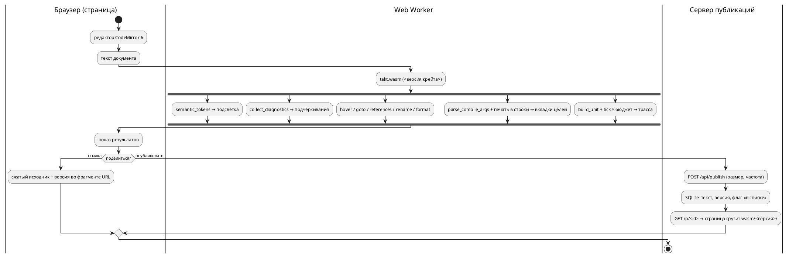

# Фича 0531: Онлайн-редактор Takt: подсветка, LSP, генерация, симуляция, обмен ссылками

- **Номер:** 0531
- **Статус:** РАЗРАБОТКА
- **Зависит от:** нет (проверено на стадии анализа 2026-09-04: ни одна незакрытая
  фича не даёт контракта, схемы или инфраструктуры, которых ждёт эта)
- **Tier:** — (шкала «признак вреда» к новой возможности не применяется;
  предложено оставить прочерк — решение заказчика, см. ADR)
- **Класс:** прочее (инструменты)
- **Связанные issue (анализ):** запрос заказчика 2026-09-04

## Стадии жизненного цикла (правило 17)

Все стадии — **разделы этой карточки** (правило 32). Пройдены регистрация,
архитектура (ADR, 2026-09-04) и анализ (2026-09-04, задачи `0531-01`…`0531-05`
и порядок их выполнения — в разделе «Анализ»); идёт разработка — задача
`0531-01` выполнена (раздел «Разработка»). Ниже — то, что сказал заказчик,
и вопросы, на которые отвечает ADR.

## Краткое описание

Веб-сервис, в котором модель на Takt пишут, проверяют и запускают прямо в
браузере, а результатом делятся по ссылке — как на pastebin.

Состав, названный заказчиком:

- **редактор** с подсветкой синтаксиса Takt;
- **семантический анализ** — «всё, что может обеспечить LSP»: диагностики по
  мере набора, переход к объявлению, поиск использований, переименование,
  наведение, форматирование;
- **генерация кода** — вывод целей рядом с исходником (предпросмотр);
- **симуляция** — отдельной вкладкой;
- **обмен**: код выкладывается на всеобщее обозрение, у каждой публикации своя
  ссылка.

⚠️ Задача **большая** и по правилу 2 подлежит декомпозиции: на стадии анализа
она разбивается на задачи `0531-YY`, а часть, возможно, выделяется в отдельные
фичи со своими номерами.

## Документирование (правило 24)

Предварительно: **язык не меняется** — сервис показывает то, что уже умеют
`taktc`, `takt-lsp` и `takt-sim`. Раздел документа при этом, вероятно, нужен:
«Инструментарий» описывает работу с инструментами, и веб-редактор — такое же
применение (правило 24 допускает прикладные разделы). Решение принимается на
стадии архитектуры; если сервис потребует ограничить конструкции языка (например
запретить долгие прогоны), это уже **изменение языка** и отдельный разговор.

## Вопросы к архитектуре (стадия 2)

Список открытых решений, а не предложений — их предстоит принять заказчику.

1. **Где исполняется компилятор.** Сборка `takt-lang` в WebAssembly и работа
   целиком в браузере — или серверный прогон с API? Первое снимает вопросы
   изоляции и нагрузки, второе не требует портирования и даёт доступ к
   инструментам целей (`cc`, `iec2c`, `verilator`), которых в браузере нет.
2. **Симуляция.** Прогон в браузере против прогона на сервере; лимиты шагов и
   времени; что делать с моделями, которые не завершаются (у эталона есть предел
   итераций, но не предел прогона).
3. **Хранение публикаций.** Что именно сохраняется (исходник, сценарий,
   выбранная цель, версия языка), сколько живёт, можно ли править и удалять;
   нужен ли приватный режим «по ссылке, но не в списке».
4. **Версия языка у публикации.** Ссылка должна открываться так же и через год:
   значит публикация хранит версию, а сервис — несколько версий компилятора.
   Иначе старые ссылки будут молча меняться в поведении.
5. **LSP в браузере.** `takt-lsp` — процесс, говорящий по LSP; в вебе нужен
   мост (WebSocket или WASM-сборка). Пути поиска импортов в вебе отсутствуют —
   решить, поддерживаются ли многофайловые публикации.
6. **Цели генерации в предпросмотре.** Показывать все восемь или выбранную;
   что делать с целями, отказывающими на входе (это нормальный ответ, а не
   ошибка сервиса).
7. **Злоупотребления.** Публичная площадка с исполнением кода: лимиты на размер,
   частоту, длительность; модерация; хранение адресов.
8. **Куда кладётся сервис.** Отдельный крейт в этом репозитории или отдельный
   репозиторий; как он собирается и чем проверяется (правило 5: у изменения
   обязана быть сборка и тесты).

## Что уже есть в проекте (опора для анализа)

- `takt-lang` — компилятор с восемью целями и библиотечным API (`parse`,
  `compile_to_c`, …);
- `takt-lsp` — сервер LSP: диагностики, переход к объявлению, использования,
  переименование, форматирование, символы документа;
- `takt-sim` — эталонный симулятор: прогон по тактам, сценарии, GIF/SVG;
- `book/takt.sublime-syntax` и списки ключевых слов — готовое описание лексики
  для подсветки, сверяемое с лексером гейтом `check-book-keywords.py`;
- плагины редакторов (`extensions/`) — образец того, какие возможности
  редакторского слоя уже описаны.

## Архитектура (ADR)

- **Status:** Proposed — решения, названные в «Decision» как **решения заказчика**,
  ждут его слова; остальное предложено к принятию.
- **Date:** 2026-09-04
- **Authors:** архитектор, системный аналитик

### Context

Сервис обязан показывать **то же**, что `taktc`, `takt-lsp` и `takt-sim`:
документ уже обещает, что «диагностика в редакторе совпадает с диагностикой
компилятора» (раздел «Инструментарий»), и второй компилятор для веба проект
позволить себе не может. Значит, вопрос архитектуры — **где исполняется тот же
самый код** и **через какую границу** он говорит с браузером.

**Что уже есть (снято чтением дерева 2026-09-04):**

| Слой | Что есть | Что мешает браузеру |
|---|---|---|
| компилятор | `takt-lang`: `parse`, `compile_to_*` (8 целей), `compile_cli::parse_compile_args` (разбор ключей — одна таблица `target_flags`, 0466), `verify_all` | `compile_to_*` и `generator::generate` принимают **путь вывода** и пишут файлы сами; `std::fs` встречается в 17 файлах — генераторы, импорт, карта адресов, рабочая область LSP |
| LSP | библиотечный слой — **чистые функции над текстом**: `collect_diagnostics(src)`, `hover_info(src, pos)`, `goto_declaration`, `references_at`, `rename_at`, `formatting_edits`, `document_symbols`, `completion_items`, `semantic_tokens`; позиции — UTF-16 (`lsp/position.rs`) | транспорт (`Connection::stdio`, диспетчер) живёт в бинарнике `takt_lsp.rs` (529 строк); варианты `*_in_workspace` читают диск |
| эталон | `takt_sim::build_unit` + `Unit::tick`, `active_states`, `variable`, `set_port`, `is_terminal`; сценарий — `json_input::SimStep`; предел итераций цикла `MAX_ITERATIONS = 100_000` **на такт** | `SimulationRunner` печатает в stdout (11 мест) и пишет GIF/SVG на диск; раскладка графа берёт `rand::rng()` (`unit/viewport/graph.rs`) — на `wasm32-unknown-unknown` `getrandom 0.4` требует явного бэкенда; предела **прогона** нет — только `-n` |
| подсветка | `lsp::semantic_tokens` (лексер + имена из дерева), `book/takt.sublime-syntax` (для PDF, сверяется с лексером гейтом 0298) | третий список ключевых слов для веба — класс 0084/0193 |
| процесс | гейты внешних инструментов — мягкий пропуск, под `PRECHECK_STRICT=1` ошибка; CI Actions **не исполняется** (биллинг, 0175) — развёртывание только руками; расширение Zed собирается под WASM вне предкоммита (0414) | предкоммит 233 с — новый крейт в корневом workspace платит на каждом прогоне |

**Замер 2026-09-04 (проба, правило 30): крейты собираются под WebAssembly без
единой правки.** `cargo check --target wasm32-wasip1` (таргет уже стоит в пине
0414):

| Крейт | Набор фич | Результат | Время |
|---|---|---|---|
| `takt-lang` | умолчание | `Finished` | 14.6 с |
| `takt-lang` | `lsp` (`lsp-types`, `lsp-server`, `serde_json`) | `Finished` | 10.1 с |
| `takt-sim` (`--lib`, вместе с `resvg`, `gif`, `clap`) | умолчание | `Finished` | 5.8 с |

Пробный `cdylib` с одним экспортом, удерживающим компилятор с восемью целями,
слой LSP и эталон (релиз, `opt-level = "s"`, `lto`, `panic = "abort"`, без
`wasm-opt`): **3.3 МБ** (`takt_wasm_probe.wasm`), **937 КБ** в gzip; сборка модуля при
готовых зависимостях — 10.9 с. ⚠️ В пробу вошли `resvg`, `fontdb`, `rustybuzz`
(графика эталона) — рабочий модуль без них будет меньше (A2).

⚠️ Что проба **не** доказывает: таргет браузера `wasm32-unknown-unknown` в пине
отсутствует и не проверялся; известное по документации препятствие на нём —
`getrandom` (см. таблицу), а операции `std::fs` там **компилируются**, но
отвечают ошибкой при вызове. Инструменты целей (`cc`, `iec2c`, `verilator`,
`yosys`) в браузере недоступны при любом варианте.

### Decision Drivers

1. **Исполнение чужого кода.** На сервере это изоляция, лимиты, дежурство и
   площадка для злоупотреблений; в браузере — песочница, за которую платит
   браузер, и нагрузка, за которую платит автор модели.
2. **Один носитель.** Тот же код, что у `taktc`; подсветка — из того же лексера;
   ключи сборки — из той же таблицы. Второй список — молчаливое расхождение
   (класс 0084/0193/0195).
3. **Ссылка через год.** Поведение задаёт **версия крейта** `takt-lang`
   (0.55.0), а не только версия языка (0.17.0): фиксы меняют вывод без подъёма
   языка. Публикация обязана хранить то, что задаёт поведение.
4. **Стоимость владения.** CI не исполняется, дежурного нет, разработчик один.
   Каждая движущаяся часть на сервере — обязательство навсегда.
5. **Правило 5 и цена предкоммита.** У каждой части — сборка и тесты; при этом
   233 с предкоммита не должны вырасти вдвое ради веба.
6. **Правило 2.** Части обязаны быть самостоятельно полезны: редактор без
   сервера публикаций — уже инструмент.

### Considered Options

#### Option A. Всё в браузере (WebAssembly); сервер — только хранилище публикаций

Компилятор, слой LSP и эталон собираются в **один модуль WASM**, исполняются в
Web Worker; сервер (если он есть) хранит тексты и раздаёт статику.

**Pros:** песочница браузера снимает вопросы 1, 2 и 7 карточки (изоляция,
лимиты прогона, злоупотребления исполнением); версии — это **файлы**
`wasm/<версия>/takt.wasm`, старые лежат рядом с новыми и не стоят ничего;
ноль процессов на сервере ради компиляции; проба показала, что портировать
нечего — только развязать вывод от файловой системы.

**Cons:** нет инструментов целей — показывается вывод компилятора, а не вердикт
`cc`/`iec2c`/`verilator` (граница названная: тот же класс «валидный вывод при
нулевом коде», который у проекта сторожат гейты, в браузере не виден); модуль
весит мегабайты (замер выше); в проект входит JS-инструментарий (см. A3).

#### Option B. Всё на сервере: API над `taktc`/`takt-sim`, `takt-lsp` через WebSocket-мост

**Pros:** ничего не портируется; доступны инструменты целей; LSP говорит своим
протоколом.

**Cons:** исполнение чужого кода на сервере — контейнер/seccomp, лимиты CPU и
памяти, очередь; **процесс `takt-lsp` на сессию** (сервер не многодокументный);
несколько версий — несколько установленных бинарников и их маршрутизация;
`takt-sim` без предела прогона надо убивать по таймеру; при заблокированном CI
всё это разворачивается и чинится руками. Драйверы 1 и 4 против.

#### Option C. Гибрид: LSP и генерация в браузере, симуляция на сервере

**Cons:** худшее обеих — сервер всё равно исполняет чужой код, а код живёт на
двух путях; единственный аргумент (длинные прогоны) закрывается бюджетом
тактов в Worker с `terminate()`. Отвергнут.

#### Option D. Чужая площадка (Compiler Explorer)

Language добавляется PR с бинарником компилятора; ссылки короткие — их
инфраструктура. **Cons:** нет ни LSP, ни симуляции, ни своих публикаций;
исполнение — на их машинах со своей политикой. Отвергнут: закрывает одну
позицию из пяти.

**Выбор — Option A.** Ниже — решения внутри него; каждое с отвергнутой
альтернативой.

#### A1. Мост браузер ↔ WASM: C-ABI + JSON, без `wasm-bindgen`

Экспорты вида `fn(ptr, len) -> ptr` с строками UTF-8; аргументы и ответы —
JSON. Ответы слоя LSP сериализуются **типами `lsp-types`** (они уже `serde`):
форма ответа в вебе тождественна форме ответа `takt-lsp` редактору, и второго
описания API нет. Ключи сборки принимаются **строкой аргументов CLI** и
разбираются `parse_compile_args` — таблица применимости ключей 0466 остаётся
единственной.

Отвергнуто: `wasm-bindgen`/`wasm-pack` — ещё один внешний инструмент, чья
версия обязана совпадать с версией крейта; связка склеивающего JS занимает
≈60 строк, и писать их дешевле, чем сторожить инструмент. Отвергнуто: LSP
JSON-RPC через `lsp_server::Connection::memory()` — переносит в веб
**транспорт** (529 строк диспетчера), тогда как содержание — функции над
текстом; редактору в вебе клиент протокола не нужен.

#### A2. Таргет `wasm32-unknown-unknown`; вывод генераторов развязывается от файлов

Таргет браузера без WASI: прослойка WASI в браузере — ещё одна JS-зависимость
ради `std::fs`, которого в вебе быть не должно. Следствие — правка **в
библиотеке**: у генераторов появляется носитель «напечатать в строки»
(`Vec<(имя_файла, текст)>`), а нынешний `generate(…, output_path, …)` становится
«напечатать и записать». Бинарник и веб зовут один печатник; снимки
`examples/generated/` (0048, 0274) сторожат тождественность байт в байт.
Раскладка графа получает **детерминированный** генератор (трасса проекта
воспроизводима по замыслу 0134, случайность в кадре — то же нарушение), а
`resvg`/`gif` уходят под фичу `graphics` крейта `takt-sim` (умолчание — вкл.,
в WASM — выкл.).

#### A3. Редактор — CodeMirror 6; подсветка — `semantic_tokens` из модуля

Токены приходят от того же лексера, что у `takt-lsp` (на неразбираемом файле —
лексерные, имена появляются после разбора), диагностики — декорациями; своей
грамматики подсветки у веба **нет**. Отвергнуто: Monaco + `monaco-languageclient`
(мегабайты и клиент протокола ради того, что уже есть функциями); отвергнута
грамматика Monarch/Lezer (третий список слов).

Цена: в проект входит `node` с `package-lock.json` и сборщиком (`esbuild`);
политика та же, что у `iec2c`/`verilator` — нет `node` → мягкий пропуск,
`PRECHECK_STRICT=1` → ошибка. Отвергнуто: CDN во время исполнения (сервис
зависит от чужого хоста) и коммит собранного бандла (собранный артефакт в
дереве — то, чего проект избегает: 0274 сверяет снимки, а не хранит).

#### A4. Симуляция — в Worker, потактово через `Unit::tick`, с бюджетом

Сценарий — тот же JSON, что у `-s` (`json_input`); за такт — состояния и
значения в трассу (таблица, как у `takt-sim`); бюджет — число тактов (умолчание
как у `-n`) **и** время стены; превышение — `Worker.terminate()` и сообщение с
названной причиной. ⚠️ Бюджет — **свойство прогона**, как `-n`, а не языка:
конструкции не ограничиваются, язык не меняется (раздел «Документирование»
карточки). Кадры SVG — позже, после A2.

#### A5. Версия публикации — версия крейта `takt-lang`; модули лежат по версиям

Публикация хранит `takt_lang` (крейт) и `LANGUAGE_VERSION` (для показа);
страница грузит `wasm/<версия крейта>/takt.wasm`; новый документ берёт
последнюю. Старые модули **не удаляются** — это и есть ответ на вопрос 4
карточки. Отвергнуто: хранить только версию языка — фиксы меняют поведение
между подъёмами языка (0507…0512 вышли без подъёма).

#### A6. Обмен — двумя ступенями

1. **Ссылка без сервера:** сжатый исходник + сценарий + цель + версия — во
   фрагменте URL (приём Compiler Explorer / TypeScript Playground). Вечная,
   самодостаточная, площадки для злоупотреблений нет. Достаточна для «поделиться».
2. **Сервер публикаций** (вопросы 3 и 7 карточки): `POST` → короткий
   идентификатор; список публичных; флаг «по ссылке, но не в списке»
   (умолчание — **не в списке**); удаление по токену владельца; предел размера
   (64 КиБ); ограничение частоты по адресу с окном в минуты — **адрес с
   публикацией не хранится**; модерация — удаление администратором. Сервер
   ничего не исполняет. Реализация — Rust (`axum` + SQLite) в **своём**
   workspace `web/server` (драйвер 5: корневой `cargo test` его не собирает),
   со своим шагом предкоммита.

Срок жизни публикаций и наличие ступени 2 в первом выпуске — **решение
заказчика**.

#### A7. Один файл; импорт — названная граница

Публикация — один файл. `import` даёт штатный `SE-001` с подсказкой (0279) —
это честный ответ, не отказ сервиса. Многофайловые публикации требуют
поставщика файлов в `semantic::import` (сейчас читает диск напрямую) — кандидат
в фичи после закрытия этой.

#### A8. Размещение в дереве и гейты

| Часть | Где | Сборка и проверка |
|---|---|---|
| привязки | `takt-wasm/` — **член корневого workspace** (тонкий: JSON ↔ вызовы библиотек) | нативно — обычный `cargo test`; под WASM — шаг предкоммита `cargo build --release --target wasm32-unknown-unknown -p takt-wasm` (таргет — в пин `rust-toolchain.toml`, приём 0414) |
| фронтенд | `web/` (`package.json`, lockfile, `esbuild`) | шаг предкоммита: сборка + **сверка в `node`**: корпус `examples/*.takt` через модуль против вывода `taktc` **байт в байт** по всем целям и трассы `examples/simulations/` против `takt-sim` — основание 0048 (генерация детерминирована) |
| сервер | `web/server/` — свой workspace (как `extensions/zed-takt`) | свой шаг: `cargo test` в его каталоге |

Гейты, перечисляющие крейты списком (`check-test-targets.py: CRATES`,
`check-module-size.sh`), получают третий крейт — иначе он невидим им молча.
Хостинг статики и домен — **решение заказчика**; развёртывание — скриптом
`scripts/`, поскольку CI не исполняется.

### Decision

Принять **Option A** с решениями A1–A8. Целевой поток:

**Декомпозиция для стадии анализа** (правило 2; порядок — по самостоятельной
пользе):

| Часть | Содержание | Что даёт сама по себе |
|---|---|---|
| 0531-01 | печать генераторов в строки; фича `graphics` и детерминированная раскладка у `takt-sim`; крейт `takt-wasm` (компиляция всех целей, диагностики, функции LSP, форматирование, потактовая симуляция); таргет в пине; шаг сборки WASM | модуль, который можно позвать из `node` |
| 0531-02 | фронтенд: редактор, токены, диагностики, наведение/переход/использования/переименование/форматирование, вкладки целей, вкладка симуляции с бюджетом; ссылка во фрагменте URL; гейт сверки с `taktc`/`takt-sim` | рабочий редактор без сервера |
| 0531-03 | сервер публикаций: API, хранение, список, приватность, лимиты, удаление, раздача модулей по версиям | «как pastebin» |
| 0531-04 | документ: подраздел «Онлайн-редактор» в разделе «Инструментарий» (правило 24 допускает; новый **раздел** не заводится); README; скрипт развёртывания | описание применения |

Нумерация задач уточняется анализом; выделение 0531-03 в отдельную фичу —
по решению заказчика о ступени 2.

**Решения, ожидающие заказчика:** (1) `Tier` — шкала признака вреда к новой
возможности не применяется, предложено оставить `—`; (2) нужна ли ступень 2
обмена в первом выпуске и срок жизни публикаций; (3) хостинг статики и домен;
(4) согласие на вход `node` в предкоммит на условиях мягкого пропуска.

### Consequences

- **Язык не меняется**; бюджет прогона — свойство прогона. Раздел
  «Документирование» карточки подтверждается.
- Библиотека `takt-lang` получает печать генераторов **в строки** — правка
  касается всех восьми целей и сторожится снимками 0274 и гейтом 0048; это
  улучшение и для тестов (сегодня они читают файлы).
- `takt-sim` теряет случайность в раскладке — кадр становится воспроизводимым,
  что согласно 0134 и так ожидалось от эталона.
- В предкоммит входят три шага (WASM-сборка, сверка в `node`, тесты сервера);
  цена измеряется на стадии анализа (`scripts/measure-precheck.sh`, урок 0272)
  и обязана уложиться в бюджет, названный там.
- Граница «инструменты целей в браузере недоступны» показывается пользователю
  словами на вкладке цели, а не молчанием.
- Первый JS-код в проекте: правила `docs/CODE.md` его не покрывают — анализ
  называет минимум (lockfile, версия `node`, без транспиляции сверх `esbuild`).

#### Acceptance criteria

1. Вывод каждой из восьми целей в браузере **байт в байт** совпадает с
   `taktc` на корпусе `examples/*.takt`; трасса симуляции совпадает с
   `takt-sim` на `examples/simulations/` — проверяет гейт, а не глаз.
2. Подсветка, диагностики, наведение, переход, использования, переименование
   и форматирование в браузере идут через функции `takt_lang::lsp`; в `web/`
   нет списка ключевых слов Takt (сторож — греп по каталогу).
3. Публикация, открытая по ссылке, грузит модуль **своей** версии; при двух
   выложенных версиях старая продолжает открываться (тест на двух модулях).
4. Прогон, превышающий бюджет, останавливается с названной причиной; страница
   остаётся отзывчивой (Worker).
5. Ключи сборки в вебе — те же строки, что у `taktc compile`; отказ цели
   показывается как её диагностика.
6. `./scripts/precheck.sh` зелёный; без `node` шаги веба пропускаются словом
   «пропуск», под `PRECHECK_STRICT=1` — ошибка.

## Анализ

### Цель и контекст

ADR принял **Option A**: компилятор, слой LSP и эталон исполняются в браузере
одним модулем WebAssembly, сервер (ступень 2 обмена) только хранит публикации.
Анализ переводит решение в задачи: что именно меняется в библиотеках, что
заводится заново, чем каждая часть проверяется и в каком порядке они идут.
Нумерация частей совпадает с нумерацией задач разработки (правило 17).

### Замер (правило 30, дата 2026-09-04)

Сверх замеров ADR (сборка под WASM без правок; модуль 3.3 МБ / 937 КБ gzip):

| Предмет | Факт | Следствие для задач |
|---|---|---|
| как генераторы пишут вывод | текст собирается **в памяти** (`generate_header`/`generate_source` → `String`), запись — `fs::write` в `generate` каждой цели: `c` (2 файла), `sv` (модуль + адаптер шины), `rust`, `st`, `plantuml` — **7 мест в 5 модулях**; `c-hal`, `st-at`, `sv-mmio` идут теми же печатниками | задача 01: одно место записи вместо семи, печатники не трогаются |
| печать позиции диагностики | `diagnostics/position.rs` **читает файл с диска** (два места), чтобы напечатать `файл:строка:колонка` | в браузере файла нет: реестр файлов обязан принимать текст из памяти — путь, которым уже идёт LSP на несохранённом документе (0153: «текст открытых документов сильнее диска»); проверяется в 02 |
| импорт | `semantic/import` читает диск напрямую и канонизирует путь **корневого** файла | в вебе — пустой список путей и синтетическое имя; `import` даёт `SE-001` (A7); отказ канонизации на несуществующем корне — проверить в 02 |
| трасса эталона | строку шага печатает `runner.rs` (`print!` ×5, `println!` ×4, `eprintln!` ×3); тесты `examples_scenario_tests.rs` идут **через библиотеку** (`build_unit`/`tick`) | задача 01: строка шага собирается функцией в библиотеке, CLI и веб печатают одну и ту же |
| сценарии корпуса | `examples/simulations/` — 6 сценариев + каталог `graphics` | материал гейта сверки трасс (02) |
| случайность | `rand::rng()` — два места в `unit/viewport/graph.rs` (раскладка графа); `getrandom 0.4` в `Cargo.lock` | задача 01: сеяный генератор; проверка сборки на `wasm32-unknown-unknown` — в 02 |
| предел прогона | `MAX_ITERATIONS = 100 000` — на **цикл в такте**; предела тактов нет, только `-n` | бюджет веба — свойство прогона (A4): умолчание 10 000 тактов и 5 с стены |
| инструменты машины | `node` v26.8.1, `npm` 11.19.0 есть; `esbuild` нет (ставится через `npm ci`); таргеты rustup: `aarch64-apple-darwin`, `wasm32-wasip1`, `wasm32-wasip2` — **`wasm32-unknown-unknown` не установлен** | первый шаг 02 — таргет в пин (приём 0414) |
| корпус редакторского слоя | 0464: 295 входов × шесть операций, выгружаются в `target/matrix-corpus/` | гейт 02 гоняет тот же корпус через модуль: ответ обязан приходить (без падения) |

### Зависимости фичи (правило 17/19)

**Зависит от: нет.** Проверено по контракту (библиотечные API `takt-lang` и
`takt-sim` — на месте), по схеме (новых узлов языка нет) и по инфраструктуре
(гейты внешних инструментов с мягким пропуском есть). Замороженная 0257 (кэш
рабочей области LSP) не нужна: рабочей области в вебе нет. 0175 (CI) не
блокирует: развёртывание руками заложено в ADR.

### Требования и проверяемые условия

- **R1. Печать в строки.** `generator::generate` печатает через новый носитель
  `generate_texts(l, model, options) -> Result<Output, Diagnostic>`, где `Output`
  — список `(имя файла, текст)` плюс предупреждения; запись на диск делает
  обёртка. Проверка: снимки `examples/generated/` (0274) и гейт
  детерминированности (0048) **байт в байт** без изменений.
- **R2. Эталон без консоли.** Строка шага и итоговая сводка строятся функциями
  библиотеки; `SimulationRunner` их печатает. Проверка: вывод `takt-sim` на
  `examples/simulations/` совпадает с прежним байт в байт (`run_simulations.sh`).
- **R3. Графика — фича.** `resvg`/`gif`/`svg`-рендер под фичей `graphics`
  (умолчание вкл.); раскладка графа — сеяный генератор (`StdRng::seed_from_u64`),
  кадр воспроизводим. Проверка: `cargo test -p takt-sim --no-default-features`
  зелёный; два прогона с GIF дают одинаковые байты.
- **R4. Крейт `takt-wasm`.** Экспорты C-ABI со строками JSON: `version`,
  `compile(target, args, source)`, `diagnostics`, `tokens`, `hover`, `goto`,
  `references`, `rename`, `format`, `symbols`, `completion`, `sim_open(source,
  scenario)`, `sim_tick(n)`, `sim_close`. Формы ответов — типы `lsp-types` и
  `Diagnostic` через `serde`. Нативные тесты крейта — в `cargo test`.
- **R5. Тождественность.** Гейт в `node`: каждый `examples/*.takt` × каждая цель
  — файлы из модуля равны файлам `taktc` байт в байт, отказы равны по коду и
  позиции; каждый сценарий `examples/simulations/` — трасса равна выводу
  `takt-sim`; корпус 0464 × операции — ответ приходит.
- **R6. Редактор.** Подсветка из `tokens`; диагностики подчёркиванием и
  списком; наведение, переход, использования, переименование, форматирование —
  командами; вкладки восьми целей с ключами сборки строкой `taktc compile`;
  вкладка симуляции: сценарий, бюджет, трасса, останов с причиной. В `web/` нет
  списка ключевых слов Takt (сторож — греп).
- **R7. Ссылка.** Фрагмент URL несёт `{v, src, scn, t, args}` (сжатие
  `CompressionStream("deflate-raw")`, base64url); открытие восстанавливает всё
  и грузит `wasm/<v>/`. Проверка: круговой рейс на корпусе.
- **R8. Сервер (ступень 2, по решению заказчика).** `POST /api/publications`
  → `{id, owner_token}`; `GET /api/publications/{id}`; `DELETE` с токеном;
  `GET /api/publications?listed=1` постранично; предел 64 КиБ; частота — окно
  в минуты по адресу, адрес **не** хранится; SQLite; раздача статики и
  `wasm/<версия>/`. Проверка: интеграционные тесты HTTP в своём workspace.
- **R9. Гейты.** Шаги предкоммита: сборка модуля, сверка в `node`, тесты
  сервера; политика — мягкий пропуск / `PRECHECK_STRICT=1`. Цена шагов
  измеряется `scripts/measure-precheck.sh` и записывается в отчёт.
- **R10. Документ.** Подраздел «Онлайн-редактор» в разделе «Инструментарий»
  (правило 24; без номеров фич); README — раздел «Онлайн-редактор»; скрипт
  сборки статики и развёртывания в `scripts/`.

### Критерии приёмки и способ проверки

Критерии ADR 1–6 остаются; способ проверки — **гейт R5**, а не ручной прогон.
Дополнительно: `scripts/precheck.sh` зелёный при отсутствующем `node` (слово
«пропуск») и при `PRECHECK_STRICT=1` с установленным `node`; снимки 0274 и
вывод `takt-sim` не изменились после 01.

### Редакторский слой (правило 29)

**Язык не меняется** — правки `takt-lang/src/lsp/` и плагинов `extensions/` не
требуются. Веб — **новый потребитель** того же слоя: он зовёт функции
`takt_lang::lsp` напрямую, поэтому любое будущее изменение слоя доезжает до
него сборкой. Ответ зафиксирован; в отчёте стадии 6 повторить.

### Особенности по обратной функциональности

- Сигнатуры `compile_to_*` и CLI **не меняются**; меняется публичный трейт
  `Generator` (метод печати в строки) — версия крейта `takt-lang` поднимается
  по semver (минор), версия языка **нет**.
- `takt-sim`: вывод CLI байт в байт прежний; фича `graphics` по умолчанию
  включена, потребители без изменений.
- Ссылка ступени 1 самодостаточна и не зависит от сервера — при появлении
  ступени 2 старые ссылки продолжают открываться.

### Риски и зависимости

- **`getrandom` на `wasm32-unknown-unknown`** отвечает ошибкой компиляции без
  явного бэкенда. Снятие — `rand` без `os_rng` (сеяный генератор — R3);
  запасной ход — бэкенд `wasm_js` только для `wasm32`. Решается сборкой в 02.
- **Паника в модуле** = `abort`, модуль умирает. Worker пересоздаёт модуль и
  сообщает «внутренняя ошибка»; пределы глубины (0129/0156) делают панику на
  входе неожиданной, а не штатной.
- **Цена предкоммита.** Холодная сборка под второй таргет — полный проход
  зависимостей; замер в 02 (`measure-precheck.sh`, урок 0272: два прогона).
- **JS без правил.** `docs/CODE.md` его не описывает: минимум — lockfile,
  версия `node` в `package.json` (`engines`), `esbuild` как единственный шаг,
  без транспиляции и фреймворков.
- **Хостинг и CI.** Развёртывание — скрипт; площадка — решение заказчика.
- **Размер модуля** 3.3 МБ до снятия графики; при необходимости — `wasm-opt`
  как **необязательный** инструмент с мягким пропуском.

### План разработки: задачи и порядок выполнения

| Порядок | Задача | Предмет | Зависит от | Проверка |
|---|---|---|---|---|
| 1 | `0531-01` | библиотеки: печать генераторов в строки (R1), строка шага эталона функцией (R2), фича `graphics` и сеяная раскладка (R3) | — | снимки 0274, гейт 0048, `run_simulations.sh` байт в байт |
| 2 | `0531-02` | крейт `takt-wasm` (R4), таргет в пине, шаг сборки модуля, гейт сверки в `node` (R5, R9) | 01 | гейт R5 зелёный; `precheck.sh` с `node` и без |
| 3 | `0531-03` | фронтенд `web/`: редактор, вкладки целей, симуляция с бюджетом (R6), ссылка во фрагменте (R7) | 02 | гейт сборки `web/`, круговой рейс ссылки, греп на список слов |
| 4 | `0531-04` | сервер публикаций `web/server/` (R8) — **по решению заказчика**; при отказе задача отменяется, порядок сдвигается | 03 | HTTP-тесты в своём workspace, шаг предкоммита |
| 5 | `0531-05` | документ и README (R10), скрипт сборки статики и развёртывания | 03 (и 04, если она есть) | гейты документа (0133…0527), `check-readme-commands.sh` |

Порядок обусловлен пользой каждой ступени (правило 2): после 01 библиотеки
чище и без веба; после 02 модуль проверяем из `node`; после 03 есть работающий
редактор с обменом по ссылке; 04 добавляет площадку; 05 закрывает
документирование.

#### Часть 01 — библиотеки готовятся к модулю

- **Что меняется:** `generator/mod.rs` (носитель `Output`, `generate_texts`,
  `generate` = печать + запись), пять `generate` целей (семь `fs::write` → один
  носитель), `takt-sim/src/runner.rs` (строка шага и сводка → функции),
  `takt-sim/Cargo.toml` (фича `graphics`), `unit/viewport/graph.rs` (сеяный
  генератор).
- **Проверки:** снимки и гейты R1–R3; тест «два прогона с GIF — одинаковые
  байты»; тест «`generate_texts` для `c` отдаёт два файла с именами, которые
  прежде писались на диск».

#### Часть 02 — крейт `takt-wasm` и гейт тождественности

- **Что меняется:** новый член workspace `takt-wasm/` (`cdylib` + `rlib` для
  нативных тестов; экспорты R4; JSON через `serde_json`); `rust-toolchain.toml`
  (`wasm32-unknown-unknown`); `scripts/check-test-targets.py` и
  `check-module-size.sh` (третий крейт); `scripts/check-wasm.sh` (сборка) и
  `scripts/check-wasm-identity.mjs` (сверка R5 в `node`, склейка ≈60 строк JS:
  память, UTF-8, вызовы); сторожа гейтов по правилу 0315.
- **Проверки:** R5 на корпусе; отказ канонизации корня и печать позиции без
  файла — тестами на синтетическом имени; `precheck.sh` в обоих режимах.

#### Часть 03 — фронтенд и ссылка

- **Что меняется:** `web/` (`package.json`, lockfile, `esbuild`, CodeMirror 6,
  Worker с модулем, страницы), `scripts/check-web.sh` (сборка + смоук в
  `node`), сторож грепа «нет списка ключевых слов».
- **Проверки:** R6, R7; бюджет останавливает бесконечную модель (`loop` без
  выхода) с названной причиной; страница отзывчива во время прогона.

#### Часть 04 — сервер публикаций (решение заказчика)

- **Что меняется:** `web/server/` — свой workspace (`axum`, `rusqlite`
  bundled), схема БД, лимиты, раздача статики и модулей по версиям;
  `scripts/check-web-server.sh`.
- **Проверки:** R8 интеграционными тестами; предел размера и частоты; удаление
  по токену; «не в списке» не появляется в списке; адрес не хранится (тест на
  схему БД).

#### Часть 05 — документ и развёртывание

- **Что меняется:** `book/src/17-tools/index.typ` — подраздел «Онлайн-редактор»
  (применение: адрес, вкладки, ссылка, бюджет прогона; без процесса и номеров);
  README; `scripts/deploy-web.sh` (сборка статики, раскладка `wasm/<версия>/`).
- **Проверки:** гейты документа и README; `check-readme-commands.sh` на новых
  командах.

## Разработка

### Решения заказчика, принятые по ходу разработки

- **2026-09-04: сервис — отдельный крейт.** Подтверждает раскладку ADR
  (раздел «Decision»): привязки WebAssembly живут в **своём** крейте
  `takt-wasm` (член корневого workspace), сервер публикаций — в **своём**
  workspace `web/server/`. В `takt-lang`/`takt-sim` кода сервиса нет и не
  будет: библиотеки лишь получают вход без диска и без консоли (задача
  `0531-01`), а всё, что знает про браузер, HTTP и хранение, живёт снаружи.

### Задача 0531-01 — библиотеки готовятся к модулю

Предмет — требования R1–R3 анализа. Веб-кода задача не содержит: после неё
библиотеки чище и без веба (правило 2 — польза каждой ступени).

#### Что сделано

**R1. Печать целей в строки** (`takt-lang`, версия крейта `0.55.0` → `0.56.0`).

- `generator::Output` — файлы вывода (`GeneratedFile { name, text }`) и
  предупреждения цели; `generator::generate_texts(l, model, options)` —
  печать **в память**; `generate(l, model, output_path, options)` — та же
  печать плюс запись. Запись делает один носитель `write_output`, а код
  диагностики отказа диска спрашивается у цели (`Generator::write_failure`):
  `CC-010`, `ST-001`, `RS-001`, `SV-001`, `PU-001` остались прежними.
- Трейт `Generator` вместо `generate` объявляет `generate_texts` +
  `write_failure`. `fs::write` было **семь** мест в пяти модулях (`c` — два,
  `sv` — два, `st`, `rust`, `plantuml`), стало одно; выбор цели тоже один —
  `generator_of` (прежде список целей повторялся бы в двух функциях, класс
  0084).
- Публичные `compile_to_*` и CLI **не меняются**: `Compilation::emit` зовёт
  прежний `generate`.

**R2. Эталон без консоли** (`takt-sim`, версия крейта `0.11.0` → `0.12.0`).

- Новый публичный модуль `takt_sim::trace`: `step_line(unit, port_names,
  step_no, now_ns)` строит строку шага, `result_report(&RunResult)` — итоговую
  сводку (`ResultReport { info, errors }`; деление на потоки — свойство
  содержания, а не CLI). Туда же переехали `format_duration` (прежний путь
  `runner::format_duration` держит реэкспорт) и `format_value`.
- `SimulationRunner` и бинарник `takt-sim` эти строки только **печатают**.

**R3. Графика — выключаемая фича** (`takt-sim`).

- `[features] graphics` (умолчание — включена) закрывает `gif`, `svg`,
  `unit::viewport` и зависимости `resvg`/`gif`/`svg`/`base64`/`petgraph`/
  `rand`/`rand_distr`. Бинарник `takt-sim` объявляет `required-features =
  ["graphics"]`: CLI умеет писать GIF и SVG, и без них половина его ключей
  бессмысленна.
- `runner.rs` стал каталогом: `runner/mod.rs` — прогон, `runner/graphics.rs` —
  запись кадров (рекордер, `capture_frame*`, легенда). Граница проведена по
  модулю, а не россыпью `#[cfg]` внутри цикла прогона.
- Запрос кадров при сборке без графики — **отказ** с названной причиной, а не
  молчаливый пропуск.
- Раскладка графа сеяна (`StdRng::seed_from_u64`, `LAYOUT_SEED`), а порядок
  узлов и рёбер берётся **отсортированным**: `state_transitions` — `HashMap`,
  и её обход давал разную раскладку при одинаковой трассе. Порядка проверки
  переходов сортировка не касается — она живёт в раскладке.

#### Замер (2026-09-04)

| Предмет | До | После |
|---|---|---|
| мест `fs::write` в генераторах | 7 в 5 модулях | 1 (`write_output`) |
| вывод восьми целей на `examples/*.takt` | — | **байт в байт** прежний (11 примеров × 8 целей, включая коды возврата и текст диагностик) |
| трассы `examples/simulations/` | — | **байт в байт** прежние (6 сценариев); сводки жёсткого и мягкого режимов сверены отдельно |
| два прогона с графикой | GIF 100 955 Б против 99 973 Б, кадры SVG разные | GIF и 27 кадров SVG совпадают побайтно |
| `cargo test -p takt-sim --no-default-features` | не собирался (фичи не было) | 711 тестов зелёные |
| шаг предкоммита «сборка без графики» | — | 0.7 с (тёплый кеш) |

⚠️ **Расхождение кадров нашлось не там, где ожидал анализ.** Замер анализа
называл единственным источником случайности `rand::rng()` в `graph.rs`; сеяный
генератор дефект **не снял** — кадры остались разными. Второй источник —
обход `HashMap` переходов: порядок узлов входит в начальное размещение, и
раскладка зависела от затравки `RandomState`, то есть менялась от запуска к
запуску даже с постоянным зерном.

#### Проверки

- Носитель печати: `takt-lang/src/generator/mod.rs` — `c_output_carries_header_and_source`
  (цель `c` отдаёт `root.h` и `root.c`) и `written_files_match_texts`
  (записанное на диск равно напечатанному в память, пять целей).
- Сводка прогона: `takt-sim/src/trace.rs` — `every_outcome_is_reported`
  (все пять исходов, каждый в свой поток).
- Воспроизводимость раскладки: `takt-sim/src/unit/viewport/graph.rs` —
  `layout_is_reproducible` и `node_order_does_not_depend_on_map_order`.
- Шаг предкоммита `cargo build -p takt-sim --no-default-features --lib`:
  выключаемая ветвь, которую никто не собирает, ломается молча — прогон с
  `--all-features` компилирует ровно противоположную.

#### Что осталось за границей задачи

- Предупреждения эталона (`SIM-030`…`SIM-032`, `SIM-037`, двусмысленные имена)
  по-прежнему печатаются `eprintln!` из библиотеки. Это тот же класс, что R2, но
  R2 назван точно — строка шага и сводка; вынос предупреждений — кандидат для
  `0531-02`, где модулю понадобится и этот канал.
- Публичного входа «скомпилировать в строки» у `takt-lang` нет: `compile_to_*`
  остались файловыми. Вход заводит `0531-02` вместе с крейтом `takt-wasm` —
  там же, где разбираются ключи сборки (`parse_compile_args`).
