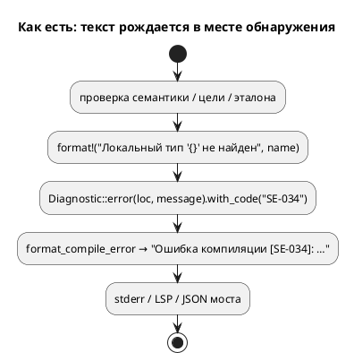
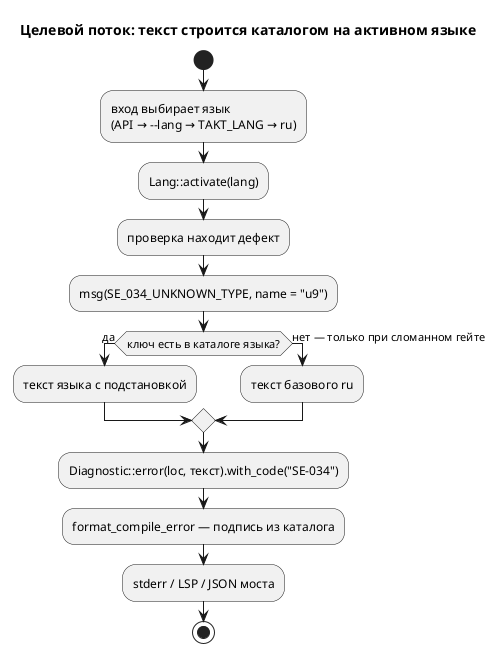

# Фича: Язык сообщений компилятора и симулятора (i18n)

- **Номер:** 0532
- **Статус:** ГОТОВО
- **Зависит от:** нет (проверено на стадии анализа 2026-09-04: каталог, ключ и переменная живут в библиотеках и CLI)
- **Tier:** — (прочерк — решение заказчика 2026-09-06: шкала «признак вреда» описывает дефекты вывода, а здесь новая возможность)
- **Класс:** прочее (инструменты)
- **Связанные issue (анализ):** запрос заказчика 2026-09-04

## Стадии жизненного цикла

Пройдены все стадии: регистрация, архитектура (ADR, 2026-09-04), анализ
(2026-09-04), разработка (задачи `0532-01`…`0532-06` и `0532-06b`,
2026-09-06…2026-09-13), тестирование и закрытие (задача `0532-07`, 2026-09-13). Ответы заказчика на семь открытых вопросов получены
2026-09-06 и записаны разделом «Ответы заказчика». Все стадии — **разделы этой карточки**: «Архитектура (ADR)»,
«Анализ», «Разработка», «Тест-план», «Отчёт о тестировании», «Итог». Раздел
заводится в момент прохождения стадии, а не заранее. Отдельным артефактом
остаются только исправления — [`docs/fixes/`](../fixes/README.md) (при
необходимости `0532-YY-*`).

## Краткое описание

Сообщения инструментов Takt — диагностики компилятора (`SE-`, `CC-`, `ST-`,
`RS-`, `SV-`, `LE-`, `SY-`, `FM-`), сообщения прогона (`SIM-`) и тексты CLI —
сегодня существуют **только по-русски** и вшиты в код строковыми литералами.
Заказчик (2026-09-04) просит завести механизм выбора языка сообщений во всём
компиляторе и симуляторе.

Предмет фичи — **механизм**, а не перевод: как сообщение отделяется от места,
где оно рождается; чем задаётся язык (переменная окружения, ключ CLI,
параметр библиотеки); что происходит с сообщением, у которого перевода нет;
как это не разъезжается с реестром диагностик и со справочником документа.

Цена ошибки здесь выше обычной. Тексты диагностик **проверяются машиной**:
проверка качества  судит 2995 сообщений корпуса, проверка справочника
(0290) сверяет состав кодов с реестром, а разборы приложения прогоняются
инструментом (0520) и сверяются с его выводом. Механизм языка обязан
объяснить, что делают эти проверки, когда сообщений становится два на код.

Второй потребитель — веб: интерфейс редактора и сообщения
инструментов должны говорить на одном языке, иначе получится оболочка на
одном языке вокруг диагностик на другом. Разбор i18n самого веб-интерфейса
живёт в задаче `0531-10`; эта фича отвечает за инструменты.

## Документирование

**Язык не меняется** — меняется язык сообщений о нём, поэтому версия языка
прежняя. Документ: раздел «Язык сообщений — `--lang`» главы «Инструментарий»
(заведён задачей `01`; при закрытии дополнен — код сообщения от языка не
зависит, данные трассы, вывод `takt-sim project` и порождённый код не меняются,
язык сервера задаёт клиент) и вводная приложения «Ошибки и предупреждения»
(тексты приведены по-русски, разбор ищется по коду). Справочник остаётся
русским — ответ заказчика 6.

## Архитектура (ADR)

- **Status:** Proposed
- **Date:** 2026-09-04
- **Authors:** аналитик (проработка выполнена моделью Fable), решения — заказчик

### Context

Сообщения инструментов рождаются **в месте обнаружения** русской строкой и
уезжают в `Diagnostic.message: String`. Замер-04 (счёт по конструкторам
`Diagnostic::*` вне `#[cfg(test)]`):

| Предмет | Факт |
|---|---|
| конструкторы диагностик | **344** места в 121 файле `takt-lang/src` (`semantic/` 173, `generator/` 132) и **43** в 6 файлах `takt-sim/src` — всего 387 |
| с подстановками | **299 из 387** (77 %) строят текст `format!`; 58 — литерал; 30 — переменная или вызов |
| коды рядом с конструктором | 223 в `takt-lang`, из них **72 с несколькими местами эмиссии** (максимум 10 — `RS-012`); 21 в `takt-sim`, 9 кратных |
| заметки | 26 мест `with_note`/`Note {`, 14 с `format!` |
| перечисления с текстом | `LexicalError`, `EvalError` (19 вариантов), `UnsupportedReason::text()` — три места **уже** отделяют параметры от текста |
| подписи печатников | `Ошибка компиляции`, `Предупреждение`, `примечание:` — `diagnostics/batch.rs`; склейки LSP («в файле …», «Заметка: ») |
| тексты вне `Diagnostic` | ≈ 165 мест: `bin/taktc.rs` 101, `takt-sim` 32, `export_cli` 11, `verify_cli` 8, `verification/*` 8, `bin/takt_lsp.rs` 3 |
| реестр кодов | 284 записи, 9 снятых → **275 живых** |
| тесты на русский текст | **1059** проверок в 313 файлах |
| выбор языка сегодня | механизма нет вовсе: ни `env::var`, ни ключа, ни зависимости `fluent`/`gettext` |

**Почему это стало проблемой.** Веб (0531) обнажил устройство: оболочка
переводима задачей `0531-10`, а диагностики и трасса приходят по-русски. Но
дело не в вебе — текст неотделим от места рождения, и **любой** второй
потребитель (документация на другом языке, плагин, чужой CI) получит то же.

**Что уже контролирует тексты и что с этим станет:**

| Проверка | Что судит | Со вторым языком |
|---|---|---|
| `check-diagnostic-quality.py` (0467) | 2995 сообщений корпуса: код, позиция, **русский**, нет `Debug`, покрытие | не меняется, пока умолчание `ru`; для `en` — зеркальная проверка |
| `check-diagnostic-codes.sh` (0077) | код эмитируется ↔ записан в реестре | не меняется, **если код остаётся литералом в коде** |
| `check-stub-branches.py` (0217/0332) | заглушка не переживает задачу; ищет формулировку **в исходнике** | **ослепнет**: текст уедет в каталог — путь каталога добавляется в область поиска |
| `check-book-diagnostics.py` (0290), `check-book-diagnostic-examples.py` (0520) | состав кодов и воспроизводимость разборов | не затронуты при умолчании `ru` |
| `diagnostic_text_tests.rs` (0231) | нет внутреннего представления в тексте | языконезависим |

### Decision Drivers

- **D1.** Русский вывод остаётся байт в байт: 1059 тестов, 2995 сообщений
  проверки, 88 пар CLI (методика 0531-02), снимки `book/`.
- **D2.** Код диагностики рождается в коде литералом — иначе слепнет проверка
  и рвётся правило «диагностика без кода запрещена типом» (0276).
- **D3.** Один носитель текста на смысл: второй словарь разъехался бы с первым.
- **D4.** Язык **либо полон, либо не заведён**: частичный перевод — падение на
  русский посреди вывода — хуже отсутствия (у референса 163 ключа из 506 не
  переведены молча).
- **D5.** Без новых зависимостей; собирается под `wasm32-unknown-unknown`.
- **D6.** Новая диагностика дорожает не более чем на строку в каталоге, и этот
  шаг контролирует машина.

### Considered Options

**A. Свой каталог: ключ + именованные подстановки, текст рендерится при
рождении диагностики.** `takt-lang/messages/{ru,en}.txt`, парсер ≈ 40 строк,
`include_str!` + `OnceLock`; ключи — константы, порождаемые `build.rs` из
базового каталога (в `takt-lang` `build.rs` уже есть — LALRPOP), поэтому
несуществующий ключ — ошибка `rustc`, а неиспользуемый — `dead_code`. Активный
язык — потоковый носитель (прецеденты: `generator/site.rs`,
`semantic/statement/loop_context.rs`). Цена: ≈ 590 мест правятся механически;
язык обязан быть выбран **до** компиляции.

**B. Библиотека `fluent` либо `gettext`.** Даёт множественное число и
склонение. Цена: 4–6 новых крейтов, пригодность под WASM не проверялась,
синтаксис FTL — второй язык, которого не знает ни одна проверка. Покупаем свойство,
которого тексты **не используют** (`содержит {got} полей` — уже без
согласования). Против D5.

**C. Перевод у потребителя: ядро отдаёт код и параметры.** Не годится по
замеру: у 72 кодов несколько текстов, значит ключ ≠ код, и клиент обязан знать
**форму** каждого сообщения — второй носитель смысла (D3). CLI и LSP всё равно
печатают текст сами.

**D. Не делать либо перевести только подписи печатников.** Дёшево и
бесполезно: смешение внутри одного сообщения — то, что «Краткое описание»
называет запретом.

### Decision

**Option A.** По драйверам: D1 — умолчание `ru`, тексты переезжают в каталог
**дословно** (контроль: корпус до и после, `diff` пуст); D2 — `with_code`
остаётся литералом; D3 — носитель текста один; D4 — паритет ключей и параметров
проверяет проверка без ратчета, а `build.rs` строит константы из `ru`; D5 — ни одной
зависимости; D6 — новая диагностика = строка в двух каталогах плюс `msg(...)`.

Устройство:

- `takt_lang::diagnostics::lang` — `enum Lang { Ru, En }`, `parse`, `activate`
  (потоковый носитель), `current`, `ALL`. Умолчание — `Ru`.
- Порядок выбора: параметр API → ключ `--lang <ru|en>` у `taktc` и `takt-sim` →
  переменная `TAKT_LANG` → `Ru`. **Системная локаль не читается**: вывод
  инструмента не должен зависеть от машины (детерминизм — свойство проекта).
- Каталог: `takt-lang/messages/ru.txt` (база) и `en.txt`; строка — один ключ;
  подстановка `{имя}`; значение приходит **строкой**, поэтому `{:?}` в каталог
  не попадает по построению (усиление 0231).
- Печатники и склейки LSP берут подписи из того же каталога — смешения внутри
  сообщения нет по построению.
- `Diagnostic` **не меняется**: `message` — готовый текст на языке, активном в
  момент рождения; дедупликация по тексту остаётся верной (в прогоне язык один).
- Мост: поле `lang` в запросе, `languages` в `takt_version`. LSP:
  `initializationOptions.lang`, иначе `InitializeParams.locale`, иначе `ru`.

### Consequences

- **2995 сообщений проверки качества** не меняются: проверка гоняет `taktc` без
  ключа, умолчание `ru`. Для `en` заводится проверка **каталога** (нет
  кириллицы, паритет) и смоук одного входа на префикс. Второй полный прогон
  корпуса отвергнут: удвоил бы время проверки ради того, что каталожная проверка
  доказывает дешевле.
- **Справочник документа** остаётся русским; в разделах «Диагностики» и
  «Инструментарий» появляется абзац о выборе языка. Проверка требует
  упоминания каждого ключа сборки в `book/` — новый ключ обязан туда попасть.
- **Реестр кодов**: строки не меняются; формулировка шапки — «текст строится
  каталогом `messages/`».
- **Правило «диагностика без кода запрещена»** не ослабляется. Связывание ключа
  с кодом (авто-`with_code` по префиксу) — **не в этой фиче**: ослепило бы 0077.
- **Проверка заглушек** читает и каталог.
- **Версии**: публичный API не ломается; `takt-lang` 0.57.0 → 0.58.0, `takt-sim`
  0.13.0 → 0.14.0, `takt-wasm` 0.1.0 → 0.2.0. **Версия языка не меняется**:
  язык прежний, меняется язык сообщений о нём.
- **Не покупается**: множественное число и склонение — текстам не нужны;
  граница названа.

#### Acceptance criteria

1. Без выбора языка вывод **байт в байт** прежний: 88 пар корпуса, `stderr`,
   коды возврата, трассы `examples/simulations/`, снимки `book/`.
2. Под `en` — ни одного сообщения с кириллицей (смоук по префиксам) и в
   каталоге (проверка).
3. Проверка паритета падает списком: ключ без перевода, лишний ключ, разный набор
   параметров, неиспользуемый ключ; неизвестный язык — отказ с перечислением.
4. Греп-контроль: в исходниках нет текста с кириллицей в конструкторах диагностик
   и в печати вне тестов; список исключений пуст.
5. `precheck.sh` зелёный в обоих режимах; проверка без изменений; 0217 видит
   каталог.
6. Мост с `"lang":"en"` отдаёт диагностику без кириллицы; без поля — как прежде.

## Анализ

### Цель и контекст

Отделить текст сообщения от места рождения так, чтобы язык выбирался входом
инструмента, русский вывод не изменился ни на байт, а проверки текстов сохранили
предмет. Замер — в ADR.

### Замер (дата 2026-09-04)

Предмет здесь не расхождение потребителей, а устройство, поэтому замер снят
**счётом по исходнику** (таблица ADR). Число подстановок вида `{:?}` внутри
конструкторов **не считалось**; оно замеряется первым шагом задачи `0532-02` —
каждое такое место требует явного `Display` у аргумента, иначе дамп узла
пролезет в текст.

### Зависимости фичи

- **Зависит от: нет.** Каталог, ключ и переменная живут в библиотеках и CLI.
  Задача `0532-05` правит `takt-wasm`, существующий с закрытой задачи `0531-02`.
- **0531 зависит от 0532 частично**: подзадача `0531-10b` ждёт эту фичу;
  `0531-10a` — нет.
- **Tier**: шкала «признак вреда» описывает дефекты вывода, а здесь новая
  возможность — вывод верен. Предложение — прочерк, как у 0531.

### Требования и проверяемые условия

| № | Требование | Проверка |
|---|---|---|
| R1 | Текст строится из каталога по ключу с именованными подстановками | греп-контроль «нет текста с кириллицей в конструкторах» |
| R2 | Умолчание `ru`, вывод байт в байт прежний | сверка корпуса; 1059 тестов без правки ожиданий |
| R3 | Язык задаётся входом: API → `--lang` → `TAKT_LANG` → `ru`; системная локаль не читается | тесты порядка; тест «`LANG=en_US` без `TAKT_LANG` — русский» |
| R4 | Неизвестный язык — отказ с перечислением известных | тесты CLI и моста |
| R5 | Каталоги полны: паритет ключей и параметров, без ратчета; мёртвый ключ — ошибка | `scripts/check-messages.py` + контроль |
| R6 | Код остаётся литералом; `with_code` обязателен | проверка без правок |
| R7 | Подписи печатников и склейки LSP — из каталога | тест под `en`; тест LSP-конверсии |
| R8 | Тексты эталона и CLI — тем же механизмом | трассы байт в байт под `ru`; смоук под `en` |
| R9 | Мост: `lang` в запросе, `languages` в версии | тесты `takt-wasm` |
| R10 | Документ: абзац о выборе языка; тексты приложения русские | проверки |
| R11 | Проверка заглушек читает каталог | контроль на копии |

### План разработки: задачи и порядок выполнения

| Порядок | Задача | Предмет | Зависит от | Проверка |
|---|---|---|---|---|
| 1 | `0532-01` | носитель языка, формат и загрузчик каталога, `build.rs` с константами, `msg()`, проверка паритета со контролем, ключ и переменная у обоих CLI, подписи печатников, **один** пробный код с контролем, абзац в документе | — | критерии 1, 3, 4; тест «пробный код под `en` без кириллицы» |
| 2 | `0532-02` | `semantic/` — 173 места и 26 заметок; замер `{:?}` первым шагом | 01 | корпус байт в байт под `ru`; паритет |
| 3 | `0532-03` | `generator/` — 132 места; вердикты верификации | 01 | то же + снимки `examples/generated/` и `book/` |
| 4 | `0532-04` | `takt-sim`: 43 места, `EvalError`, `runner`/`trace`/`json_input` | 01 | трассы байт в байт; сверки зелёные |
| 5 | `0532-05` | мост и LSP | 02–04 | тесты моста и LSP; проверка тождественности 0531-02 |
| 6 | `0532-06` | тексты CLI (≈ 165 мест); `--help` — по решению заказчика | 01 | сверка вывода под `ru`; смоук под `en` |
| 6b | `0532-06b` | доперенос, найденный замером задачи 06: лексер и разбор (`LE`/`SY`), адреса и `--define`, канон именования, форматтер, LTL-строка API, отказы и подписи LSP, отказы модуля | 01 | смоук по префиксам под `en`; корпус байт в байт под `ru` |
| 7 | `0532-07` | закрытие: реестр, проверка на каталог, смоук по префиксам, контекст, журнал, версии | 02–06 | `precheck.sh` в обоих режимах |

Задачи 02, 03, 04 независимы; каждая переводит **свои** ключи на `en` сразу —
паритет без ратчета не даёт отложить перевод.

### Оценка объёма

387 конструкторов + 26 заметок + 3 печатника + 2 склейки LSP + ≈ 165 макросов
CLI и эталона ≈ **585 мест**; каталог `ru` ≈ 450–550 ключей (часть кратных
кодов делит текст — точное число даёт задача 02). Перевод — работа человека:
машина контролирует полноту и отсутствие кириллицы, не смысл.

### Риски и зависимости

- **`{:?}` в подстановках** — число не замерено; каждое место требует
  `Display`, иначе дамп узла пролезет в текст.
- **Потоковый носитель и потоки LSP**: если сервер обрабатывает запросы в
  разных потоках, язык потеряется — задача 05 начинается с замера модели
  потоков; запасной путь — язык параметром входа.
- **Язык нужен до компиляции**: готовую диагностику не перевести; для веба это
  перекомпиляция, которая и так идёт на каждую правку.
- **Согласование форм** (число, падеж) не решается — граница названа.
- **Проверка слепнет** до задачи 07 — потому она обязательна.
- **Трассы эталона** содержат русские слова: если они окажутся **данными** для
  сверок и проверки, перевод изменит формат — вопрос заказчику.
- **Вес модуля WASM**: два каталога ≈ 100 КБ текста против 3,3 МБ модуля —
  несущественно, но замер в отчёт.

### Открытые вопросы к заказчику

1. **Языки**: `ru` + `en`, и только они в первом выпуске — подтвердить.
2. **Справка `taktc --help`** (101 строка): переводить в этой фиче (предложено —
   да, последней задачей) или оставить русской.
3. **Системная локаль**: игнорировать `LANG`/`LC_MESSAGES`, читать только
   `TAKT_LANG` — подтвердить (детерминизм против ожиданий Unix-пользователя).
4. **Tier**: прочерк (как у 0531) либо `3`.
5. **Трасса эталона**: строки шага — текст (переводится) или формат данных
   (язык фиксирован)? Предложено: сводка — текст, строка шага — данные.
6. **Документ**: приложение «Ошибки» остаётся русским — подтвердить.
7. **Плагины редакторов**: настройка языка сервера — отдельной фичей позже.

### Ответы заказчика (2026-09-06)

Вопросы 1–7 выше заданы на стадии анализа; ответы получены перед началом
разработки и меняют одно решение ADR — устройство [`Lang`].

1. **Языки — `ru` + `en`, но список открытый.** Это отменяет `enum Lang { Ru,
   En }` из раздела «Decision»: перечисление вариантов означало бы, что третий
   язык требует правки кода. Вместо него `Lang` — код, проверенный по каталогам,
   а сам список строит `build.rs` **сканированием** `messages/*.txt`. Третий
   язык — третий файл, и ни одной строки Rust. Повторить список в исходнике
   нельзя: он разошёлся бы с файлами молча.
2. **Справка `--help` переводится** — последней задачей `0532-06`, как и
   предлагалось. Инструмент, отвечающий диагностиками по-английски и справкой
   по-русски, был бы половинчатым.
3. **Системная локаль игнорируется**, читается только `TAKT_LANG` —
   подтверждено. Основание записано в носителе: на выводе инструмента стоят
   потактовые сверки и проверки корпуса.
4. **Tier** — прочерк (как у 0531).
5. **Строка шага трассы — данные, сводка прогона — текст.** Строку шага язык не
   меняет: на неё опираются потактовые сверки, `examples/simulations/` и проверка
   трасс документа (0522). Переводится только итоговая сводка.
6. **Приложение «Ошибки» остаётся русским** — подтверждено.
7. **Плагины редакторов** — отдельной фичей позже.

## Разработка

### Задача — носитель языка, каталог и проверка паритета

Предмет — требования R1 (частично), R3, R4, R5, R7: механизм на месте и
проверяем, но переведён **один пробный код**. Массовый перенос текстов — задачи
`02`…`04` и `06`.

#### Что сделано

**Каталоги.** `takt-lang/messages/ru.txt` (база) и `en.txt`; строка — `ключ =
текст`, `#` — комментарий, подстановка `{имя}`, `\n` — перевод строки. Значение
подставляется через `Display`, поэтому `{:?}` в текст не попадает **по
построению** (усиление 0231).

**`build.rs`** сканирует каталог и строит: `LANGS` (список кодов),
`CATALOGUES` (отсортированные пары «ключ, текст») и модуль `keys` — константы
ключей из базового каталога. Константы существуют ради одного: ключ,
написанный литералом, ошибался бы **молча** — сообщение не нашлось бы, и
`render` отдал бы запасной текст. Константа делает опечатку отказом компиляции.
Паритет `build.rs` **не** проверяет: сборка, падающая на неполном переводе,
лишила бы переводчика возможности собрать дерево в процессе работы. Это предмет
проверки.

**`diagnostics::lang`** — `Lang`, `parse` (отказ перечисляет известные),
`activate`/`current`/`reset` (потоковый носитель), `render`/`render_in`,
`take_flag` и макрос `msg!`. Порядок выбора: параметр API → `--lang` →
`TAKT_LANG` → `ru`.

**CLI.** `taktc` изымает `--lang` **до** маршрутизации подкоманд — язык есть
свойство прогона, а не подкоманды, и отказ разбора самих аргументов обязан
прийти уже на выбранном языке. `takt-sim` получил тот же ключ полем `clap`.
Разбор общий (`lang::take_flag`), второй копии нет.

**Переведено.** Подписи трёх печатников (`format_compile_error`, `format_notes`,
`format_warning`), отказы выбора языка и **пробный код `SE-034`** — оба его
текста. Пробный код выбран так, чтобы показать главное: ключ ≠ код
диагностики. У `SE-034` два разных сообщения, значит два ключа при одном
`with_code`, — и правило «диагностика без кода запрещена» (0077) не
ослабляется.

**Проверка паритета** — `scripts/check-messages.py` (`M1`…`M5`) и контроль
`scripts/test-check-messages.sh` (`M1`…`M7`), оба в предкоммите, контроль первым.
Ратчета у паритета нет **намеренно**: он позволил бы «перевести потом», а
`render` в этом случае молча отдаёт базовый текст — английский вывод оказался
бы наполовину русским при зелёном проверке.

#### Что нашёл замер

**Текст переезжает дословно, включая дефект.** Второе сообщение `SE-034`
содержит **42 пробела подряд** — след склеенной строки исходника. В каталог оно
перенесено как есть: правило D1 требует, чтобы вывод остался байт в байт, а
починка текста — отдельная работа, иначе прогон «до и после» перестал бы быть
доказательством переноса. Запись о лишних пробелах заведена кандидатом.

#### Проверки

| Предмет | Факт |
|---|---|
| вывод корпуса под умолчанием | **байт в байт** прежний: 6 целей × 11 примеров сверены с `examples/generated/` |
| `--lang=en` на живом входе | `local type 'MyType' not found` против `Локальный тип 'MyType' не найден` |
| тесты носителя | 13 в `diagnostics::lang` |
| проверка паритета | 7 ключей × 2 языка; контроль — 7 проб, каждая проверена снятием |

Тест «системная локаль не читается» — **текстовый**: он грепает исходник
носителя на `var("LANG")` и соседей. Проверить это прогоном нельзя, не сделав
тест флаки: переменная окружения общая для всех потоков процесса, а тесты идут
параллельно (0190).

### Задача — тексты семантики в каталоге

Предмет — требование R1 в части `semantic/`: все тексты, которые видит автор
модели, живут в каталоге, а места эмиссии зовут `msg!` с константой ключа.

#### Замер (2026-09-09)

`{:?}` в подстановках, которого опасался анализ, в текстах диагностик семантики
**нет вовсе**: единственное вхождение лежит в построении имени специализации, то
есть не в сообщении. Конструкторов диагностик — 176; сверх них перенесены
причины, заметки и предметы сообщений (метки вида «переменная», «поле»,
«вызов функции»), которые собираются в текст на месте эмиссии.

#### Что сделано

Каталог вырос с 21 до 306 ключей в обоих языках при соблюдённом паритете.
Перенесены: дерево моделей, длительности и время, общие проверки, обращение к
ячейке по адресу, выражения, перечисления, импорт (отбор имён, поиск файла,
усыновление объявлений), аргументы инстанцирования, объявления, состояния,
порты и адреса, обращение к члену, функции, тип `q(m, n)`, специализация,
константное вычисление (выражения и вызовы), структуры, недетерминизм, реестр
типов, неиспользуемые объявления, неявная булевость, место присваивания,
коллизии имён, диапазон литерала, глубина, постоянные условия, длина агрегата,
константная выдержка, подстановка тела и внутренние отказы.

#### Что нашёл перенос

**Причина обязана хранить ключ, а не текст.** У константной выдержки причина
(`Cause`) держала русскую строку и печаталась позже — на английском выводе она
осталась бы русской. Теперь причина хранит ключ, а язык выбирается в момент
печати. Тот же приём применён к видам того, что стоит слева от присваивания.

**Подстановку нельзя называть словом языка.** Имя `type` пишется в макросе как
`r#type`, и `stringify!` дал бы «r#type», разойдясь с шаблоном **молча** —
подстановка просто не нашлась бы. Имя изменено на `ty`.

**Ключ — не код диагностики.** Один код нередко имеет несколько сообщений
(`se-021.identifier-missing` и `se-021.next-state-not-a-definition`), а одно
сообщение — несколько мест эмиссии (`se-006.model-already-declared` встречается
трижды). Каталог отражает **смыслы**, а не коды.

#### Проверки

| Предмет | Факт |
|---|---|
| паритет каталогов | 306 ключей × 2 языка, расхождений нет |
| тесты крейта | 3417 пройдено (`--all-features`), 0 отказов |
| русский вывод | не изменился: наборы дерева, целей и корпуса зелёные |
| английский вывод | `--lang=en` на живом входе: `identifier 'unknown_name' not found in scope` |

#### Что осталось за границей задачи

- Массовый перенос текстов: `semantic/` — задача `02`, `generator/` — `03`,
  `takt-sim` — `04`, CLI и `--help` — `06`.
- Мост `takt-wasm` и LSP — задача `05`; там же замеряется модель потоков
  (потоковый носитель теряет язык, если сервер отвечает из другого потока).
- Число подстановок вида `{:?}` в конструкторах диагностик — замер первым шагом
  задачи `02`, как и предписывает анализ.

### Задача — тексты генераторов и верификации в каталоге

Предмет — требование R1 в части `generator/` и `verification/`: отказы и
предупреждения всех целей (`c`, `rust`, `st`, `sv`), общий носитель таблицы
переходов, вердикты верификации, экспорт графа и её отладочные трассы.

#### Что сделано

Каталог вырос с 306 до 692 ключей в обоих языках при соблюдённом паритете.
Префикс ключа — цель и код (`cc-018.…`, `rs-020.…`, `st-024.…`, `sv-013.…`),
предметы сообщений — `cc.what-…`, `rs.what-…`, `st.what-…`, `sv.what-…`.
Предметы, которые печатают несколько целей одним текстом («период 'every'»,
«приведение типа», «параметр '…' функции '…'»), живут один раз под `gen.*`:
пять ключей, заведённых целями порознь с одинаковым текстом, сведены в них.

Заметку «причина [код]: текст» у отказа условного перехода печатали пять мест
трёх целей своими копиями — теперь один носитель `generator::cause_note`.

Не переведены намеренно: текст **порождённого** кода (комментарии в выводе
`st` и `sv`, сообщение `assert!` у `rust`, `_Static_assert` у `c`) — это
вывод цели, а не сообщение инструмента; тексты `panic!`/`unreachable!`; разбор
аргументов `taktc verify` — задача `06`.

#### Что нашёл перенос

**Сдвоенная скобка перестала быть скобкой.** Задача `02` унесла в каталог
тексты с `{{ … }}`: в `format!` это одна литеральная скобка, а подстановка
каталога печатала обе, и `SE-084` показывал `'always {{ x := now(); }}'`. Правило
подстановки теперь то же, что у `format!`: `{{` и `}}` — одна скобка, и тест
носителя держит оба случая.

**Текст продолжения строки нёс отступ исходника.** Два отказа цели `st` и один
цели `sv` содержали по 14 пробелов подряд внутри фразы (тот же класс, что у
`SE-034`). В каталог они перенесены **с одним пробелом**: вывод этих трёх
сообщений изменился, прочие остались байт в байт.

**Значение каталога обрезается по краям.** Пометки трассы произведения
(` (нач.)`) начинались с пробела и потеряли бы его — пробел перенесён в код.

#### Проверки

| Предмет | Факт |
|---|---|
| паритет каталогов | 692 ключа × 2 языка, расхождений нет |
| тесты крейта | 3409 пройдено (`--all-features`), 0 отказов |
| русский вывод | наборы целей, сверок и корпуса зелёные |
| английский вывод | `TAKT_LANG=en`, цель `sv`, `float`: `variable 'x': the real type (float) does not exist in synthesizable RTL…` |

### Задача — тексты эталона в каталоге

Предмет — требование R8 в части библиотеки `takt-sim`: вычисление, выражения и
условия, операторы и построение модели, прогон по сценарию, сводка прогона, файлы
состояния и сценария, экспорт и лента кадров. Разбор аргументов `takt-sim` —
задача `06`.

#### Что сделано

Каталог вырос с 692 до 816 ключей в обоих языках при соблюдённом паритете.
Ключи эталона — `sim-NNN.…` там, где у текста один код, и `sim.…` для
предметов, видов значения и текстов без кода. Ключ ставится тем же макросом
`msg!`, что и в компиляторе: второго механизма у эталона нет.

**Строка шага трассы не переводится**, сводка прогона — переводится (ответ
заказчика 5): на строку шага опираются потактовые сверки, прогон
`examples/simulations/` и проверка трасс документа. Под `en` поэтому видна
смесь — английская сводка под русскими строками шагов; это названная граница, а
не пропуск.

Не переведены намеренно тексты `unreachable!` и `expect` — они описывают
нарушенный инвариант кода, а не ошибку модели.

#### Что нашёл перенос

**Вид значения хранится ключом.** `EvalError` держал русское название вида
(«целое», «массив») и собирал текст позже, при печати, — тот же класс, что у
причины константной выдержки в задаче `02`. Теперь поле несёт ключ каталога, а
текст строится на языке прогона.

**Операция бывала словом, а не символом.** Поле операции у `SIM-005` везде
хранит символ (`+`, `<<`), кроме значения в позиции условия: там стояло
«логическое условие». Слово вынесено в свой вариант `NotACondition` с тем же
кодом и тем же текстом, и тест держит тождественность — иначе поле с символом
пришлось бы переводить, а символы переводу не подлежат.

#### Проверки

| Предмет | Факт |
|---|---|
| паритет каталогов | 816 ключей × 2 языка, расхождений нет |
| тесты `takt-sim` | 224 модульных, 197 и 303 интеграционных (сверки), 0 отказов |
| тесты `takt-lang` | все наборы зелёные (`--all-features`) |
| русский вывод | деление на ноль: `ОШИБКА вычисления на шаге 1: деление на ноль (SIM-001)` — байт в байт прежний |
| английский вывод | `TAKT_LANG=en`: `evaluation ERROR at step 1: division by zero (SIM-001)` |

### Задача — язык моста и LSP

Предмет — требование R9: язык ответа модуля в браузере и сервера LSP.

#### Что сделано

**Мост.** Язык задаёт поле `lang` запроса, и принимает его одна точка —
`takt_wasm_io::call`, общая для всех операций ядра и модуля экспорта. Язык
ставится **на вызов** и не запоминается: запрос без поля получает умолчание,
иначе язык прошлого вызова отвечал бы за чужой запрос. Неизвестный код — отказ
вызова с перечислением известных. Ответ `takt_version` обоих модулей называет
`languages` — список каталогов, так что страница своего списка не заводит.

**Страница.** `Bridge` хранит язык и добавляет его к каждому запросу; главный
поток ставит его при загрузке и при смене языка, после чего диагностики
спрашиваются заново. Сообщения потоку прогона (сессия и экспорт) несут язык, и
поток отдаёт его обоим своим мостам. Язык не входит в ключ сессии прогона:
модель от него не меняется, а каждый такт несёт язык сам.

Плашка «сообщения инструментов только на русском» снята: диагностики, сводка и
отказы теперь приходят на языке страницы. Осталось пояснение для трассы —
строки её шагов по ответу заказчика 5 остаются данными прогона.

**LSP.** Язык берётся из `initializationOptions.lang` (разбор —
`lsp::lang_from_options`, тестируемый в библиотеке) либо из ключа `--lang`,
общего с `taktc` и `takt-sim`; параметр клиента сильнее ключа. Замер модели
потоков, которого требовал анализ: запросы обрабатывает один поток
(`main_loop` по `connection.receiver`, отдельные потоки заняты только
вводом-выводом), поэтому потоковый носитель языка держится до конца сеанса, и
запасной путь «язык параметром входа» не понадобился.

Проверка паритета смотрела использования ключей в трёх крейтах из пяти и
объявила ключи моста мёртвыми; список дополнен `takt-wasm-io` и
`takt-wasm-export`.

Не переведён намеренно запасной ответ `reply::to_json` на отказ сериализации:
по устройству он недостижим — тот же случай, что `unreachable!` у эталона.

#### Проверки

| Предмет | Факт |
|---|---|
| язык на вызов | тесты `takt-wasm-io`: язык задаёт запрос, следующий без поля его не наследует; неизвестный — отказ с перечислением |
| версия модулей | `languages` = `["en", "ru"]` у ядра и модуля экспорта |
| страница | `web-tests.mjs`: 148 из 148, в том числе новый тест языка моста (`ref Nowhere;` под `en` без кириллицы, без поля — по-русски) |
| тождественность модуля | `check-wasm.sh` зелёный: 77 компиляций корпуса, 1032 редакторских входа |

### Задача — тексты CLI и справка

Предмет — требование R8 в части инструментов командной строки: `taktc` (диспетчер,
`fmt`, печать вердиктов `verify`, справка), разбор аргументов `compile`, `verify`
и `address-map`, `takt-sim` с подкомандами `export` и `project`, `takt-lsp`
(ключи, `--graph`, журнал) и строка версии. Справка переводится по ответу
заказчика 2.

#### Что сделано

Каталог вырос с 816 до 962 ключей в обоих языках при соблюдённом паритете.
Префиксы — `cli.*` для общих текстов (одна «ошибка разбора аргументов», один
«неизвестный флаг» на все подкоманды вместо четырёх копий) и `cli.<подкоманда>.*`
для своих.

**Справка `taktc` живёт в каталоге разделами** — вступление, использование,
общий ключ, флаги `compile`, цели, примеры, `fmt`, `verify`. Пустую строку между
разделами ставит код: это разметка, а переводчику легче держать раздел, чем одну
запись в сто строк.

**Справку `takt-sim` строит `clap`**, и её тексты берутся из каталога атрибутами
`help = msg!(…)`: они вычисляются при построении команды, то есть в момент разбора,
а не при сборке. Отсюда два следствия. Язык выбирается **до** разбора — общий
носитель `take_flag` ищет ключ в копии аргументов, а сами аргументы остаются
`clap`, который ключ и принимает, и показывает. Doc-комментарии полей заменены
обычными: `clap` взял бы их русский текст поверх ключа. Имя значения `<код>`
строкой времени выполнения требует фичи `string` у `clap` — она без зависимостей.

**Справка изменилась намеренно в трёх строках**, прочий вывод — байт в байт:
- ключ `--lang` не был упомянут ни в `taktc --help`, ни в `takt-lsp --help` — ключ,
  которого нет в справке, найти нельзя;
- строка «По умолчанию 64 (double) — совпадает с точностью симулятора» стояла под
  `--tick-hz`, у которого умолчания нет, и читалась как частота такта по умолчанию;
  она возвращена к `--float-width`, чьё умолчание описывает.

**Не переводятся намеренно**: вывод `takt-sim project` — стабильные строки для
скриптов, то есть данные (тот же случай, что у строки шага трассы, ответ
заказчика 5); отказы `takt-project` и `takt-scheme` — библиотеки без компилятора
(`takt-project` — намеренно), им носитель языка недоступен, и это граница задачи.

#### Что нашёл перенос

**Отказ разбора языка давал смесь.** `TAKT_LANG=en taktc --lang de` отвечал
английской подписью «Argument parsing error:» и русским текстом отказа: носитель
печатал отказ базовым языком, потому что `current()` звал `parse()`, и отказ
через `current()` ушёл бы в рекурсию. Поиск кода вынесен в `known()`, его зовут
оба, и отказ идёт на языке, выбранном до ключа (переменная либо умолчание); тест
носителя держит это.

**Замер нашёл пробел шире CLI.** Сканер литералов с кириллицей вне тестов и
комментариев насчитал 204 литерала в 34 файлах. Часть законна: текст
**порождённого** кода (комментарии в выводе `sv`, `st`, `c`), строка шага трассы,
внутренние метки. Но задачи 02–05 не покрыли ошибки лексера и разбора (`LE`, `SY`),
адреса и `--define` (`address_map`), канон именования `CS-001`, отказ форматтера
`FM-001`, разбор LTL-строки в API, отказы `rename` и описания автодополнения LSP,
отказы модулей `takt-wasm` и `takt-wasm-export`. Синтаксическая ошибка под `en`
пришла бы по-русски, и критерий 2 так не выполнить. В CLI это не входит, поэтому
в план добавлена задача `0532-06b` — до закрытия.

#### Проверки

| Предмет | Факт |
|---|---|
| паритет каталогов | 962 ключа × 2 языка, расхождений нет |
| тесты воркспейса | `--all-features`: все наборы зелёные, 0 отказов; носитель языка — 15 тестов |
| русский вывод | 84 случая CLI (справки, отказы разбора, `fmt`, `verify`, `address-map`, `compile`, прогон, экспорт, сервер) сняты до и после: 70 байт в байт, 14 отличаются только тремя намеренными строками справки; справка `takt-sim` через `clap` совпала дословно |
| английский вывод | те же 84 случая под `TAKT_LANG=en`: кириллица в 5 — трасса (2), состав проекта, отказ `takt-project`, `DF-001` (задача `06b`) |

### Задача — доперенос, найденный замером

Предмет — требование R1 целиком: всё, что видит автор модели или пользователь
инструмента, строится каталогом. Задача заведена замером задачи 06 и включает то,
что пропустили задачи 02–05.

#### Почему пропустили

Сканер литералов, по которому работали прошлые задачи, искал строку в пределах
**одной строки исходника**. Многострочный литерал с продолжением `\` ему невидим, а
именно так записаны длинные сообщения: `SE-084`, `SE-102`, `SE-122`, `SE-132`,
`SY-006`, `LE-009` и ещё двадцать с лишним. Новый сканер разбирает Rust мини-лексером
(строки, сырые строки, символы, вложенные комментарии) и отсеивает литералы внутри
`assert!`, `expect`, `panic!`, `unreachable!`. Он же даёт границу задачи: было 264
литерала в 57 файлах, осталось 57 в 15 — и каждый из оставшихся назван ниже.

#### Что сделано

Каталог вырос с 962 до 1155 ключей в обоих языках при соблюдённом паритете.

- **Лексер и разбор**: тексты `LE-001`…`LE-011`, `SY-001`…`SY-008`. У `LexicalError`
  атрибуты `#[error(...)]` сняты, `Display` написан вручную через каталог: атрибут
  вычисляется при сборке, а язык выбирается при запуске, так что текст был один на
  все языки. Зависимость `thiserror` крейту больше не нужна и снята.
- **Адреса и `--define`**: `AM-001`…`AM-006`, `DF-001`…`DF-004`, `SE-050`…`SE-055`,
  `SE-060`, `SE-090` и причины вычислителя адреса. «Деление на ноль» и «остаток от
  деления на ноль» взяты у константного вычислителя — дубль не заведён.
- **Семантика**: 24 многострочных сообщения, пропущенных задачей 02 (`SE-038`,
  `SE-055`/`SE-056` для LTL, `SE-059`, `SE-084`, `SE-088`, `SE-092`, `SE-096`,
  `SE-099`, `SE-102`, `SE-109`, `SE-113`, `SE-114`, `SE-116`, `SE-117`, `SE-119`,
  `SE-122`, `SE-124`, `SE-130`, `SE-131`, `SE-132`, три заметки) и `RS-026` цели `rust`.
- **Форматтер и стиль**: `FM-001` с названиями узлов, `CS-001` с видами объявлений
  (вид стал ключом, текст строится при печати). Вид оператора (`kind_name`) отвечает
  строкой каталога; ключевые слова языка (`if`, `for`, `match`) — слова самого языка
  и печатаются как написаны.
- **LTL-строка API и предупреждения АСД**: `parse_ltl_property`, `SE-044`, `SE-045`.
- **LSP**: отказы `rename`, описания 49 ключевых слов и 13 встроенных типов для
  автодополнения и наведения (в словаре вместо текста стоит ключ), подписи
  «модель», «тип», «локальная», «в файле», «Заметка».
- **Модули для браузера**: отказы разбора ключей сборки, карты адресов, подсветки,
  прогона, параметров экспорта.

Три текста изменились под `ru` намеренно: описание `at` для автодополнения несло 10
пробелов подряд (след склеенной строки, тот же класс, что у `SE-034`), а описание
`duration` — номер фичи, которого автор модели знать не обязан (правило 0332). Оба
видны только в редакторе.

#### Что нашёл перенос

**Разрез причины по русской подстроке.** `SE-084` цитирует причину вычислителя без его
вводной и находил её разрезом по `"не вычисляется при компиляции: "`. Причина к тому
времени уже строилась каталогом (задача 02), и под `en` разрез молча промахивался —
вводная ехала в сообщение целиком, то самое «заикание», от которого код защищался.
Разделитель теперь берётся у каталога: шаблон отрисовывается с метками вместо
`{name}` и `{reason}`, и разделителем становится текст между последней другой
подстановкой и `{reason}`. Тест прогоняет его по всем языкам каталога.

**Один смысл — один ключ.** `se-052.port-without-address` уже жил в каталоге (задача
02, проверка полноты адресов), и `build.rs` отверг повтор. Русские тексты совпали
дословно, английские разошлись артиклями — оставлен прежний ключ, код обоих мест
эмиссии ссылается на одну константу.

#### Что осталось русским намеренно

| Где | Почему |
|---|---|
| комментарии в выводе `c`, `rust`, `st`, `sv`, `sv-mmio` | текст порождённого кода, а не сообщение инструмента |
| строка шага трассы, вывод `takt-sim project` | данные: на них опираются сверки и скрипты |
| `const _: () = assert!(…)`, метки `no_diagnostic` | нарушенный инвариант кода, недостижим из модели |
| запасные ответы `unreachable_empty` и `reply::to_json` | недостижимы по устройству |
| отказы `takt-project`, `takt-scheme` | библиотеки без компилятора — решение на закрытии |

#### Проверки

| Предмет | Факт |
|---|---|
| паритет каталогов | 1155 ключей × 2 языка, расхождений и мёртвых ключей нет |
| корпус под `ru` | 313 файлов (`tests/data`, `examples`, `book/src`) × `compile` и `fmt`, 437 диагностик: до и после — байт в байт |
| корпус под `en` | те же 437 диагностик (`CC`, `CS`, `LE`, `SE`, `SY`): кириллицы нет ни в одной |
| CLI под `ru` | 84 случая совпали со снимком задачи 06 целиком |
| CLI под `en` | кириллица в 4 из 84: трасса (2), состав проекта, отказ `takt-project` |
| сканер литералов | 264 → 57, все оставшиеся — в таблице выше |
| предкоммит | `precheck.sh` зелёный, включая `cargo test --all-features` по воркспейсу |

**Размер `lib.rs`.** Файл числится в долге по размеру, и расти ему нельзя. После
переноса вызовы каталога разошлись `rustfmt` на несколько строк, и файл вырос на
четыре. Проверки АСД `SE-044` и `SE-045` вынесены в модуль `ast_lints.rs` (публичный
путь `takt_lang::…` прежний, через `pub use`), и запись долга опущена с 1094 до 1008
строк: общее превышение по реестру — с 526 до 440.

### Задача — закрытие

Предмет — критерии приёмки 2 и 4, которые до сих пор держались ручными замерами, и
учёт фичи.

- **Проверка литералов** `scripts/check-message-literals.py` (`L1`…`L3`) с
  контролем `test-check-message-literals.sh` (9 проб, первым в предкоммите):
  русский литерал мимо каталога — отказ. Устройство — мини-лексер задачи `06b`;
  реестр `scripts/message-literals.txt` называет 13 файлов, где русский текст
  сообщением не является (порождённый код, данные трассы и `project`,
  недостижимые запасные ответы), и число литералов в каждом — рост и убыль
  ловятся. Критерий 4 требовал пустого списка исключений: он пуст для
  **сообщений**, реестр перечисляет то, что сообщением не является.
- **Правило `M8`** проверки каталогов: три пробела подряд в однострочном тексте.
  Правило нашло ещё два текста того же класса, что `SE-034`, — `SE-065` и `SE-108`
  (в обоих языках); все три починены, кандидат о `SE-034` снят.
- **Смоук под `en`**: `messages_en_tests` гоняет корпус `tests/data` через разбор,
  семантику, предупреждения, форматтер и семь целей плюс пробы карты адресов,
  `--define` и строки LTL; `t11_division_by_zero_speaks_the_chosen_language` —
  ошибку прогона.
- **Версии**: `takt-lang` 0.62.0, `takt-sim` 0.16.0, `takt-wasm` 0.4.0,
  `takt-wasm-io` 0.2.0, `takt-wasm-export` 0.2.0; версия языка прежняя.

Отказы `takt-project` и `takt-scheme` остаются русскими: крейт проекта
намеренно не зависит от компилятора, а носитель языка живёт в `takt-lang`.
Перенести носитель в свой крейт — отдельная работа; граница названа здесь и в
реестре допустимых мест не значится, потому что проверка литералов этих крейтов
не смотрит.

## Тест-план

По критериям приёмки ADR и требованиям анализа; способ проверки назван у каждого
пункта.

1. **Без выбора языка вывод прежний** (критерий 1, R2): диагностики корпуса,
   вывод CLI, трассы `examples/simulations/`, снимки `examples/generated/` и
   `book/`. Способ: снимки «до и после» у задач `06` и `06b`, предкоммит.
2. **Под `en` кириллицы нет** (критерий 2, R8): каталог, диагностики всех
   префиксов, ошибка прогона, вывод CLI. Способ: `M4`, `messages_en_tests`,
   тест `SIM-001`, снимок CLI под `TAKT_LANG=en`.
3. **Паритет каталогов** (критерий 3, R5): ключ без перевода, лишний ключ,
   подстановки, мёртвый ключ, хвост пробелов; неизвестный язык — отказ с
   перечислением. Способ: `check-messages.py` и его контроль, тесты носителя.
4. **Текст мимо каталога невозможен** (критерий 4, R1). Способ:
   `check-message-literals.py` и его контроль.
5. **Порядок выбора языка** (R3, R4): параметр API → `--lang` → `TAKT_LANG` →
   `ru`, системная локаль не читается, отказ разбора на языке, выбранном до
   ключа. Способ: тесты носителя `diagnostics::lang`.
6. **Мост и LSP** (критерий 6, R9). Способ: тесты `takt-wasm-io`,
   `web-tests.mjs`, `check-wasm.sh`.
7. **Код остаётся литералом** (R6), **проверка заглушек читает каталог** (R11).
   Способ: `check-diagnostic-codes.sh`, `check-stub-branches.py` без правок.
8. **Документ** (R10) и **предкоммит**. Способ: проверки документа, `precheck.sh`.

## Отчёт о тестировании

Прогон 2026-09-13, macOS 26.6 (Darwin 25.6.0); дерево задачи `07` поверх
`2280b0e4`.

| № | Итог | Факт |
|---|---|---|
| 1 | пройдено | CLI: 84 случая, 70 байт в байт, 14 отличаются только тремя намеренными строками справки (задача 06), после `06b` — совпадение со снимком `06` целиком; корпус 313 файлов × `compile` и `fmt`, 437 диагностик — `diff` пуст; снимки `examples/generated/`, `book/` и трассы — зелёные проверки предкоммита |
| 2 | пройдено | `messages_en_tests`: 1354 сообщения на 256 фикстурах, префиксы `AM`, `CC`, `CS`, `DF`, `LE`, `RS`, `SE`, `ST`, `SV`, `SY` — кириллицы нет; `SIM-001` под `en` без кириллицы; CLI под `en` — кириллица в 4 случаях из 84, все названы (трасса, состав проекта, отказ `takt-project`) |
| 3 | пройдено | 1155 ключей × 2 языка; контроль — 8 проб (`M1`…`M8`), каждая ловится, согласованное дерево проходит |
| 4 | пройдено | 374 файла, мимо каталога — ни одного литерала; контроль — 9 проб, в том числе многострочный литерал и `panic!` в комментарии |
| 5 | пройдено | 16 тестов носителя, в том числе «отказ разбора под `en` без кириллицы» и текстовый «системная локаль не читается» |
| 6 | пройдено | задача `05`: язык на вызов, `languages` у обоих модулей, `web-tests.mjs` 148 из 148, `check-wasm.sh` зелёный |
| 7 | пройдено | реестр кодов и проверка заглушек зелёные без правок записей |
| 8 | пройдено | абзацы в «Инструментарии» и приложении «Ошибки», шапка реестра диагностик; проверки документа и `precheck.sh` зелёные |

Дефекты, найденные по ходу, закрыты в своих задачах и названы в их разделах:
разрез причины `SE-084` по русской подстроке (`06b`), смесь языков в отказе
`--lang` (`06`), хвосты пробелов в пяти текстах (`01`, `03`, `07`). Исправлений в
`docs/fixes/` нет. Вердикт: **готово**.

## Итог (что сделано)

ГОТОВО. Сообщения инструментов Takt говорят на выбранном языке: диагностики
компилятора всех префиксов, сообщения и сводка прогона, тексты командной
строки и справка `--help` строятся каталогом `takt-lang/messages/<язык>.txt`
по ключу с именованными подстановками (`msg!`). Язык задаёт параметр
библиотеки, ключ `--lang` у `taktc`, `takt-sim` и `takt-lsp`, переменная
`TAKT_LANG`, `initializationOptions.lang` у сервера и поле `lang` у моста
страницы; умолчание — русский, вывод байт в байт прежний, системная локаль не
читается. Список языков открыт: третий язык — третий файл каталога.

Держат это три проверки — паритет каталогов, литералы мимо каталога и смоук
корпуса под `en`. Коды диагностик одни на все языки, справочник документа
русский. Данные — строка шага трассы, вывод `takt-sim project`, текст
порождённого кода — языком не меняются. Граница: отказы крейтов `takt-project` и
`takt-scheme` остаются русскими. Подробности — разделы «Разработка» и «Отчёт о
тестировании».
| LSP | 11 тестов `init_options`; `takt-lsp --lang=xx` — отказ `неизвестный язык сообщений 'xx'; известны: en, ru`, код 2 |
